# 第一题：二维线性对流方程有限体积显式求解器验证报告

**项目目录：** `/home/a776/workdocuments/上交船舶/slover/student_project`
**题目来源：** `../../pdf/01/first_advection_problem.pdf`
**理论推导：** `../../pdf/01/advection_fvm_explicit_solver_derivation.pdf`
**报告日期：** 2026-08-25
**求解器：** `explicitAdvectionFoamStudent`
**OpenFOAM 版本：** OpenFOAM 14

## 目录

- [研究概况](#研究概况)
- [1. 问题定义与研究目标](#1-问题定义与研究目标)
- [扩展实验矩阵](#扩展实验矩阵)
- [2. 假设、范围与验收标准](#2-假设范围与验收标准)
  - [2.1 基本假设](#21-基本假设)
  - [2.2 本报告范围](#22-本报告范围)
  - [2.3 验收标准](#23-验收标准)
- [3. 数学离散与求解器实现](#3-数学离散与求解器实现)
  - [3.1 有限体积半离散形式](#31-有限体积半离散形式)
  - [3.2 空间离散](#32-空间离散)
  - [3.3 时间离散](#33-时间离散)
  - [3.4 CFL 时间步](#34-cfl-时间步)
- [4. 几何区域、初始条件和边界条件](#4-几何区域初始条件和边界条件)
  - [4.1 正弦波算例](#41-正弦波算例)
  - [4.2 固体旋转算例](#42-固体旋转算例)
- [5. 软件、网格和算例组织](#5-软件网格和算例组织)
- [6. 正弦波算例：结果与格式对比](#6-正弦波算例结果与格式对比)
  - [6.1 四边形网格](#61-四边形网格)
  - [6.2 三角形网格](#62-三角形网格)
  - [6.3 线性迎风扩展](#63-线性迎风扩展)
    - [四边形网格，线性迎风](#四边形网格线性迎风)
    - [三角形网格，线性迎风](#三角形网格线性迎风)
- [7. 固体旋转算例](#7-固体旋转算例)
  - [7.1 计算设置](#71-计算设置)
  - [7.2 四边形网格结果](#72-四边形网格结果)
  - [7.3 三角形网格结果](#73-三角形网格结果)
- [8. 跨实验比较：参数变化如何产生图像现象](#8-跨实验比较参数变化如何产生图像现象)
  - [$N$ 与误差、振幅和轮廓](#n-与误差振幅和轮廓)
  - [一阶迎风为什么表现为“变平、变宽”](#一阶迎风为什么表现为变平变宽)
  - [线性迎风为什么误差更小但可能过冲](#线性迎风为什么误差更小但可能过冲)
  - [四边形和三角形为什么不能只按相同 $N$ 比较](#四边形和三角形为什么不能只按相同-n-比较)
  - [CFL、误差和守恒分别说明什么](#cfl误差和守恒分别说明什么)
- [9. 收敛、监测量与守恒性检查](#9-收敛监测量与守恒性检查)
- [10. 结果讨论](#10-结果讨论)
- [11. 局限性、风险与未完成事项](#11-局限性风险与未完成事项)
- [12. 结论](#12-结论)
- [13. 结果与报告完整性检查](#13-结果与报告完整性检查)
- [14. 复现实验命令](#14-复现实验命令)
- [15. 证据索引](#15-证据索引)

## 研究概况

| 项目 | 内容 |
|---|---|
| 研究类型 | 显式有限体积对流求解器开发与数值验证 |
| 研究对象 | 二维守恒型线性对流方程 |
| 计算平台 | OpenFOAM 14 |
| 基准算例 | 正弦波平移、复杂轮廓固体旋转 |
| 网格类型 | 结构化四边形、非结构三角形棱柱 |
| 空间格式 | 一阶迎风、线性迎风 |
| 主要考察量 | 误差、收敛阶、CFL、守恒性、数值耗散和过冲 |

本报告中的参数来自各组实验配置文件，具体计算设置以生成后的 OpenFOAM case
字典为准；计算结果来自运行日志、逐网格汇总数据和后处理图像。所有关键结论都在
相应章节中给出数据或文件依据。

## 1. 问题定义与研究目标

本报告针对第一题二维守恒型线性对流方程，验证学生版 OpenFOAM 显式有限体积求解器的
数学实现、网格适配能力、空间离散格式、时间推进和后处理流程。

控制方程为

$$
\frac{\partial \phi}{\partial t}
\;+\;
\nabla\cdot(\boldsymbol{u}\phi)=0.
$$

其中，$\phi(x,y,t)$ 是被速度场输运的标量，$\boldsymbol{u}$ 是给定速度场。
本项目使用标量场 `T` 表示 $\phi$，使用速度场 `U` 表示 $\boldsymbol{u}$。

原题包含两个数值算例：

1. 正弦波在周期方形区域上的平移，要求给出 $t=1$ 时的 $L_1$ 误差和网格收敛阶；
2. 包含切口圆盘、圆锥和光滑峰值的复杂轮廓固体旋转，要求给出一圈旋转后的等值线图。

本项目除完成原题要求外，还增加了：

- 四边形和三角形网格的对比；
- `Gauss upwind` 与 `Gauss linearUpwind grad(T)` 的对比；
- 多个网格分辨率下的自动化运行、误差收集和绘图；
- 固体旋转案例的 `N=50,100,200` 网格测试。

原题要求与本项目交付内容的对应关系如下：

| 原题要求 | 本项目对应结果 | 报告位置 |
|---|---|---|
| 正弦波在周期方形区域平移 | 四边形、三角形网格均完成 | 第 6.1、6.2 节 |
| 在 $t=1$ 给出 $L_1$ 误差 | 四组正弦波实验均给出 $L_1$ | 第 6 节各结果表 |
| 给出网格收敛阶 | 四组正弦波实验均给出观察收敛阶 | 第 6 节各结果表和收敛阶图 |
| 复杂轮廓旋转一周 | 四边形、三角形网格均推进至 $t=2\pi$ | 第 7 节 |
| 给出旋转后的等值线图 | 每个网格分辨率均给出场图、等值线图和 CFL 图 | 第 7.2、7.3 节 |
| 完成求解器开发与验证 | OpenFOAM 14 求解器、自动化脚本和数据后处理 | 第 3、5、14 节 |

## 扩展实验矩阵

| 实验组 | 物理问题 | 网格 | 空间格式 | 分辨率 | 主要输出 |
|---|---|---|---|---|---|
| 01 | 正弦波平移 | 四边形 | `Gauss upwind` | $N=10,20,40,80$ | $L_1$、$L_2$、$L_\infty$、收敛阶 |
| 02 | 正弦波平移 | 四边形 | `Gauss linearUpwind grad(T)` | $N=10,20,40,80$ | 误差、收敛阶、振幅历史 |
| 03 | 正弦波平移 | 三角形 | `Gauss upwind` | $N=10,20,40,80$ | $L_1$、$L_2$、$L_\infty$、收敛阶 |
| 04 | 正弦波平移 | 三角形 | `Gauss linearUpwind grad(T)` | $N=10,20,40,80$ | 误差、收敛阶、振幅历史 |
| 05 | 复杂轮廓固体旋转 | 四边形 | `Gauss upwind` | $N=50,100,200$ | 一圈后轮廓、耗散、质量误差 |
| 06 | 复杂轮廓固体旋转 | 三角形 | `Gauss upwind` | $N=50,100,200$ | 一圈后轮廓、耗散、质量误差 |

因此，原题的两类算例之外，本项目还完成了空间格式扩展、三角形网格扩展和固体旋转
多分辨率研究。后文将把这些扩展实验单独分析。

## 2. 假设、范围与验收标准

### 2.1 基本假设

- 速度场由用户给定，不求解动量方程；
- 标量场满足守恒型线性对流方程；
- 正弦波算例采用周期方形区域；
- 固体旋转算例采用单位方形区域和单位角速度旋转；
- 时间推进采用显式前向 Euler；
- 所有基准案例的目标 CFL 数为 `0.2`。

### 2.2 本报告范围

本报告只覆盖第一题，不覆盖扩散方程、Poisson 方程、Navier-Stokes 方程和船舶
复杂几何。`linearUpwind` 和固体旋转多分辨率是围绕第一题完成的扩展验证。

### 2.3 验收标准

| 验收项 | 标准 |
|---|---|
| 求解器编译 | 生成 `build/bin/explicitAdvectionFoamStudent` |
| 网格检查 | `checkMesh` 无致命错误并报告 `Mesh OK` |
| 时间推进 | 正确到达目标终止时间 |
| 稳定性 | 实际最大 CFL 不超过目标值 `0.2` |
| 正弦波结果 | 给出 $t=1$ 的 $L_1$ 误差和观察收敛阶 |
| 固体旋转结果 | 给出 $t=2\pi$ 的最终轮廓图 |
| 守恒性 | 归一化质量误差保持在数值舍入误差量级 |

## 3. 数学离散与求解器实现

本节的有限体积推导、显式空间离散、前向 Euler 时间推进、CFL 条件和
OpenFOAM 接口对应关系，均以项目中的理论文档
`../../pdf/01/advection_fvm_explicit_solver_derivation.pdf` 为主要推导依据。
本报告将该文档中的数学步骤与实际求解器、案例字典和运行结果连接起来。

### 3.1 有限体积半离散形式

对任意控制体 $\Omega_c$ 积分：

$$
\int_{\Omega_c}\frac{\partial\phi}{\partial t}\,\mathrm d\Omega
+\int_{\Omega_c}\nabla\cdot(\boldsymbol{u}\phi)\,\mathrm d\Omega=0.
$$

应用高斯散度定理，并用单元中心值近似时间项，得到：

$$
V_c\frac{\mathrm d\phi_c}{\mathrm dt}
+\sum_{f\in\partial\Omega_c}F_{cf}\phi_f=0,
$$

其中

$$
F_{cf}=\boldsymbol{u}_f\cdot\boldsymbol{S}_{cf}.
$$

$V_c$ 是单元体积，$\boldsymbol{S}_{cf}$ 是面面积矢量，$F_{cf}$ 是有方向的面体积通量。

### 3.2 空间离散

基准格式使用一阶迎风面值：

$$
\phi_f=
\begin{cases}
\phi_{\mathrm{owner}}, & F_f\geq 0,\\
\phi_{\mathrm{neighbour}}, & F_f<0.
\end{cases}
$$

OpenFOAM 中的对应设置为：

```foam
div(phi,T)
{
    Gauss upwind;
}
```

扩展实验使用线性迎风格式：

```foam
div(phi,T)
{
    Gauss linearUpwind grad(T);
}
```

求解器中使用显式散度算子：

```cpp
fvc::div(phi, T, "div(phi,T)")
```

该调用返回已经按单元体积归一化的对流残差，对应：

$$
R_c=
\frac{1}{V_c}\sum_fF_{cf}\phi_f.
$$

### 3.3 时间离散

采用前向 Euler 格式：

$$
\phi_c^{n+1}
=
\phi_c^n
-\Delta t
\frac{1}{V_c}
\sum_fF_{cf}^n\phi_f^n.
$$

代码中没有调用 `fvm::div`、`fvm::ddt` 或线性方程组求解器，因此该求解器确实采用
显式时间和显式空间离散。

### 3.4 CFL 时间步

程序根据每个单元的通量率：

$$
r_c=\frac{\sum_f|F_{cf}|}{V_c}
$$

计算时间步：

$$
\Delta t=
\frac{2\,\mathrm{Co}_{\max}}{\max_c(r_c)}.
$$

本题统一使用：

```text
Co_max = 0.2
```

所有已完成算例的运行日志均显示最大 Courant 数为 `0.2`。

## 4. 几何区域、初始条件和边界条件

### 4.1 正弦波算例

计算域为：

$$
\Omega=[0,1]\times[0,1].
$$

初始场为：

$$
\phi(x,y,0)=\sin\left(2\pi(x+y)\right).
$$

速度场为：

$$
\boldsymbol{u}=(1,1,0).
$$

精确解为：

$$
\phi(x,y,t)
=
\sin\left(2\pi(x+y-2t)\right).
$$

当 $t=1$ 时：

$$
\phi(x,y,1)
=
\sin\left(2\pi(x+y-2)\right)
=
\sin\left(2\pi(x+y)\right),
$$

因此 $t=1$ 时的精确解与初始场相同，但数值解会受到空间离散和时间离散误差影响。

四个边界 patch 使用周期边界：

```foam
xMin { type cyclic; }
xMax { type cyclic; }
yMin { type cyclic; }
yMax { type cyclic; }
```

### 4.2 固体旋转算例

固体旋转速度为：

$$
\boldsymbol{u}(x,y)
=
\left(0.5-y,\;x-0.5,\;0\right).
$$

该速度场绕中心：

$$
(x_c,y_c)=(0.5,0.5)
$$

以单位角速度逆时针旋转。理论旋转周期为：

$$
T_{\mathrm{period}}=2\pi.
$$

因此在：

$$
t=2\pi
$$

时，连续方程的精确解应回到初始轮廓。由于计算中采用一阶迎风格式，最终轮廓会出现
数值耗散和形状模糊。

## 5. 软件、网格和算例组织

求解器源代码：

```text
UDF/solver/explicitAdvectionFoamStudent/
└── explicitAdvectionFoamStudent.C
```

编译后可执行文件：

```text
build/bin/explicitAdvectionFoamStudent
```

统一运行入口：

```text
scripts/run_study.py
```

配置文件：

```text
scripts/configs/
├── 01_sine_wave_quad_upwind.json
├── 02_sine_wave_quad_linearUpwind.json
├── 03_sine_wave_tri_upwind.json
├── 03_sine_wave_tri_linearUpwind.json
├── 04_solid_rotation_quad_upwind.json
└── 04_solid_rotation_tri_upwind.json
```

其中：

- `meshType=quad` 使用 `blockMesh` 生成结构化四边形网格；
- `meshType=tri` 使用 Gmsh 生成三角形棱柱网格，再通过 `gmshToFoam` 导入；
- `divScheme` 决定 OpenFOAM 的对流面插值格式；
- `resolutions` 决定自动化网格研究中的 $N$ 列表；
- `endTime` 决定终止时间；
- `maxCo` 决定目标 CFL 数。

## 6. 正弦波算例：结果与格式对比

### 6.1 四边形网格

配置文件：

```text
scripts/configs/01_sine_wave_quad_upwind.json
```

运行分辨率：

```text
N=10,20,40,80
```

误差定义为体积加权、以精确解范数归一化的误差：

$$
L_1=
\frac{\sum_c|\phi_c-\phi_c^{\mathrm{exact}}|V_c}
{\sum_c|\phi_c^{\mathrm{exact}}|V_c}.
$$

相邻网格的观察收敛阶为：

$$
p=
\frac{\log(E_N/E_{2N})}{\log 2}.
$$

结果如下：

| $N$ | 单元数 | $L_1$ | $L_2$ | $L_\infty$ | $L_1$ 收敛阶 | 最大 CFL | 最终振幅 |
|---:|---:|---:|---:|---:|---:|---:|---:|
| 10 | 100 | 0.966180 | 0.960868 | 0.966180 | - | 0.200 | 0.042547 |
| 20 | 400 | 0.798008 | 0.795022 | 0.794757 | 0.275888 | 0.200 | 0.205243 |
| 40 | 1600 | 0.546957 | 0.546186 | 0.546069 | 0.544977 | 0.200 | 0.453931 |
| 80 | 6400 | 0.326346 | 0.326209 | 0.326182 | 0.745023 | 0.200 | 0.673818 |

<figure id="fig-01">
  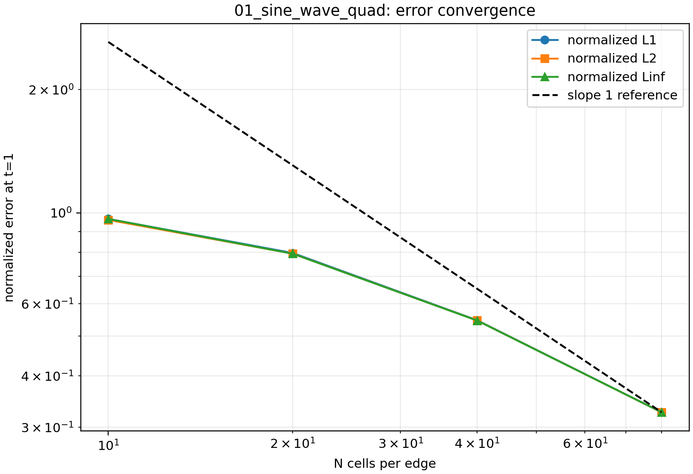
  <figcaption>图 1：四边形一阶迎风误差收敛曲线</figcaption>
</figure>

该图展示 $N=10,20,40,80$ 时归一化误差随网格尺度变化的关系；横坐标为名义网格尺度，
纵坐标为误差，数据来源为
`data/analysis/01_sine_wave_quad/convergence_summary.csv`。如[图 1](#fig-01)所示，误差随网格加密整体下降。

<figure id="fig-02">
  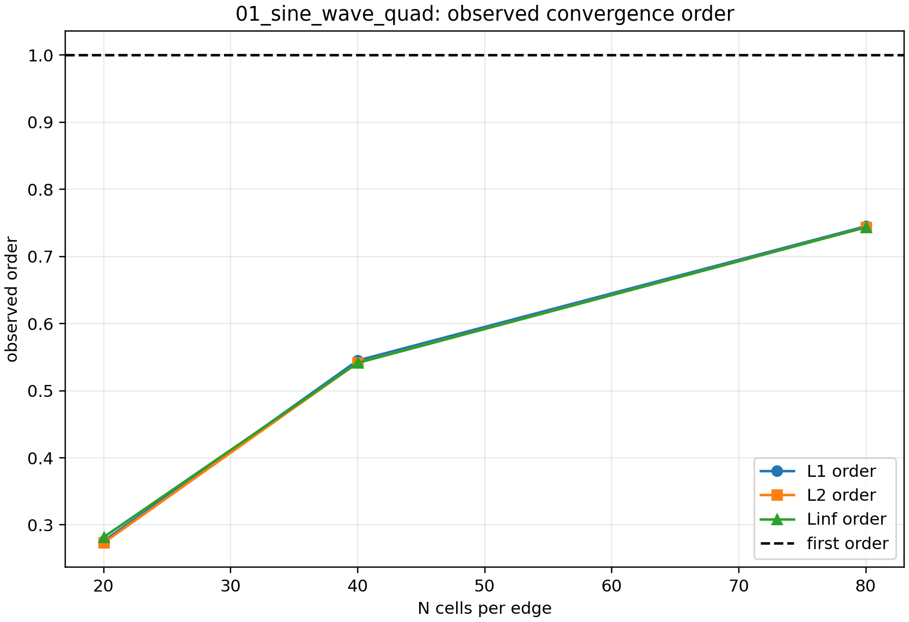
  <figcaption>图 2：四边形一阶迎风收敛阶</figcaption>
</figure>

该图展示由相邻网格误差计算得到的 $L_1$、$L_2$ 和 $L_\infty$ 观察收敛阶，不是
求解器残差曲线。它回答的是网格加密后误差下降速度是否接近理论阶数；[图 2](#fig-02)显示了各相邻网格之间的观察阶变化。

可以看到，误差随网格加密单调下降，观察收敛阶逐渐接近一阶。低分辨率下误差较大，
主要原因是一阶迎风格式的数值耗散在粗网格上非常明显。

为了把表格中的误差变化与具体场形状联系起来，下面补充 $N=80$ 的场对比、对角线
剖面、振幅历史和 CFL 历史。它们分别对应[图 3](#fig-03)、[图 4](#fig-04)、
[图 5](#fig-05)和[图 6](#fig-06)。

<figure id="fig-03">
  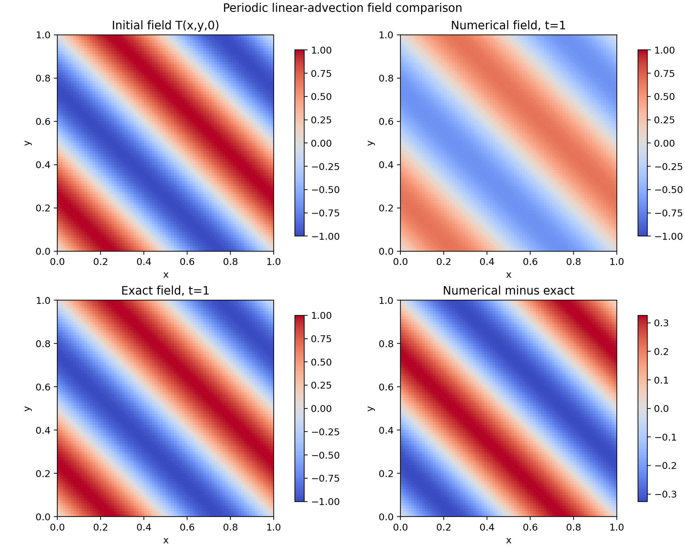
  <figcaption>图 3：四边形一阶迎风场对比 N80</figcaption>
</figure>

最终场仍保持正弦波结构，但峰值和谷值均向零收缩，说明主要误差是数值耗散。

<figure id="fig-04">
  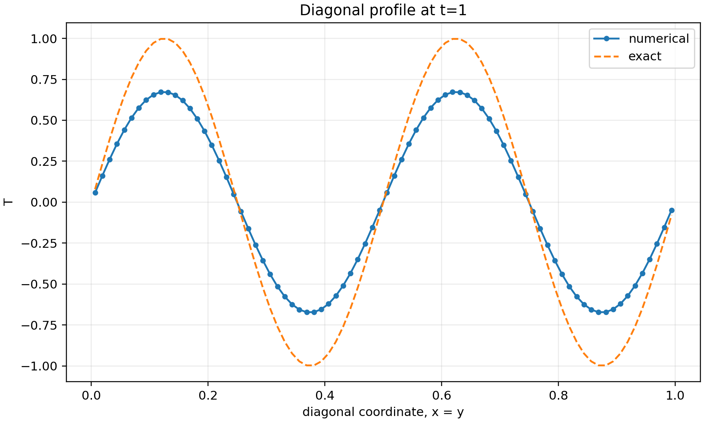
  <figcaption>图 4：四边形一阶迎风对角线剖面 N80</figcaption>
</figure>

剖面图显示数值曲线的波峰低于精确解、波谷高于精确解，形成典型的振幅压缩。

<figure id="fig-05">
  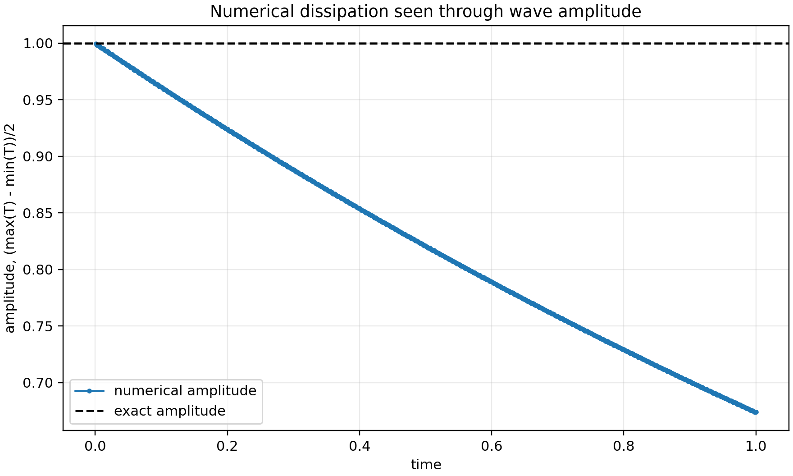
  <figcaption>图 5：四边形一阶迎风振幅历史 N80</figcaption>
</figure>

振幅随时间逐步下降。由于 CFL 受控，衰减应归因于空间迎风插值及其长期累积，
而不是时间步失控。

<figure id="fig-06">
  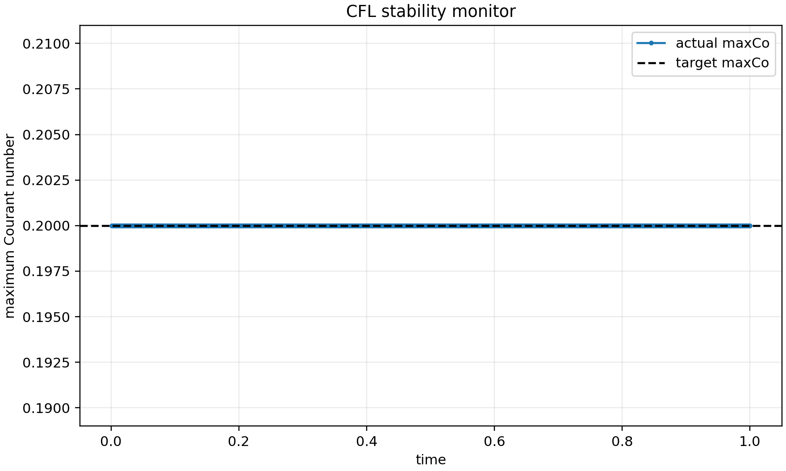
  <figcaption>图 6：四边形一阶迎风 CFL 历史 N80</figcaption>
</figure>

CFL 历史贴近目标值 `0.2`，说明该组误差和振幅变化是在相同稳定性条件下产生的。

### 6.2 三角形网格

配置文件：

```text
scripts/configs/03_sine_wave_tri_upwind.json
```

结果如下：

| $N$ | 单元数 | $L_1$ | $L_2$ | $L_\infty$ | $L_1$ 收敛阶 | 最大 CFL | 最终振幅 |
|---:|---:|---:|---:|---:|---:|---:|---:|
| 10 | 200 | 0.927034 | 0.923751 | 0.923955 | - | 0.200 | 0.078579 |
| 20 | 800 | 0.725915 | 0.722726 | 0.720627 | 0.352821 | 0.200 | 0.279127 |
| 40 | 3200 | 0.474446 | 0.473500 | 0.474030 | 0.613558 | 0.200 | 0.525970 |
| 80 | 12800 | 0.274644 | 0.274462 | 0.274564 | 0.788683 | 0.200 | 0.725436 |

<figure id="fig-07">
  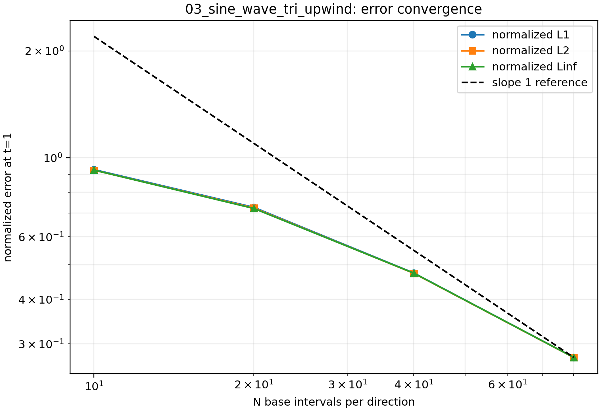
  <figcaption>图 7：三角形一阶迎风误差收敛曲线</figcaption>
</figure>

该图使用三角形棱柱的真实单元体积进行误差加权；横坐标为名义网格尺度，纵坐标为归一化
误差。三角形连接关系和 cell centre 不通过规则数组假设恢复；对应的误差变化见[图 7](#fig-07)。

三角形案例同样表现出清晰的网格收敛趋势。由于三角形网格在相同 $N$ 下的单元数约为
四边形网格的两倍，不能只按照相同的 $N$ 直接判断两种网格谁更准确，更公平的比较应
基于实际网格尺度或单元数量。

<figure id="fig-08">
  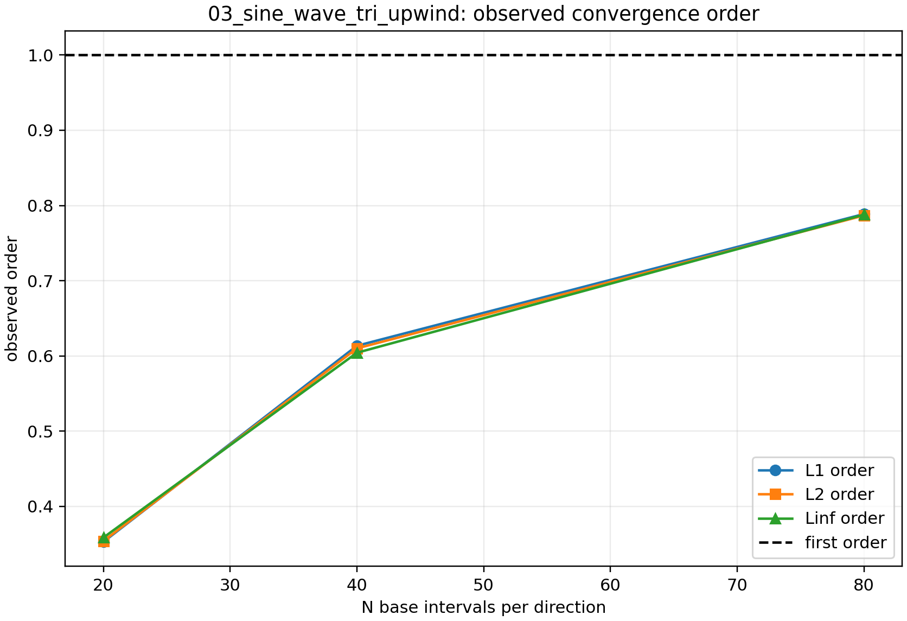
  <figcaption>图 8：三角形一阶迎风收敛阶</figcaption>
</figure>

三角形的 $L_1$ 观察收敛阶从 `0.352821`、`0.613558` 增加到 `0.788683`，
趋势与四边形相近。两种网格都在加密后趋向一阶迎风的理论行为，差别主要体现为
局部面方向、单元数量和对流方向之间的几何关系；对应的观察阶见[图 8](#fig-08)。

<figure id="fig-09">
  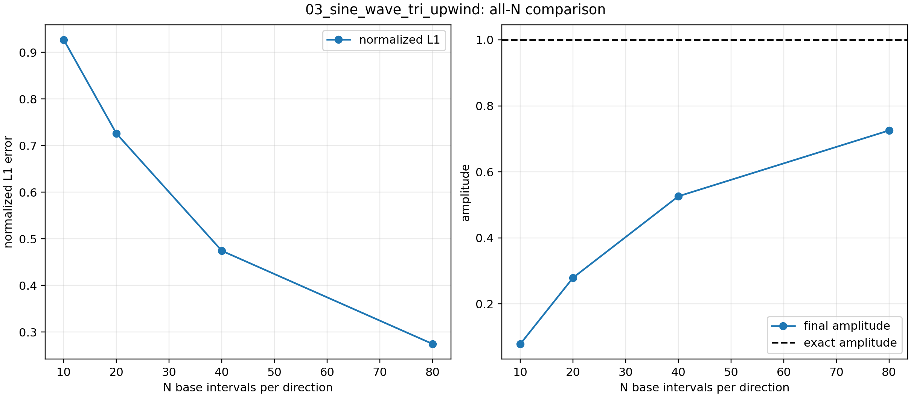
  <figcaption>图 9：三角形一阶迎风全分辨率场对比</figcaption>
</figure>

全分辨率场对比图（[图 9](#fig-09)）中，低分辨率三角形网格的波形仍然被显著削弱，但相同名义 $N$ 下的
最终振幅比四边形稍大。这与三角形案例实际单元数量更多有关；它不能被解释成三角形
网格天然具有更高阶精度。图中的三角形纹理来自真实 cell-centre 和单元连接关系。

三角形 $N=80$ 的诊断图进一步说明了这一点，依次见[图 10](#fig-10)、[图 11](#fig-11)、
[图 12](#fig-12)和[图 13](#fig-13)：

<figure id="fig-10">
  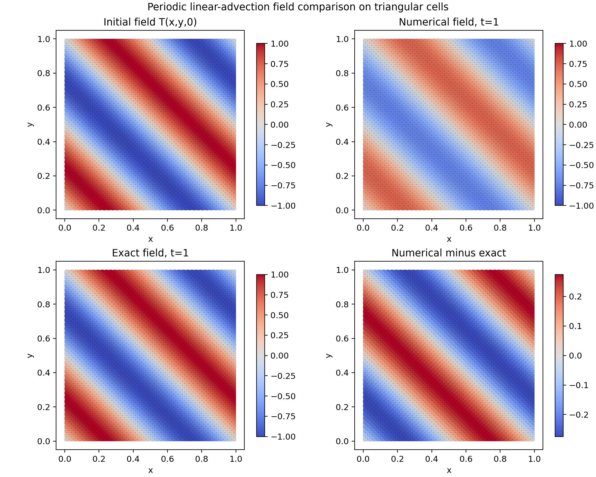
  <figcaption>图 10：三角形一阶迎风场对比 N80</figcaption>
</figure>

最终场仍保持正弦波的传播形状，但局部颜色分布带有三角形网格的几何纹理。该纹理是
非结构网格采样造成的离散表现，不等于物理解中出现了新的波动。

<figure id="fig-11">
  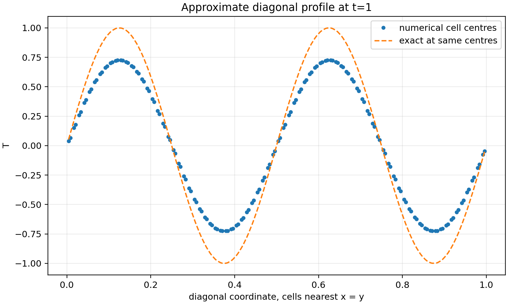
  <figcaption>图 11：三角形一阶迎风对角线剖面 N80</figcaption>
</figure>

对角线剖面中可以看到峰值降低、谷值抬高的振幅压缩；曲线局部的细小起伏来自三角形
单元中心位置和局部面方向。

<figure id="fig-12">
  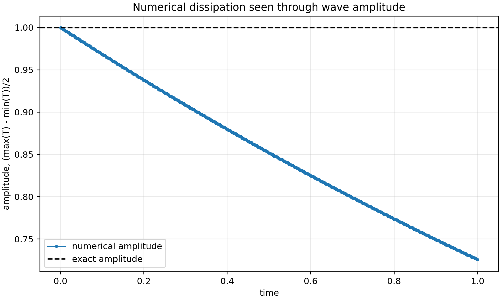
  <figcaption>图 12：三角形一阶迎风振幅历史 N80</figcaption>
</figure>

振幅随时间整体下降，说明一阶迎风的耗散在多步推进中持续累积。

<figure id="fig-13">
  
  <figcaption>图 13：三角形一阶迎风 CFL 历史 N80</figcaption>
</figure>

CFL 历史保持在目标值附近，说明三角形网格导入后面通量、单元体积和时间步计算之间
仍然匹配。因此该组与四边形组的差异主要来自网格几何和空间离散，而不是 CFL 条件不同。

### 6.3 线性迎风扩展

项目还对 `linearUpwind` 进行了扩展测试。该格式使用梯度重构计算面值，因此需要
同时观察误差是否下降，以及是否出现局部极值和过冲。

#### 四边形网格，线性迎风

四边形线性迎风的结果如下：

| $N$ | 单元数 | $L_1$ | $L_2$ | $L_\infty$ | $L_1$ 收敛阶 | 最大 CFL | 最终振幅 |
|---:|---:|---:|---:|---:|---:|---:|---:|
| 10 | 100 | 0.707166 | 0.690972 | 0.707166 | - | 0.200 | 1.588312 |
| 20 | 400 | 0.436201 | 0.433847 | 0.433515 | 0.697056 | 0.200 | 1.417537 |
| 40 | 1600 | 0.213482 | 0.213028 | 0.212900 | 1.030879 | 0.200 | 1.211436 |
| 80 | 6400 | 0.103209 | 0.103147 | 0.103125 | 1.048551 | 0.200 | 1.102974 |

这里的“最终振幅”是最终场的最大绝对值，应与连续初始场的振幅 `1` 比较。
因此四边形线性迎风在 $N=10$ 时的 `1.588312` 是明显过冲，而不是“振幅保持得更好”。
对于 $N=20,40,80$，最终振幅仍分别为 `1.417537`、`1.211436` 和 `1.102974`，
说明网格加密会减小过冲，但当前未限制的线性重构仍没有完全恢复有界性。

<figure id="fig-14">
  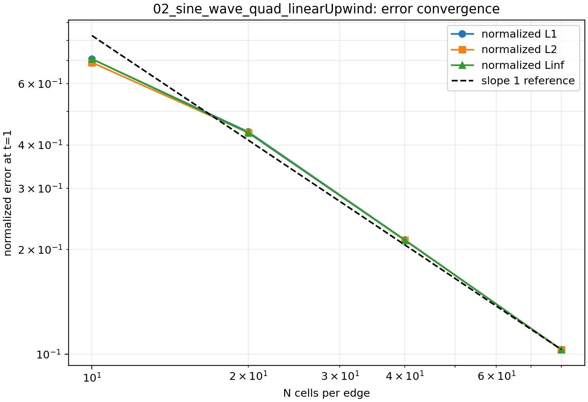
  <figcaption>图 14：四边形线性迎风误差收敛曲线</figcaption>
</figure>

误差曲线（[图 14](#fig-14)）从 `0.707166` 降到 `0.103209`。与四边形一阶迎风在 $N=80$ 的
`0.326346` 相比，线性迎风只剩约 `31.6%`，说明光滑正弦波的人工扩散明显减弱。

<figure id="fig-15">
  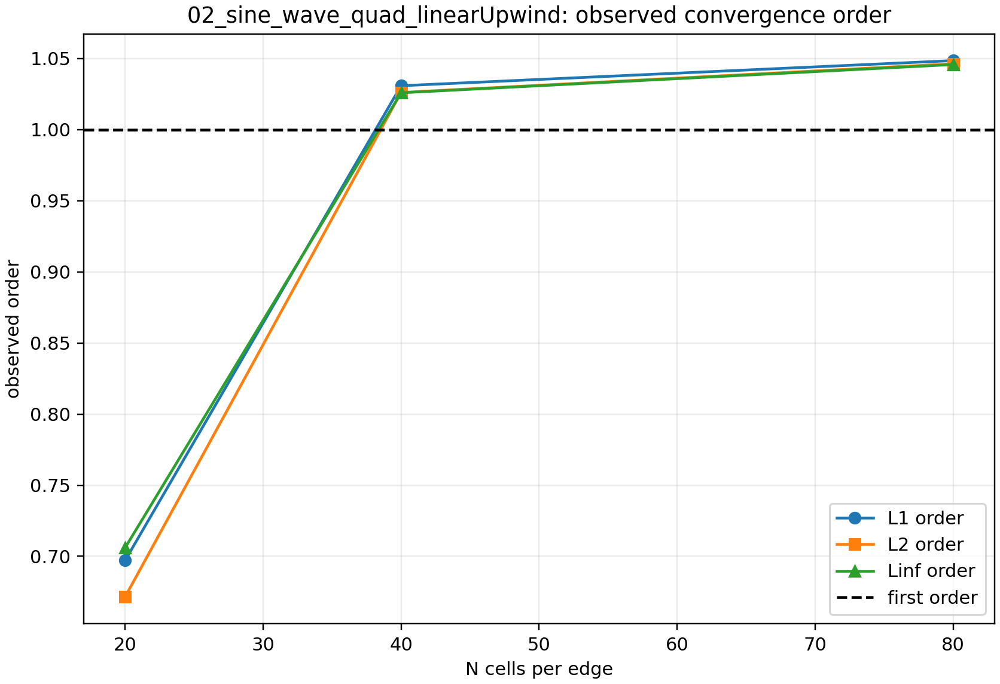
  <figcaption>图 15：四边形线性迎风收敛阶</figcaption>
</figure>

当 $N=40,80$ 时，观察收敛阶分别为 `1.030879` 和 `1.048551`，已经接近一阶；[图 15](#fig-15)显示了这一趋势。
粗网格的阶数不稳定，是因为此时正弦波还没有被充分分辨，误差中同时包含耗散、相位
误差和线性重构误差，不能把单个区间的斜率当作稳定理论阶数。

<figure id="fig-16">
  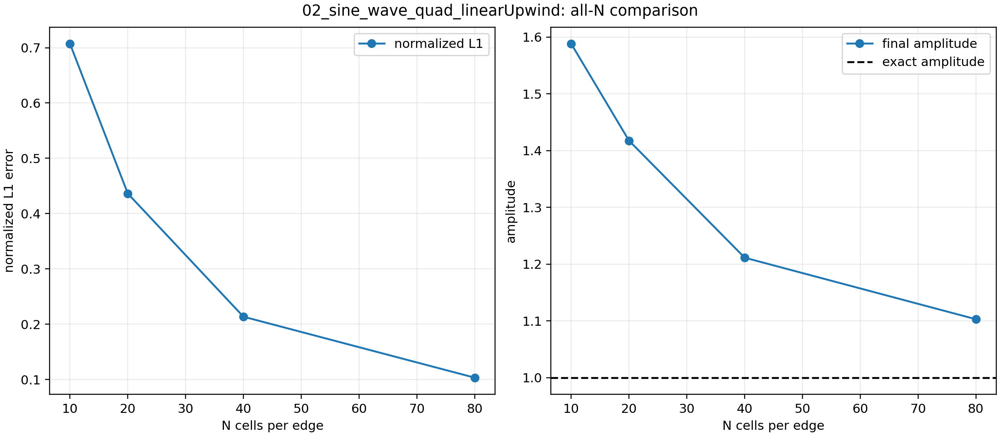
  <figcaption>图 16：四边形线性迎风各分辨率场对比</figcaption>
</figure>

各分辨率场对比（[图 16](#fig-16)）显示，$N$ 增大后波峰和波谷恢复得比一阶迎风快。可是粗网格并不一定
只是“波形变平”：线性重构可能把局部峰值推高，这也是需要检查最大值而不能只看
平均误差的原因。

<figure id="fig-17">
  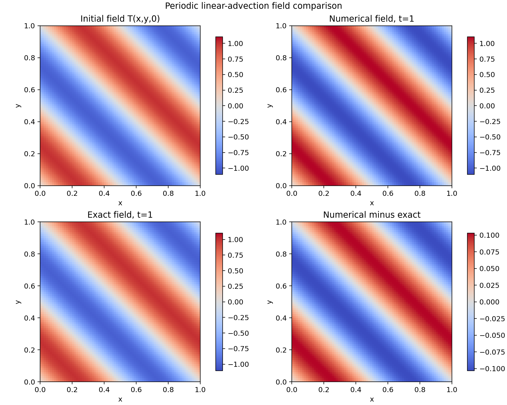
  <figcaption>图 17：四边形线性迎风场对比 N80</figcaption>
</figure>

在 $N=80$ 时，最终场与精确场的整体形状更接近，误差场比一阶迎风小，如[图 17](#fig-17)所示。图中如果出现
局部高亮区域，应结合振幅历史判断它是剩余相位误差还是局部过冲。

<figure id="fig-18">
  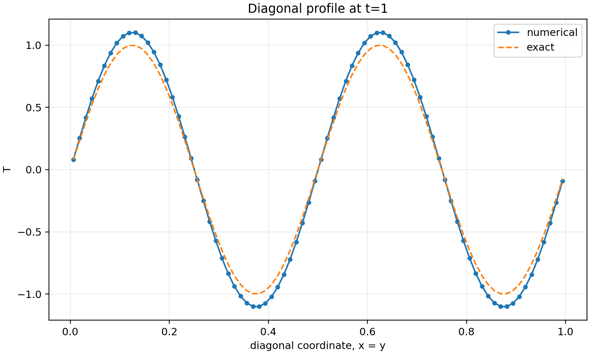
  <figcaption>图 18：四边形线性迎风对角线剖面 N80</figcaption>
</figure>

对角线剖面（[图 18](#fig-18)）能够直接比较波峰、波谷和过渡段。线性迎风的峰谷保持优于一阶迎风，
但梯度重构可能使曲线在局部越过精确解。

<figure id="fig-19">
  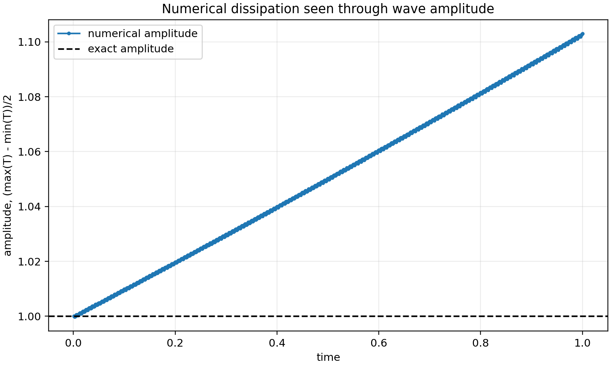
  <figcaption>图 19：四边形线性迎风振幅历史 N80</figcaption>
</figure>

细网格下振幅衰减显著减小，振幅历史见[图 19](#fig-19)。必须同时记录粗网格的极端情况：四边形线性迎风
$N=10$ 的最终振幅为 `1.588312`，超过初始振幅 `1`，这不是耗散，而是明显过冲。
因此该格式的优势是减小耗散，代价是粗网格下有界性变差。

<figure id="fig-20">
  
  <figcaption>图 20：四边形线性迎风 CFL 历史 N80</figcaption>
</figure>

CFL 图（[图 20](#fig-20)）与一阶迎风基本一致，说明两种格式使用了相同的时间步控制条件。线性迎风的
误差改善来自空间插值格式，而不是来自更大的时间步。

#### 三角形网格，线性迎风

三角形线性迎风的结果如下：

| $N$ | 单元数 | $L_1$ | $L_2$ | $L_\infty$ | $L_1$ 收敛阶 | 最大 CFL | 最终振幅 |
|---:|---:|---:|---:|---:|---:|---:|---:|
| 10 | 200 | 0.298257 | 0.306035 | 0.334536 | - | 0.200 | 0.827143 |
| 20 | 800 | 0.105560 | 0.104931 | 0.125730 | 1.498497 | 0.200 | 0.939741 |
| 40 | 3200 | 0.042703 | 0.042980 | 0.050655 | 1.305666 | 0.200 | 0.963760 |
| 80 | 12800 | 0.020097 | 0.020181 | 0.023108 | 1.087355 | 0.200 | 0.982390 |

<figure id="fig-21">
  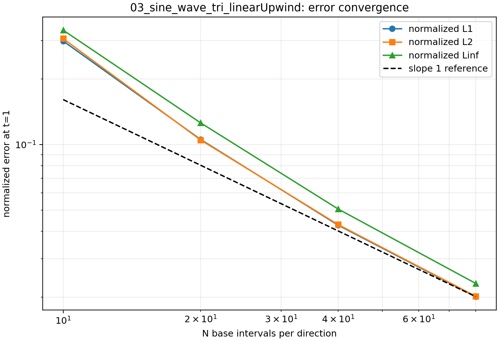
  <figcaption>图 21：三角形线性迎风误差收敛曲线</figcaption>
</figure>

三角形线性迎风误差曲线见[图 21](#fig-21)。在 $N=80$ 时的 $L_1=0.020097$，约为三角形一阶迎风
`0.274644` 的 `7.3%`。这说明在当前光滑场和当前三角形网格下，梯度重构大幅降低了
一阶迎风的扩散误差。

<figure id="fig-22">
  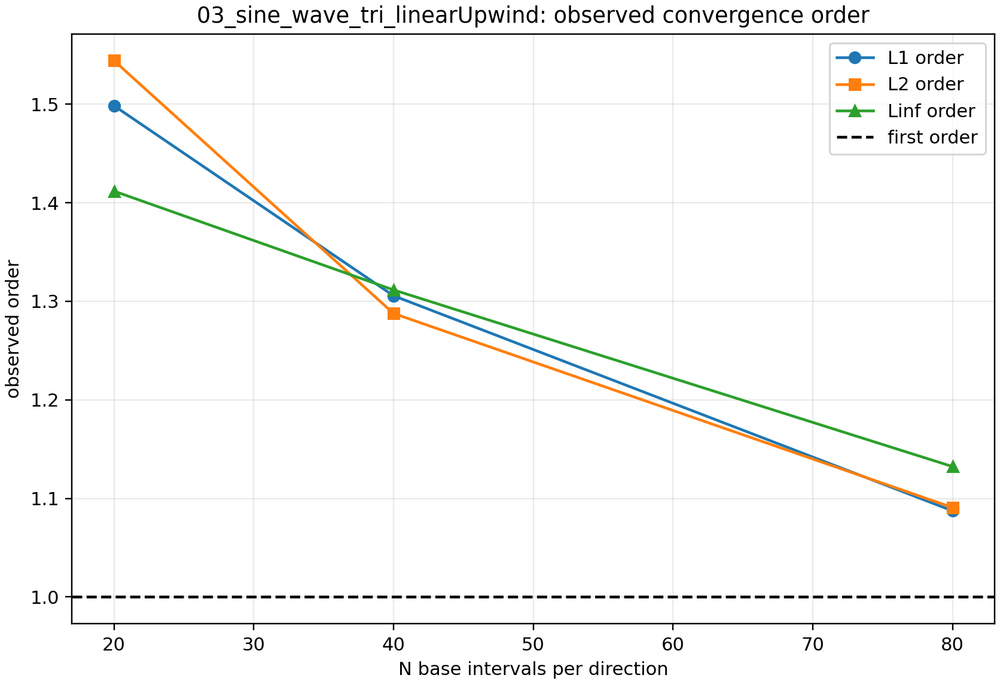
  <figcaption>图 22：三角形线性迎风收敛阶</figcaption>
</figure>

观察阶（[图 22](#fig-22)）为 `1.498497`、`1.305666` 和 `1.087355`。粗网格段出现高于一阶的局部斜率，
不能直接当作稳定超一阶结论；细网格的 `1.087355` 更能代表当前实验的渐近趋势。

<figure id="fig-23">
  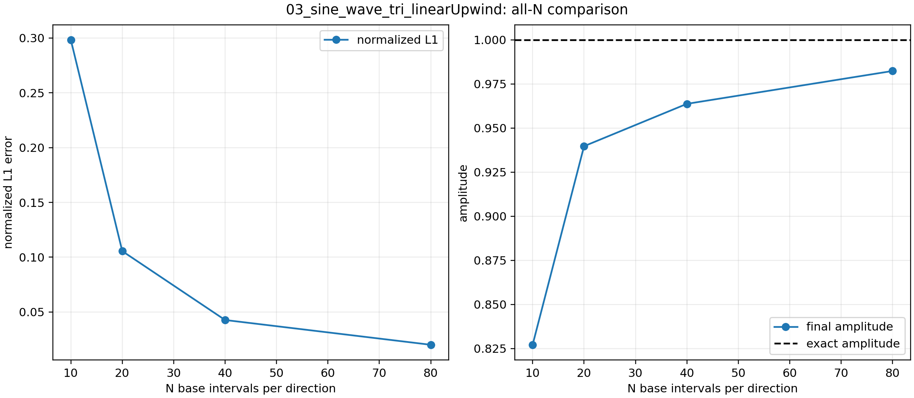
  <figcaption>图 23：三角形线性迎风各分辨率场对比</figcaption>
</figure>

各分辨率场图（[图 23](#fig-23)）中，三角形线性迎风的波形在较粗网格上也保留得较好，但应注意局部极值
可能比一阶迎风更敏感。三角形网格的方向变化和梯度重构共同决定了这些局部差异。

<figure id="fig-24">
  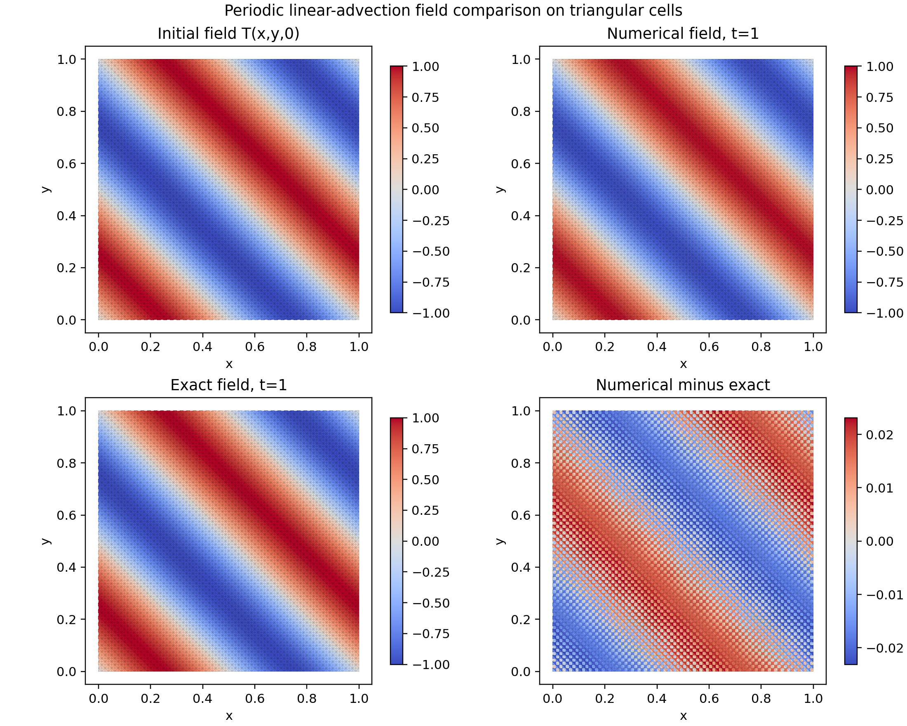
  <figcaption>图 24：三角形线性迎风场对比 N80</figcaption>
</figure>

最终场与精确场的整体形状较为接近，误差区域明显减弱，如[图 24](#fig-24)所示。三角形纹理反映真实单元中心
和连接关系，不是额外加入的物理扰动。

<figure id="fig-25">
  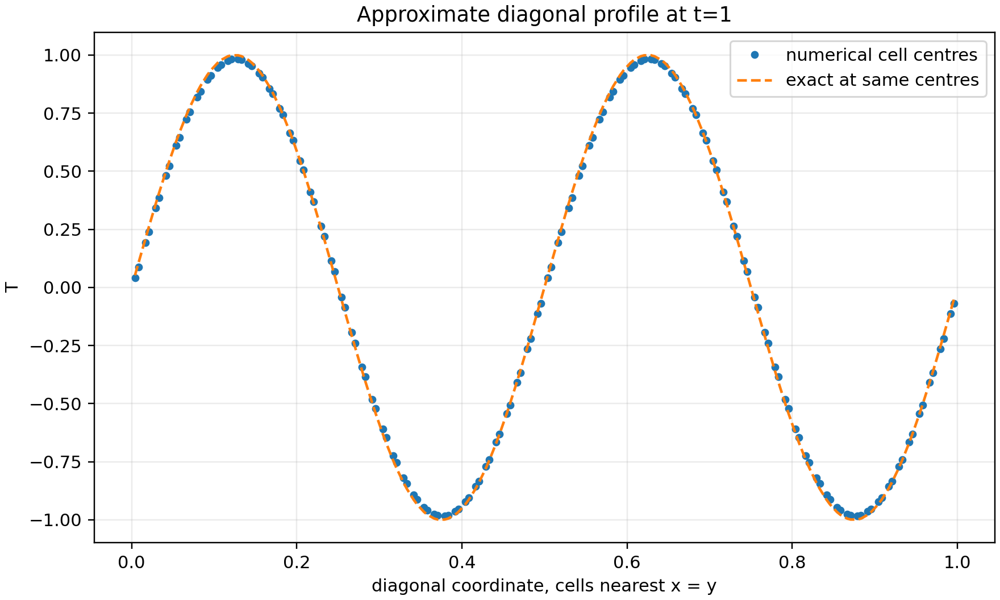
  <figcaption>图 25：三角形线性迎风对角线剖面 N80</figcaption>
</figure>

剖面图（[图 25](#fig-25)）显示波峰、波谷和过渡段均得到更好的保持。仍需检查曲线是否局部越过精确解，
因为低耗散与无条件有界并不是同一件事。

<figure id="fig-26">
  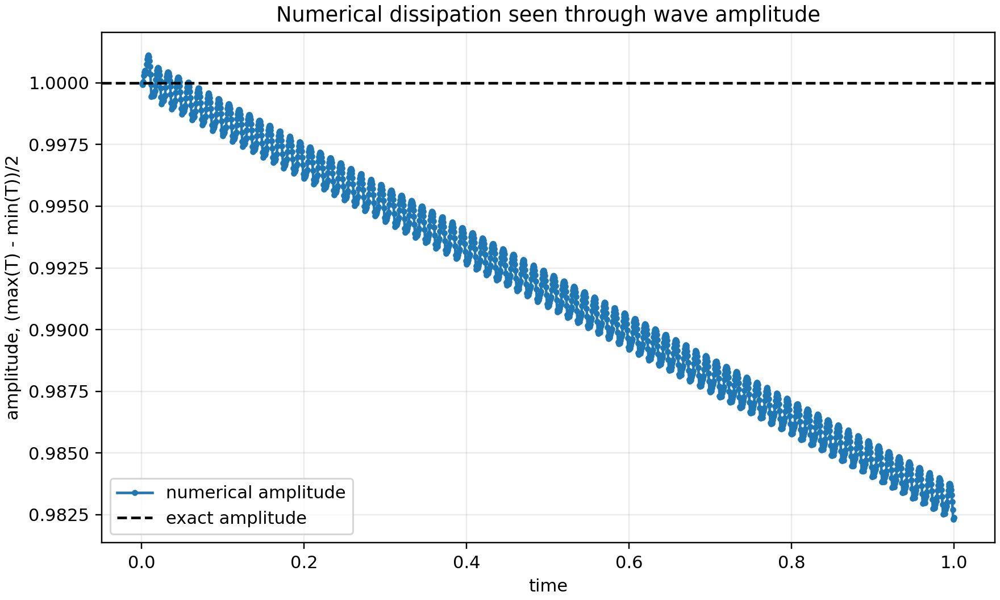
  <figcaption>图 26：三角形线性迎风振幅历史 N80</figcaption>
</figure>

振幅历史（[图 26](#fig-26)）比三角形一阶迎风更不容易衰减，说明耗散更弱；若有轻微波动，优先从线性
重构的非单调性和三角形网格方向性解释。

<figure id="fig-27">
  
  <figcaption>图 27：三角形线性迎风 CFL 历史 N80</figcaption>
</figure>

CFL 历史（[图 27](#fig-27)）始终受控在 `0.2` 附近，因此该组误差降低主要来自空间插值格式，而不是时间步条件
发生变化。

两种网格下的细网格对比为：

| 网格 | 一阶迎风 $L_1$ | 线性迎风 $L_1$ | 线性迎风/一阶迎风 |
|---|---:|---:|---:|
| 四边形 | 0.326346 | 0.103209 | 31.6% |
| 三角形 | 0.274644 | 0.020097 | 7.3% |

因此线性迎风在本实验中确实显著降低了耗散，但该结论必须与粗网格过冲风险一起报告。

## 7. 固体旋转算例

### 7.1 计算设置

固体旋转案例采用：

```text
速度场：u = (0.5-y, x-0.5, 0)
终止时间：t = 2*pi
CFL：0.2
空间格式：Gauss upwind
```

四边形和三角形网格均测试：

```text
N=50,100,200
```

这里的 `cycleL1AgainstInitial` 表示一圈旋转后数值场与初始场之间的体积加权差异，
用于观察形状变形和数值耗散；固体旋转案例本身没有使用正弦波的解析解误差定义。六组最终场、等值线和 CFL 图的图号范围为[图 28](#fig-28)至[图 45](#fig-45)。

### 7.2 四边形网格结果

| $N$ | 单元数 | `cycleL1AgainstInitial` | 最大 CFL | 归一化质量误差 | 最终最大值 |
|---:|---:|---:|---:|---:|---:|
| 50 | 2500 | 1.305504 | 0.200 | $7.40\times10^{-14}$ | 0.515869 |
| 100 | 10000 | 1.106538 | 0.200 | $1.21\times10^{-14}$ | 0.547857 |
| 200 | 40000 | 0.885152 | 0.200 | $1.49\times10^{-14}$ | 0.663497 |

#### 四边形，N=50

<figure id="fig-28">
  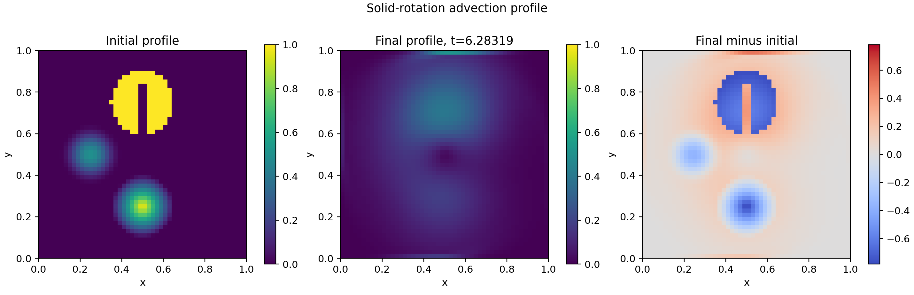
  <figcaption>图 28：四边形旋转场对比 N50</figcaption>
</figure>

<figure id="fig-29">
  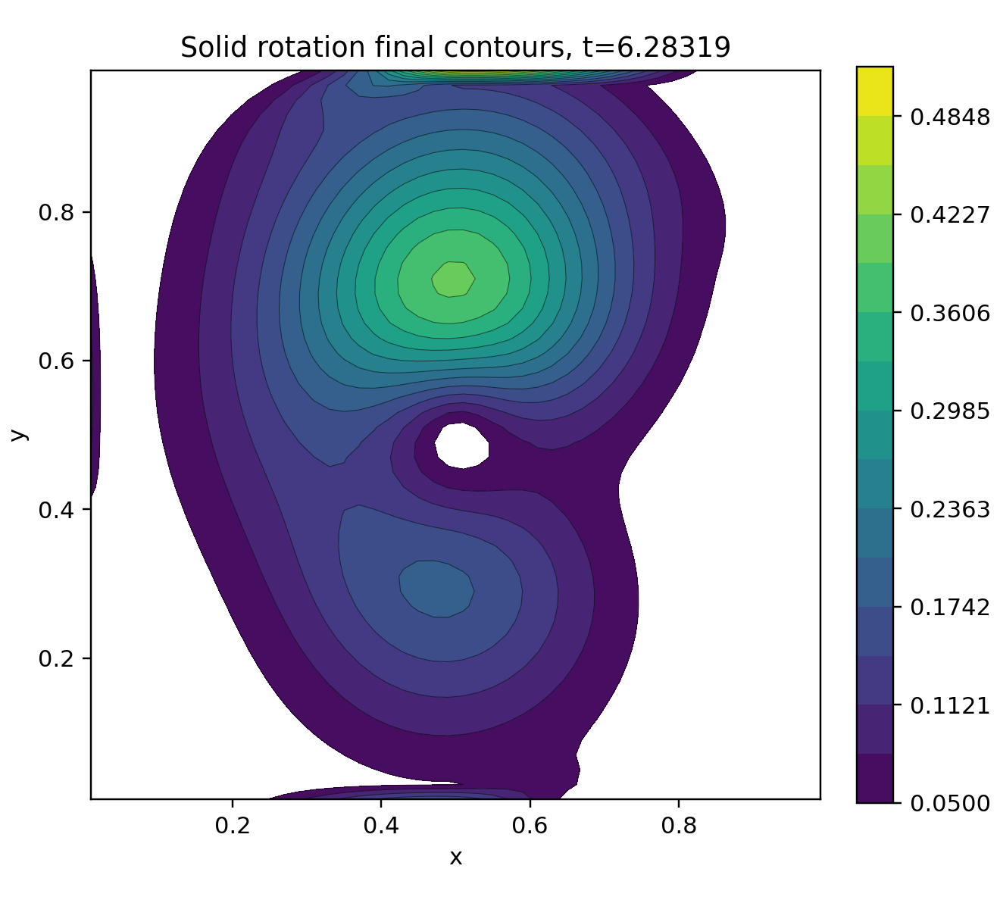
  <figcaption>图 29：四边形旋转最终等值线 N50</figcaption>
</figure>

<figure id="fig-30">
  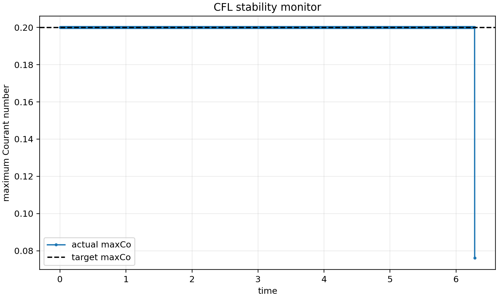
  <figcaption>图 30：四边形旋转 CFL 历史 N50</figcaption>
</figure>

$N=50$ 时最终最大值为 `0.515869`，`cycleL1AgainstInitial=1.305504`。轮廓位置基本
正确，但切口、圆盘边缘和峰值都明显变钝，如[图 28](#fig-28)和[图 29](#fig-29)
所示；这说明一阶迎风在长时间旋转中积累了较强耗散。[图 30](#fig-30)表明该现象
并非由 CFL 超限造成。

#### 四边形，N=100

<figure id="fig-31">
  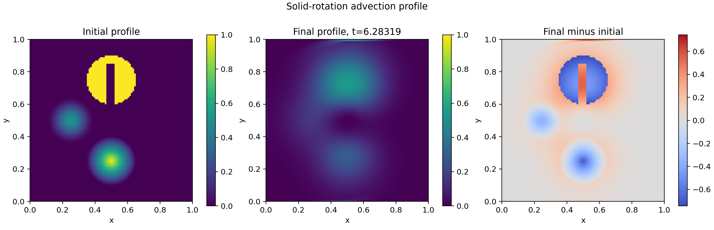
  <figcaption>图 31：四边形旋转场对比 N100</figcaption>
</figure>

<figure id="fig-32">
  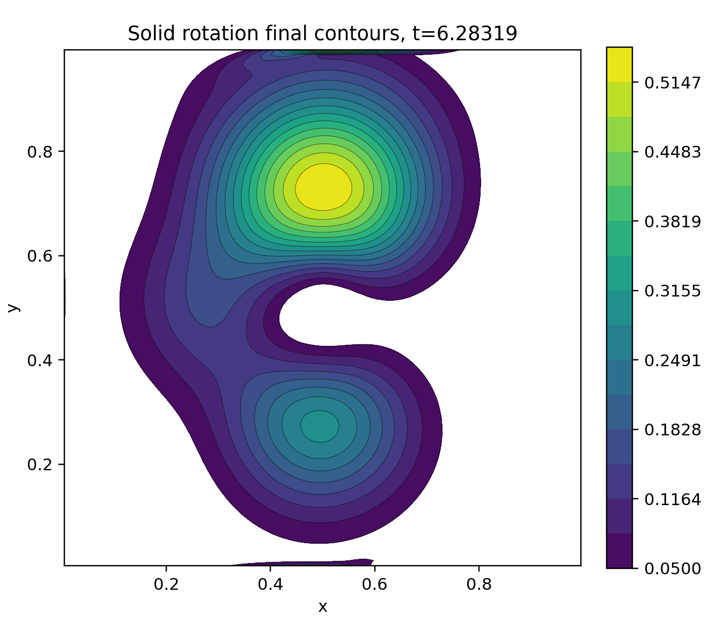
  <figcaption>图 32：四边形旋转最终等值线 N100</figcaption>
</figure>

<figure id="fig-33">
  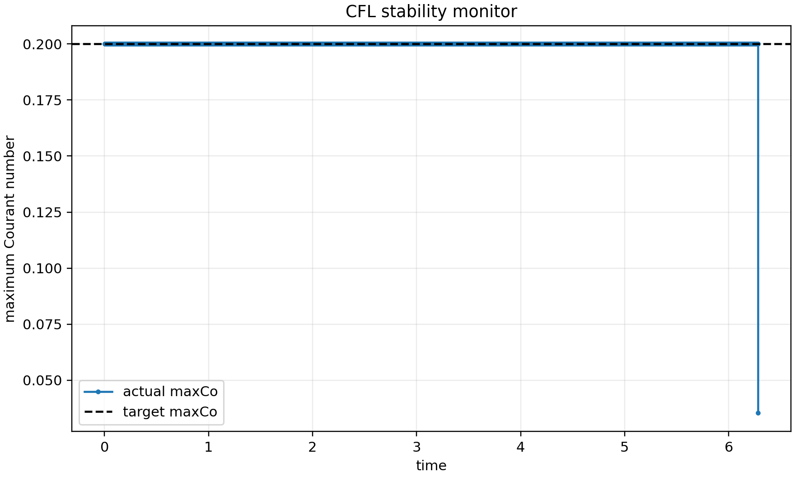
  <figcaption>图 33：四边形旋转 CFL 历史 N100</figcaption>
</figure>

$N=100$ 时最大值增加到 `0.547857`，`cycleL1AgainstInitial` 降到 `1.106538`。与
$N=50$ 相比，[图 31](#fig-31)和[图 32](#fig-32)中的边缘过渡带变窄、切口更容易
辨认；[图 33](#fig-33)中的 CFL 仍为 `0.2`，所以改善来自空间分辨率，而不是时间步
条件变化。

#### 四边形，N=200

<figure id="fig-34">
  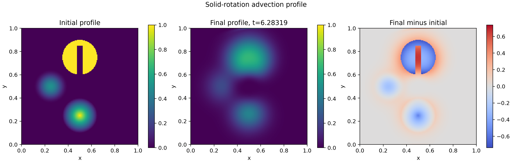
  <figcaption>图 34：四边形旋转场对比 N200</figcaption>
</figure>

<figure id="fig-35">
  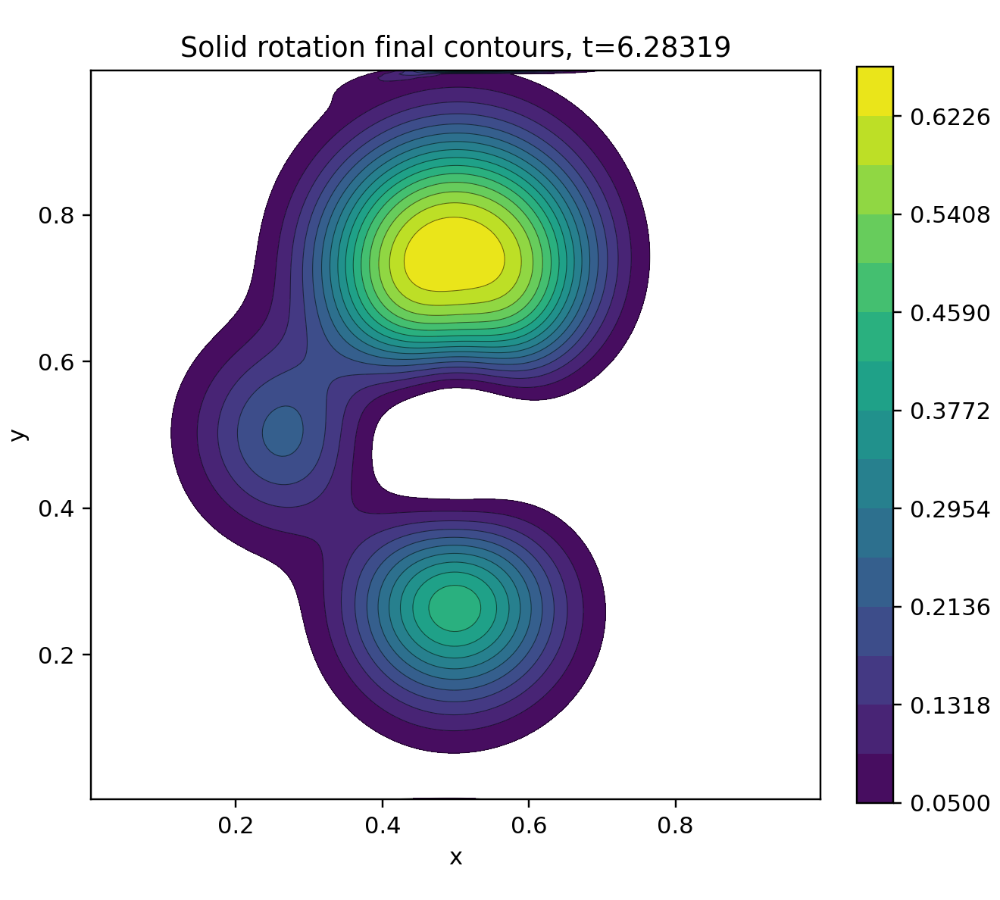
  <figcaption>图 35：四边形旋转最终等值线 N200</figcaption>
</figure>

<figure id="fig-36">
  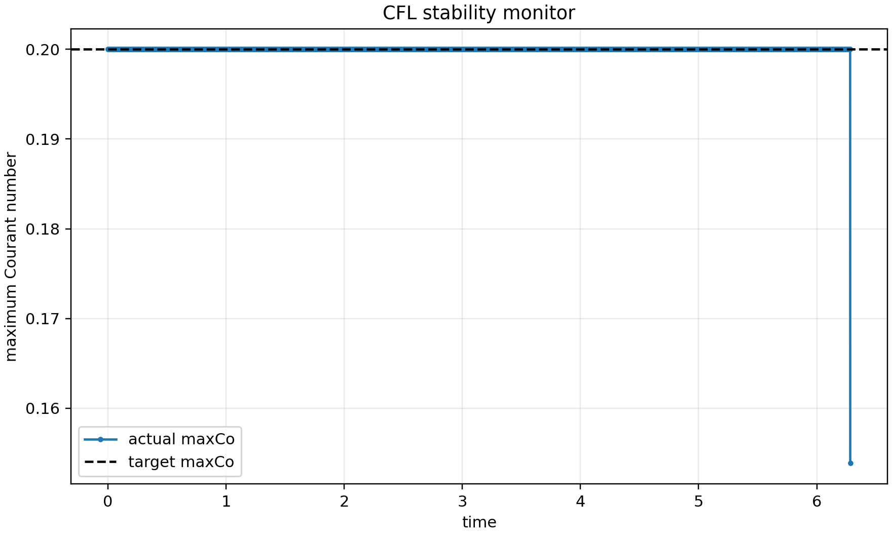
  <figcaption>图 36：四边形旋转 CFL 历史 N200</figcaption>
</figure>

$N=200$ 时最大值恢复到 `0.663497`，`cycleL1AgainstInitial=0.885152`。轮廓和峰值
明显比粗网格更清晰，如[图 34](#fig-34)和[图 35](#fig-35)所示；[图 36](#fig-36)
中的 CFL 仍保持受控。因此加密网格减小的是误差，并没有改变格式本身的耗散性质。

### 7.3 三角形网格结果

| $N$ | 单元数 | `cycleL1AgainstInitial` | 最大 CFL | 归一化质量误差 | 最终最大值 |
|---:|---:|---:|---:|---:|---:|
| 50 | 5000 | 1.075577 | 0.200 | $2.20\times10^{-13}$ | 0.576232 |
| 100 | 20000 | 0.886977 | 0.200 | $3.87\times10^{-14}$ | 0.666391 |
| 200 | 80000 | 0.685600 | 0.200 | $1.27\times10^{-13}$ | 0.727482 |

#### 三角形，N=50

<figure id="fig-37">
  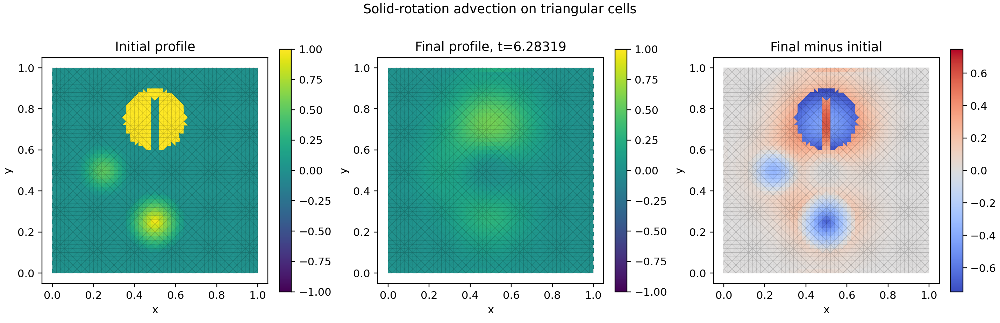
  <figcaption>图 37：三角形旋转场对比 N50</figcaption>
</figure>

<figure id="fig-38">
  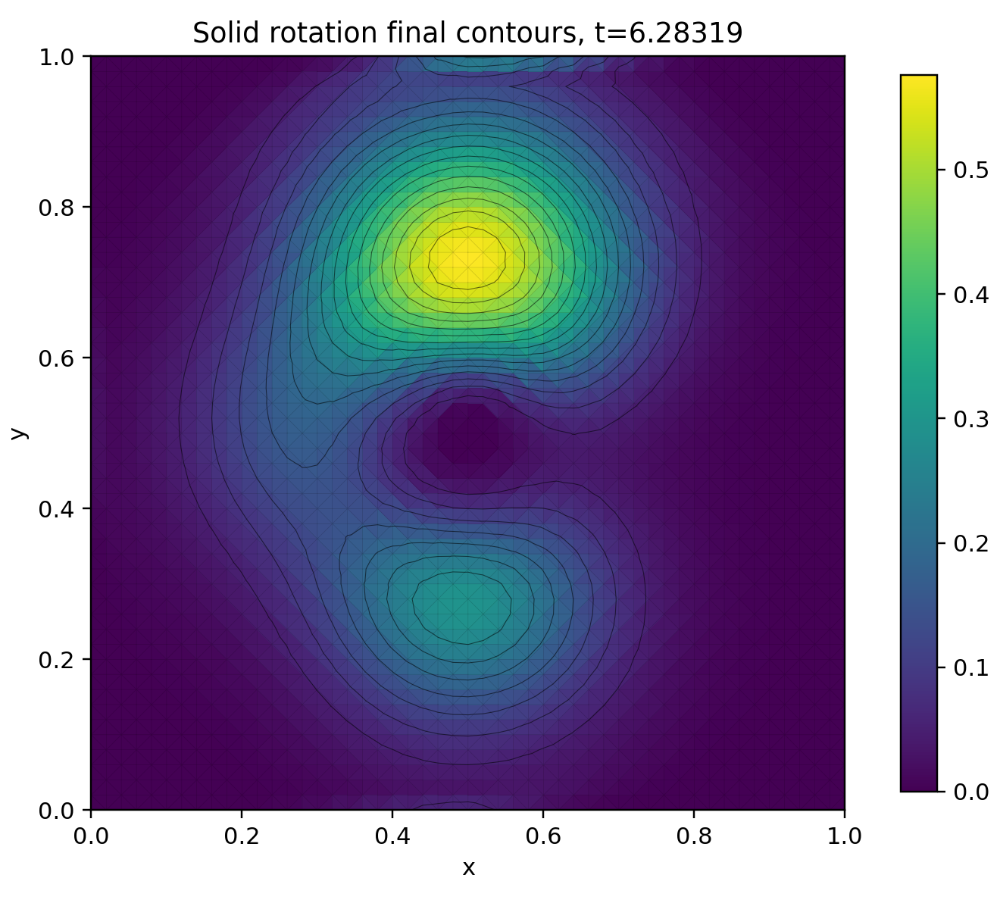
  <figcaption>图 38：三角形旋转最终等值线 N50</figcaption>
</figure>

<figure id="fig-39">
  
  <figcaption>图 39：三角形旋转 CFL 历史 N50</figcaption>
</figure>

$N=50$ 时有 `5000` 个单元，是四边形 $N=50$ 的两倍；最大值为 `0.576232`，
`cycleL1AgainstInitial=1.075577`。结果优于四边形 $N=50$，首先应解释为实际网格
更细，如[图 37](#fig-37)和[图 38](#fig-38)所示，而不是三角形拓扑自动提供了更高
精度。[图 39](#fig-39)显示 CFL 控制条件仍然一致。

#### 三角形，N=100

<figure id="fig-40">
  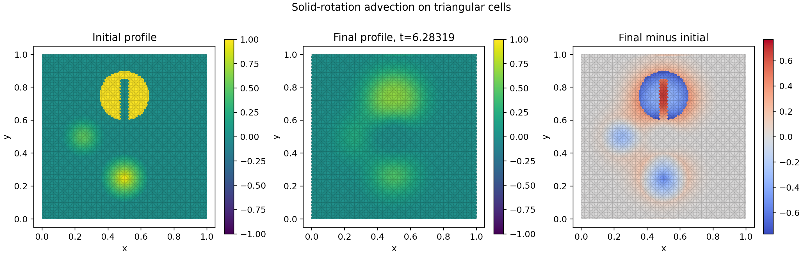
  <figcaption>图 40：三角形旋转场对比 N100</figcaption>
</figure>

<figure id="fig-41">
  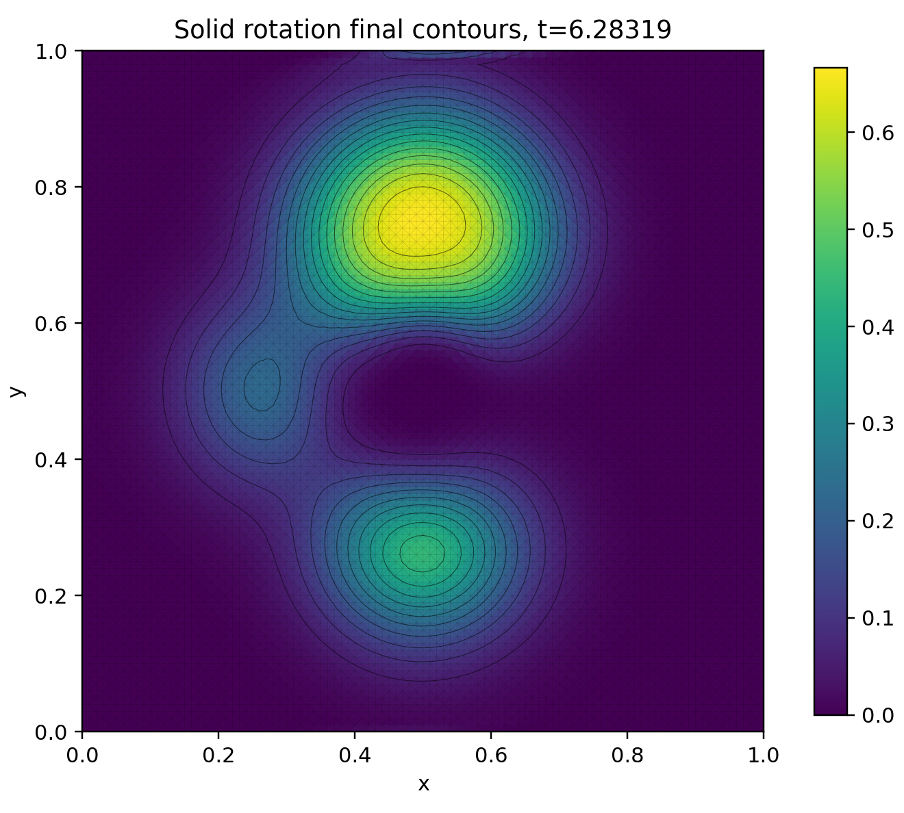
  <figcaption>图 41：三角形旋转最终等值线 N100</figcaption>
</figure>

<figure id="fig-42">
  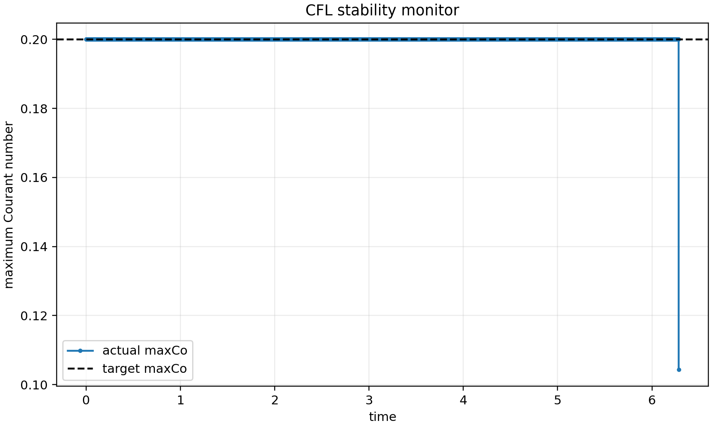
  <figcaption>图 42：三角形旋转 CFL 历史 N100</figcaption>
</figure>

$N=100$ 时最大值为 `0.666391`，`cycleL1AgainstInitial=0.886977`。等值线能够更好
保持复杂轮廓，如[图 40](#fig-40)和[图 41](#fig-41)所示；[图 42](#fig-42)中的
三角形纹理来自真实网格连接和 cell-centre 映射，而不是 CFL 波动。

#### 三角形，N=200

<figure id="fig-43">
  
  <figcaption>图 43：三角形旋转场对比 N200</figcaption>
</figure>

<figure id="fig-44">
  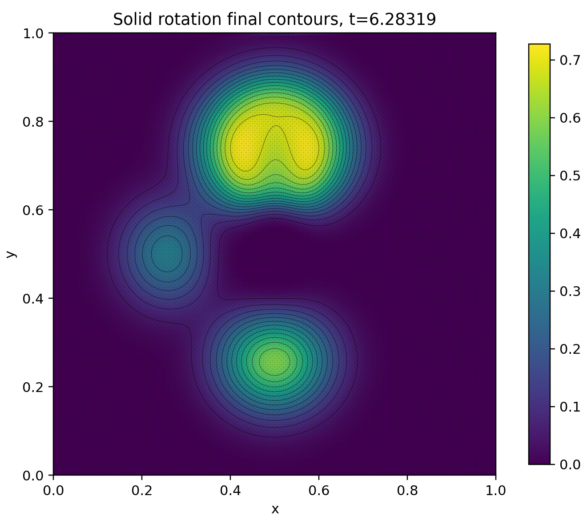
  <figcaption>图 44：三角形旋转最终等值线 N200</figcaption>
</figure>

<figure id="fig-45">
  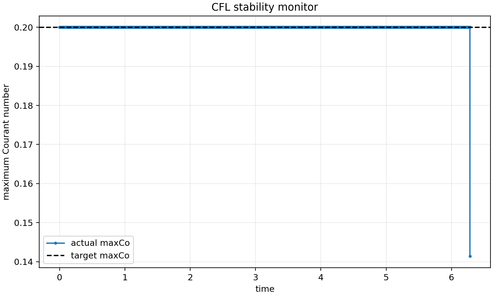
  <figcaption>图 45：三角形旋转 CFL 历史 N200</figcaption>
</figure>

$N=200$ 时最大值为 `0.727482`，`cycleL1AgainstInitial=0.685600`。这是三角形三种
分辨率中轮廓保持最好的一组，如[图 43](#fig-43)和[图 44](#fig-44)所示；[图 45](#fig-45)
中的 CFL 仍然稳定，说明加密网格有效减少了长时间推进中的空间耗散。

## 8. 跨实验比较：参数变化如何产生图像现象

本节不重复列图，而是把第 6、7 节中已经直接显示的图片和表格联系起来，解释读者
在图中看到的现象为什么会出现。

### 8.1 $N$ 与误差、振幅和轮廓

$N$ 增大意味着单元尺寸 $h$ 减小。对于固定速度、固定物理终止时间和相同目标 CFL，
网格加密会让正弦波或旋转轮廓由更多单元描述。因此图像中会同时出现：

- 误差曲线向下移动；
- 对角线剖面更接近精确解；
- 正弦波峰值衰减减小；
- 固体旋转后的切口和尖锐边界更清晰；
- `cycleL1AgainstInitial` 下降；
- 最终场最大值逐渐恢复。

四边形旋转中，$N=50\rightarrow200$ 时 `cycleL1AgainstInitial` 从 `1.305504`
降到 `0.885152`，最终最大值从 `0.515869` 增加到 `0.663497`。三角形旋转中，
对应量从 `1.075577` 降到 `0.685600`，最终最大值从 `0.576232` 增加到 `0.727482`。
这与图中轮廓变清晰、峰值恢复的现象一致。

由于这些案例的最大 CFL 都约为 `0.2`，上述变化不是时间步突然变得更稳定，而是
空间离散误差和长时间累积数值耗散减小的结果。

### 8.2 一阶迎风为什么表现为“变平、变宽”

一阶迎风按照通量方向选择上游单元值。对于光滑正弦波，它会把波峰和波谷之间的
变化过度扩散，因而在剖面图中表现为峰值降低、谷值抬高；在振幅历史图中表现为
随时间下降；在场图中表现为颜色范围收缩。

对于固体旋转，它会把切口、圆盘边缘和尖峰扩散到相邻单元，因而等值线边界变宽。
这类“变平、变宽、但不产生明显过冲”的特征是数值耗散，不是物理扩散，也不是
质量守恒失效。当前旋转案例的质量误差仍约为 $10^{-13}$ 到 $10^{-14}$。

### 8.3 线性迎风为什么误差更小但可能过冲

线性迎风使用梯度重构估计面值，比单纯采用上游单元值更能恢复光滑场的变化，所以
四边形 $N=80$ 的 $L_1$ 从 `0.326346` 降到 `0.103209`，三角形 $N=80$ 的
$L_1$ 从 `0.274644` 降到 `0.020097`。

但梯度重构也削弱了迎风格式的单调性。四边形线性迎风 $N=10$ 的最终振幅为
`1.588312`，超过初始振幅 `1`。因此观察线性迎风的图像时，必须同时看：

- 误差图：判断平均精度；
- 对角线剖面：判断波峰、波谷和相位；
- 振幅历史：判断耗散或过冲；
- 字段最大/最小值：判断是否出现非物理极值。

不能只因为误差小，就说线性迎风在所有分辨率下都比一阶迎风更可靠。

### 8.4 四边形和三角形为什么不能只按相同 $N$ 比较

在本项目中，四边形正弦波案例的单元数约为 $N^2$，三角形案例约为 $2N^2$。
因此三角形 $N=80$ 与四边形 $N=80$ 并不是相同数量的自由度，也不是完全相同的
平均单元尺寸。

三角形结果有时误差更小，可能同时来自：

- 实际单元数量更多；
- 平均单元尺度更小；
- 对流方向与局部面方向的组合不同；
- 三角形网格的局部连接方式不同。

所以报告中保留相同名义 $N$ 的结果，是为了展示实际案例的计算表现；若要进行严格的
网格族性能排名，应进一步按平均 $h$、实际单元数量、网格质量和面积加权误差重新配对。

### 8.5 CFL、误差和守恒分别说明什么

三类图不能互相替代：

| 图或指标 | 它真正回答的问题 |
|---|---|
| CFL 历史 | 时间步是否满足稳定性目标 |
| $L_1$ 误差和收敛阶 | 数值解距离解析解有多远、网格加密后误差下降多快 |
| 振幅历史 | 波形是否发生耗散或过冲 |
| 最终场和等值线 | 空间轮廓是否保持 |
| 质量误差 | 内部面通量装配是否守恒 |

例如质量误差约为 $10^{-13}$ 并不意味着局部轮廓没有耗散；本项目的固体旋转正是
“总体质量守恒，但局部峰值降低”的情况。

## 9. 收敛、监测量与守恒性检查

所有已完成的正弦波和固体旋转案例均满足：

```text
meshOK = true
solverEnded = true
solverFatal = false
maxCo = 0.2
```

正弦波案例的归一化质量误差约为 $10^{-13}$ 到 $10^{-16}$；固体旋转案例的归一化质量
误差约为 $10^{-13}$ 到 $10^{-14}$。这说明内部面通量装配满足守恒性，周期边界下的
总量误差主要处于浮点舍入误差量级。

一阶迎风结果没有出现明显的负值或超过初始最大值的非物理过冲。其主要误差表现为峰值
衰减和界面变宽，即数值耗散，而不是振荡或发散。

这些判断分别来自每个分辨率目录中的 `summary.json`、`time_history.csv`、
`field_data.csv` 和 `error_field.csv`，而不是只根据图片目测得到。

## 10. 结果讨论

本项目的结果与有限体积显式对流计算的一般认识一致：

1. 网格加密后正弦波误差下降；
2. 一阶迎风在粗网格和长时间推进中具有明显数值耗散；
3. `linearUpwind` 对光滑正弦波的误差显著小于一阶迎风，但粗网格存在过冲风险；
4. 四边形和三角形的线性迎风误差都降低，但不能只按相同 $N$ 比较格式优劣；
5. 固体旋转一圈后轮廓位置基本回到初始位置，但复杂界面发生扩散；
6. 通量守恒和 CFL 控制正常；
7. 三角形与四边形不能只按相同的 $N$ 进行公平精度比较。

需要特别说明的是，`cycleL1AgainstInitial` 随网格加密下降，说明旋转结果改善，但该量
不是严格意义上的解析解收敛阶。固体旋转案例还应在后续工作中补充不同网格尺度下的
统一误差定义和更系统的格式对比。

## 11. 局限性、风险与未完成事项

目前报告仍有以下局限：

1. 正弦波收敛研究使用了固定 CFL，而不是完全独立的空间和时间收敛分离研究；
2. 固体旋转案例主要使用一圈后的轮廓图和体积加权差异，没有像正弦波一样的独立解析解误差；
3. 三角形和四边形的相同 $N$ 对应不同单元数量，直接比较会受到网格尺度差异影响；
4. 当前重点是教学型显式求解器，没有覆盖并行计算、复杂边界和工程船舶几何；
5. `linearUpwind` 在光滑正弦波上误差较小，但四边形粗网格已经出现振幅过冲；
6. 当前复杂轮廓旋转只完成一阶迎风，尚未完成 `linearUpwind` 的旋转对比。

## 12. 结论

本项目已经完成第一题的主要数值实现和验证流程。学生版
`explicitAdvectionFoamStudent` 能够在 OpenFOAM 14 下读取速度场和标量场，计算面通量，
根据 CFL 自动调整时间步，调用显式对流散度并完成前向 Euler 时间推进。

正弦波测试表明，四边形和三角形网格都能够得到随网格加密而下降的误差；线性迎风扩展
在光滑正弦波上比一阶迎风具有更小的数值误差。固体旋转测试表明，复杂轮廓能够完成
一整圈旋转，质量守恒误差保持在浮点误差量级，但一阶迎风带来的数值耗散仍然明显。

因此，当前求解器可以认为已经完成了第一题的教学型实现和基本验证。若作为正式科研报告，
下一步应补充统一网格尺度比较、时间收敛分离、复杂轮廓的高阶格式测试和更严格的误差
分析。

## 13. 结果与报告完整性检查

| 检查项 | 当前状态 | 证据 |
|---|---|---|
| 问题定义和研究目标清楚 | 已完成 | 第 1 节、原始题目 |
| 假设、范围和验收标准明确 | 已完成 | 第 2 节 |
| 数学模型和数值方法可追溯 | 已完成 | 第 3 节、有限体积推导 PDF、UDF 源码 |
| 几何、网格和边界条件有说明 | 已完成 | 第 4-5 节、OpenFOAM case |
| 关键结果有表格和图像 | 已完成 | 第 6-8 节、`data/`、`figures/` |
| 关键结论有数据来源 | 已完成 | `report/01/evidence_index.md` |
| 局限性和风险已说明 | 已完成 | 第 11 节、`docs/bug_log.md` |
| 未解决阻塞错误已处理 | 已完成 | `summary.json` 中 `solverFatal=false` |
| 报告是否等同于正式科研论文 | 否 | 当前为教学型工程验证报告 |

## 14. 复现实验命令

从项目根目录执行：

```bash
cd /home/a776/workdocuments/上交船舶/slover/student_project
source /opt/openfoam14/etc/bashrc
```

编译求解器：

```bash
sh scripts/build_student_solver.sh
```

运行第一题正弦波四边形一阶迎风：

```bash
python3 scripts/run_study.py \
    --config scripts/configs/01_sine_wave_quad_upwind.json \
    --resolutions 10,20,40,80 \
    --overwrite
```

运行第一题正弦波三角形一阶迎风：

```bash
python3 scripts/run_study.py \
    --config scripts/configs/03_sine_wave_tri_upwind.json \
    --resolutions 10,20,40,80 \
    --overwrite
```

重新收集和分析某一组网格研究：

```bash
python3 scripts/collect_results.py \
    --config scripts/configs/01_sine_wave_quad_upwind.json \
    --resolutions 10,20,40,80

python3 scripts/analyze_study.py \
    --config scripts/configs/01_sine_wave_quad_upwind.json

python3 scripts/plot_study.py \
    --config scripts/configs/01_sine_wave_quad_upwind.json
```

## 15. 证据索引

| 证据 | 路径 |
|---|---|
| 原始第一题 | `../../pdf/01/first_advection_problem.pdf` |
| 有限体积与显式求解器推导 | `../../pdf/01/advection_fvm_explicit_solver_derivation.pdf` |
| 求解器源码 | `../../UDF/solver/explicitAdvectionFoamStudent/explicitAdvectionFoamStudent.C` |
| 求解器开发说明 | `../../UDF/README.md` |
| 四边形正弦波配置 | `../../scripts/configs/01_sine_wave_quad_upwind.json` |
| 三角形正弦波配置 | `../../scripts/configs/03_sine_wave_tri_upwind.json` |
| 四边形误差表 | `../../data/analysis/01_sine_wave_quad/convergence_summary.csv` |
| 三角形误差表 | `../../data/analysis/03_sine_wave_tri_upwind/convergence_summary.csv` |
| 四边形分析说明 | `../../data/analysis/01_sine_wave_quad/analysis.md` |
| 三角形分析说明 | `../../data/analysis/03_sine_wave_tri_upwind/analysis.md` |
| 运行 Bug 记录 | `../../docs/bug_log.md` |
| 四边形旋转结果 | `../../data/cases/04_solid_rotation_quad_upwind/` |
| 三角形旋转结果 | `../../data/cases/04_solid_rotation_tri_upwind/` |
