# 第二题：二维扩散方程有限体积显式求解器验证报告

**项目目录：** `/home/a776/workdocuments/上交船舶/slover/student_project`
**题目来源：** `../../pdf/training_examples_incomp.pdf`
**自包含题面：** `../../pdf/tex/第二题_二维扩散方程_自包含题目.tex`
**理论推导：** `../../pdf/tex/diffusion_fvm_explicit_solver_derivation.tex`
**报告日期：** 2026-08-26
**求解器：** `explicitDiffusionFoamStudent`
**OpenFOAM 版本：** OpenFOAM 14

## 目录

- [研究概况](#研究概况)
- [1. 问题定义与研究目标](#1-问题定义与研究目标)
- [扩展实验矩阵](#扩展实验矩阵)
- [2. 假设、范围与验收标准](#2-假设范围与验收标准)
  - [2.1 基本假设](#21-基本假设)
  - [2.2 本报告范围](#22-本报告范围)
  - [2.3 验收标准](#23-验收标准)
- [3. 数学离散与求解器实现](#3-数学离散与求解器实现)
  - [3.1 有限体积半离散形式](#31-有限体积半离散形式)
  - [3.2 空间离散](#32-空间离散)
  - [3.3 时间离散](#33-时间离散)
  - [3.4 显式扩散时间步](#34-显式扩散时间步)
  - [3.5 误差定义与精确解](#35-误差定义与精确解)
- [4. 几何区域、初始条件和边界条件](#4-几何区域初始条件和边界条件)
  - [4.1 四边形网格算例](#41-四边形网格算例)
  - [4.2 三角形网格算例](#42-三角形网格算例)
  - [4.3 原题歧义与工程化约定](#43-原题歧义与工程化约定)
- [5. 软件、网格和算例组织](#5-软件网格和算例组织)
- [6. 四边形网格结果与收敛性](#6-四边形网格结果与收敛性)
  - [6.1 四边形网格汇总](#61-四边形网格汇总)
  - [6.2 四边形网格图像](#62-四边形网格图像)
- [6.3 四边形 Gaussian 算例](#63-四边形-gaussian-算例)
- [7. 三角形网格结果与收敛性](#7-三角形网格结果与收敛性)
  - [7.1 三角形网格汇总](#71-三角形网格汇总)
  - [7.2 三角形网格图像](#72-三角形网格图像)
- [7.3 三角形 Gaussian 算例](#73-三角形-gaussian-算例)
- [8. 跨实验比较：参数变化如何产生图像现象](#8-跨实验比较参数变化如何产生图像现象)
  - [$N$ 与误差、峰值和扩散宽度](#n-与误差峰值和扩散宽度)
  - [四边形和三角形为什么不能只按相同 $N$ 比较](#四边形和三角形为什么不能只按相同-n-比较)
  - [为什么扩散会把间断初值抹平](#为什么扩散会把间断初值抹平)
  - [守恒性与稳定性分别说明什么](#守恒性与稳定性分别说明什么)
- [9. 结果讨论](#9-结果讨论)
- [10. 局限性、风险与未完成事项](#10-局限性风险与未完成事项)
- [11. 结论](#11-结论)
- [12. 结果与报告完整性检查](#12-结果与报告完整性检查)
- [13. 复现实验命令](#13-复现实验命令)
- [14. 证据索引](#14-证据索引)

## 研究概况

| 项目 | 内容 |
|---|---|
| 研究类型 | 显式有限体积扩散求解器开发与数值验证 |
| 研究对象 | 二维扩散方程，间断初值和 Gaussian 初值算例 |
| 计算平台 | OpenFOAM 14 |
| 基准算例 | 均匀四边形网格、均匀三角形网格 |
| 空间格式 | `Gauss linear corrected` |
| 主要考察量 | 误差、收敛阶、守恒性、边界处理和稳定性 |

本报告中的参数来自各组实验配置文件，具体计算设置以生成后的 OpenFOAM case
字典为准；计算结果来自运行日志、逐网格汇总数据和后处理图像。所有关键结论都在
相应章节中给出数据或文件依据。

## 1. 问题定义与研究目标

本报告针对第二题二维扩散方程的两个算例，验证学生版 OpenFOAM 显式有限体积求解器的
数学实现、网格适配能力、空间离散格式、时间推进和后处理流程。

控制方程为

$$
\frac{\partial \phi}{\partial t}
- \nabla\cdot(\mu\nabla \phi)=0.
$$

其中，$\phi(x,y,t)$ 为扩散场，$\mu$ 为扩散系数。本项目使用标量场 `phi` 表示未知量。

原题第一个算例是一个方块指示函数在二维区域中的扩散。原题对边界和符号写法存在歧义，
因此本项目采用如下工程化解释：

- 计算域取 `[-5,5] \times [-5,5]`；
- 扩散系数取 $\mu=1$；
- 边界取齐次 Neumann 条件；
- 间断初值定义为中心方块内 $\phi=1$，外部 $\phi=0$。

本项目除完成原题要求外，还增加了：

- 四边形和三角形网格的对比；
- 多个网格分辨率下的自动化运行、误差收集和绘图；
- 四边形和三角形网格的收敛阶对比。
- 光滑 Gaussian 精确解算例的边界条件、误差和收敛性验证。

原题要求与本项目交付内容的对应关系如下：

| 原题要求 | 本项目对应结果 | 报告位置 |
|---|---|---|
| 间断初值扩散 | 四边形、三角形网格均完成 | 第 6、7 节 |
| 给出数值误差 | 各分辨率均给出归一化误差 | 第 6、7 节结果表 |
| 给出网格收敛阶 | 四边形、三角形均给出观察收敛阶 | 第 6、7 节结果表和收敛阶图 |
| 完成求解器开发与验证 | OpenFOAM 14 求解器、自动化脚本和数据后处理 | 第 3、5、13 节 |

## 扩展实验矩阵

| 实验组 | 物理问题 | 网格 | 空间格式 | 分辨率 | 主要输出 |
|---|---|---|---|---|---|
| 01 | 间断初值扩散 | 四边形 | `Gauss linear corrected` | $N=10,20,40,80$ | $L_1$、$L_2$、$L_\infty$、收敛阶 |
| 02 | 间断初值扩散 | 三角形 | `Gauss linear corrected` | $N=10,20,40,80$ | $L_1$、$L_2$、$L_\infty$、收敛阶 |
| 03 | Gaussian 扩散 | 四边形 | `Gauss linear corrected` | $N=10,20,40,80$ | 精确解误差、场对比、中心剖面 |
| 04 | Gaussian 扩散 | 三角形 | `Gauss linear corrected` | $N=10,20,40,80$ | 精确解误差、场对比、中心剖面 |

## 2. 假设、范围与验收标准

### 2.1 基本假设

- 扩散系数 $\mu$ 为常数；
- 不求解对流项和源项；
- 初值为中心方块指示函数；
- 边界条件为齐次 Neumann；
- 时间推进采用显式前向 Euler；
- 所有基准案例使用稳定扩散时间步控制。

### 2.2 本报告范围

本报告只覆盖第二题第一个算例，不覆盖第二题中其他可能的变体，也不覆盖其他题目。

### 2.3 验收标准

| 验收项 | 标准 |
|---|---|
| 求解器编译 | 生成 `build/02_diffusion_equation/bin/explicitDiffusionFoamStudent` |
| 网格检查 | `checkMesh` 无致命错误并报告 `Mesh OK` |
| 时间推进 | 正确到达目标终止时间 `t=0.2` |
| 稳定性 | 运行中无 `FOAM FATAL ERROR` |
| 收敛性 | 误差随网格加密单调下降，观察收敛阶稳定在合理范围 |
| 守恒性 | 归一化质量误差保持在数值舍入误差量级 |

## 3. 数学离散与求解器实现

本节的有限体积推导、显式空间离散、前向 Euler 时间推进和稳定时间步控制，
均以项目中的理论文档 `../../pdf/tex/diffusion_fvm_explicit_solver_derivation.tex`
为主要推导依据。报告将该文档中的数学步骤与实际求解器、案例字典和运行结果连接起来。

### 3.1 有限体积半离散形式

对任意控制体 $\Omega_c$ 积分：

$$
\int_{\Omega_c}\frac{\partial \phi}{\partial t}\,\mathrm d\Omega
\;-\;
\int_{\Omega_c}\nabla\cdot(\mu\nabla\phi)\,\mathrm d\Omega
=0.
$$

应用高斯定理后得到：

$$
V_c\frac{\mathrm d\phi_c}{\mathrm dt}
- \sum_{f\in\partial\Omega_c}\mu_f (\nabla\phi)_f\cdot\mathbf S_f=0.
$$

### 3.2 空间离散

本项目使用 OpenFOAM 的离散接口：

```cpp
fvc::laplacian(mu, phi)
```

对应的 fvSchemes 设置为：

```foam
laplacianSchemes
{
    laplacian(mu,phi) Gauss linear corrected;
}
```

因此空间离散的核心是面通量的有限体积重构与拉普拉斯项离散，而不是手工拼接
每一个邻接单元的差分格式。

### 3.3 时间离散

采用前向 Euler 格式：

$$
\phi_c^{n+1}
=
\phi_c^n
\;+\;
\Delta t \, R_c^n,
$$

其中 $R_c^n$ 为扩散残差。

### 3.4 显式扩散时间步

程序使用显式扩散稳定系数 `diffusionCo` 控制时间步，并额外受 `maxDeltaT` 限制。
在本项目中：

```text
diffusionCo = 0.45
maxDeltaT   = 0.001
```

### 3.5 误差定义与精确解

本项目按单元体积加权计算归一化误差：

$$
L_1 = \frac{\sum_c V_c|\phi_c-\phi_c^{\mathrm{ex}}|}
{\sum_c V_c|\phi_c^{\mathrm{ex}}|},
\quad
L_2 = \sqrt{
\frac{\sum_c V_c(\phi_c-\phi_c^{\mathrm{ex}})^2}
{\sum_c V_c(\phi_c^{\mathrm{ex}})^2}
},
\quad
L_\infty = \frac{\max_c|\phi_c-\phi_c^{\mathrm{ex}}|}
{\max_c|\phi_c^{\mathrm{ex}}|}.
$$

对于该间断扩散算例，后处理使用误差函数形式的解析解。对 $\mu=1$ 的情形，
可写成

$$
\phi(x,y,t)
=
\frac14
\left[
\operatorname{erf}\left(\frac{1-x}{2\sqrt{t}}\right)
-\operatorname{erf}\left(\frac{-1-x}{2\sqrt{t}}\right)
\right]
\left[
\operatorname{erf}\left(\frac{1-y}{2\sqrt{t}}\right)
-\operatorname{erf}\left(\frac{-1-y}{2\sqrt{t}}\right)
\right].
$$

第二个算例采用光滑 Gaussian 初值：

$$
\phi(x,y,0)=\exp\left[-\mu(x^2+y^2)\right].
$$

对应的解析解为

$$
\phi(x,y,t)=
\frac{1}{1+4\mu t}
\exp\left[
-\frac{\mu(x^2+y^2)}{1+4\mu t}
\right].
$$

本报告中取 $\mu=1$，并在 $t=0.2$ 比较数值解与解析解。Gaussian 算例的四个外边界
使用随时间变化的 Dirichlet 条件，即边界上的 $\phi$ 取解析解在当前时间的值。
这样可以减少有限计算域边界对解析 Gaussian 解的影响。

## 4. 几何区域、初始条件和边界条件

### 4.1 四边形网格算例

四边形案例通过 `blockMesh` 生成，计算域为 `[-5,5]^2`。
初值写入 `0.orig/phi`，边界条件写入 `zeroGradient`。

对应配置：

- `scripts/configs/02_diffusion_equation/01_discontinuous_quad.json`
- `cases/02_diffusion_equation/01_discontinuous_quad/Nxx/system/blockMeshDict`
- `cases/02_diffusion_equation/01_discontinuous_quad/Nxx/0.orig/phi`

### 4.2 三角形网格算例

三角形案例通过 Gmsh 生成三角形棱柱网格，再经 `gmshToFoam` 转入 OpenFOAM。
它与四边形案例使用相同物理问题、相同域、相同初值和相同边界条件。

对应配置：

- `scripts/configs/02_diffusion_equation/02_discontinuous_tri.json`
- `scripts/common/gmsh_tri_mesh.py`
- `cases/02_diffusion_equation/02_discontinuous_tri/Nxx/mesh/mesh.msh`

### 4.3 原题歧义与工程化约定

原题第一个算例有两个实际歧义：

1. Neumann 边界没有明确是齐次还是非齐次；
2. 间断区域的几何描述需要用更明确的方块指示函数来实现。

本项目统一采用：

$$
\frac{\partial\phi}{\partial n}=0
$$

作为边界条件，并将初值解释为中心方块指示函数。

### 4.4 Gaussian 算例的边界与初值

第二个算例使用配置文件：

- `../../scripts/configs/02_diffusion_equation/03_gaussian_quad.json`
- `../../scripts/configs/02_diffusion_equation/04_gaussian_tri.json`

两组案例均取计算域 `[-5,5] \times [-5,5]`、扩散系数 $\mu=1$ 和终止时间
$t=0.2$。初始场为光滑 Gaussian 函数：

$$
\phi(x,y,0)=\exp\left[-\mu(x^2+y^2)\right].
$$

其解析解为：

$$
\phi(x,y,t)=
\frac{1}{1+4\mu t}
\exp\left[-\frac{\mu(x^2+y^2)}{1+4\mu t}\right].
$$

Gaussian 算例的四个外边界使用随时间变化的 `codedFixedValue` Dirichlet 条件，
边界值取上述解析解在当前时间的值。与第一个间断算例不同，该算例不使用
`zeroGradient`，也不使用周期边界。这样可以使有限计算域边界与用于误差计算的
Gaussian 解析解保持一致。

## 5. 软件、网格和算例组织

求解器源代码、编译产物、案例目录、数据目录和图片目录的组织方式如下：

| 目录 | 作用 |
|---|---|
| `UDF/solver/02_diffusion_equation/explicitDiffusionFoamStudent/` | 学生版扩散求解器源码 |
| `build/02_diffusion_equation/bin/` | 求解器可执行文件输出目录 |
| `cases/02_diffusion_equation/01_discontinuous_quad/` | 四边形扩散案例族 |
| `cases/02_diffusion_equation/02_discontinuous_tri/` | 三角形扩散案例族 |
| `scripts/configs/02_diffusion_equation/` | 第二题 JSON 配置入口 |
| `data/02_diffusion_equation/` | 结果数据和收敛汇总 |
| `figures/02_diffusion_equation/` | 单案例图与收敛图 |

本项目的自动化流程由 `scripts/run_study.py` 统一驱动，准备、运行、后处理和汇总均由
同一套配置入口控制。换言之，研究对象、网格类型、网格分辨率、边界条件、时间控制和
输出目录都由 JSON 配置文件统一描述，后续脚本只负责读取配置并完成案例派生。

## 6. 四边形网格结果与收敛性

### 6.1 四边形网格汇总

四边形网格实验的汇总结果如下：

| N | cells | $L_1$ | $L_2$ | $L_\infty$ | $L_1$ order | diffusionCo | final range |
|---:|---:|---:|---:|---:|---:|---:|---:|
| 10 | 100 | 2.10899769e-01 | 1.72401247e-01 | 1.53398257e-01 | - | 0.450000 | 6.95532413e-01 |
| 20 | 400 | 5.75007378e-02 | 4.81910462e-02 | 3.72870655e-02 | 1.874905 | 0.450000 | 7.58195095e-01 |
| 40 | 1600 | 1.14966300e-02 | 9.71420627e-03 | 8.87081636e-03 | 2.322369 | 0.450000 | 7.78449597e-01 |
| 80 | 6400 | 2.19619062e-03 | 1.83220745e-03 | 1.67248440e-03 | 2.388136 | 0.450000 | 7.83335417e-01 |

### 6.2 四边形网格图像

四边形网格的收敛图与全分辨率场对比图分别见[图 1](#fig-diff-quad-1)、
[图 2](#fig-diff-quad-2)和[图 3](#fig-diff-quad-3)。

<figure id="fig-diff-quad-1">
  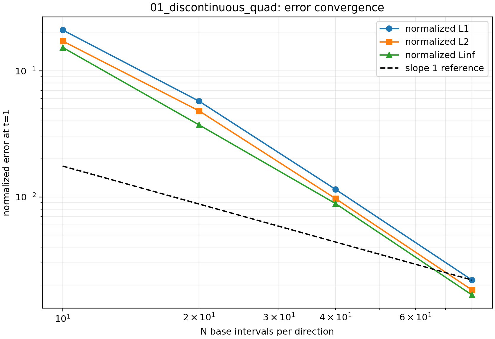
  <figcaption>图 1：四边形扩散误差收敛曲线</figcaption>
</figure>

该图展示 $N=10,20,40,80$ 时归一化误差随网格尺度变化的关系；横坐标为名义网格尺度，
纵坐标为误差，数据来源为 `data/02_diffusion_equation/analysis/01_discontinuous_quad/convergence_summary.csv`。
如[图 1](#fig-diff-quad-1)所示，误差随网格加密整体下降。

<figure id="fig-diff-quad-2">
  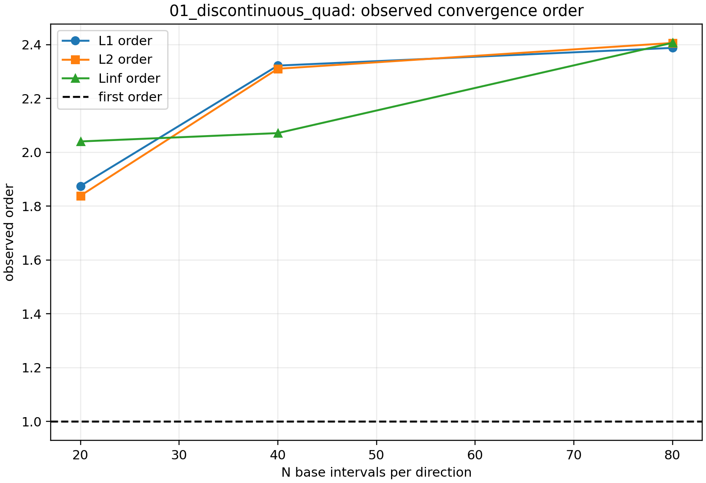
  <figcaption>图 2：四边形扩散收敛阶</figcaption>
</figure>

该图展示由相邻网格误差计算得到的 $L_1$、$L_2$ 和 $L_\infty$ 观察收敛阶，不是
求解器残差曲线。它回答的是网格加密后误差下降速度是否接近理论阶数；[图 2](#fig-diff-quad-2)
显示了各相邻网格之间的观察阶变化。

<figure id="fig-diff-quad-3">
  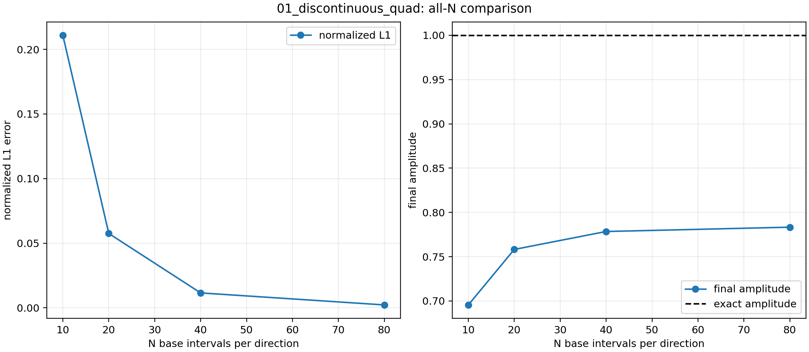
  <figcaption>图 3：四边形扩散全分辨率场对比</figcaption>
</figure>

全分辨率场对比图（[图 3](#fig-diff-quad-3)）显示，随着 $N$ 增大，间断附近的扩散层更窄，
峰值更接近解析解，说明网格加密显著减小了数值扩散。

四边形网格下的单案例诊断图位于：

- `../../figures/02_diffusion_equation/cases/01_discontinuous_quad/N80/field_comparison.png`
- `../../figures/02_diffusion_equation/cases/01_discontinuous_quad/N80/midline_profile.png`
- `../../figures/02_diffusion_equation/cases/01_discontinuous_quad/N80/diffusion_step_history.png`

### 6.3 四边形 Gaussian 算例

四边形 Gaussian 算例使用 `03_gaussian_quad` 配置，网格由 `blockMesh` 生成，
空间离散仍采用 `Gauss linear corrected`。在 $t=0.2$ 的误差结果如下：

| N | cells | $L_1$ | $L_2$ | $L_\infty$ | $L_1$ order |
|---:|---:|---:|---:|---:|---:|
| 10 | 100 | 8.08607416e-02 | 6.22248177e-02 | 5.21787953e-02 | - |
| 20 | 400 | 2.02429482e-02 | 1.93250425e-02 | 2.68987648e-02 | 1.998020 |
| 40 | 1600 | 4.58095316e-03 | 4.30523118e-03 | 6.59251764e-03 | 2.143700 |
| 80 | 6400 | 7.41846218e-04 | 6.43224181e-04 | 9.39301851e-04 | 2.626456 |

如表所示，四边形网格加密后三个误差范数均持续下降。$L_1$ 观察收敛阶约为
`2.00`、`2.14` 和 `2.63`。前两个网格区间已经体现出接近二阶的趋势，最后一个
区间的较高数值应理解为有限分辨率下的局部超收敛现象，不能据此宣称格式具有三阶精度。

图 7 展示四边形 Gaussian 数值场与解析场的对比，图 8 展示中心剖面，
图 9 展示时间推进历史。随着 $N$ 增大，数值 Gaussian 轮廓与解析解逐渐重合，
误差区域逐渐减小。

<figure id="fig-diff-gaussian-quad-field">
  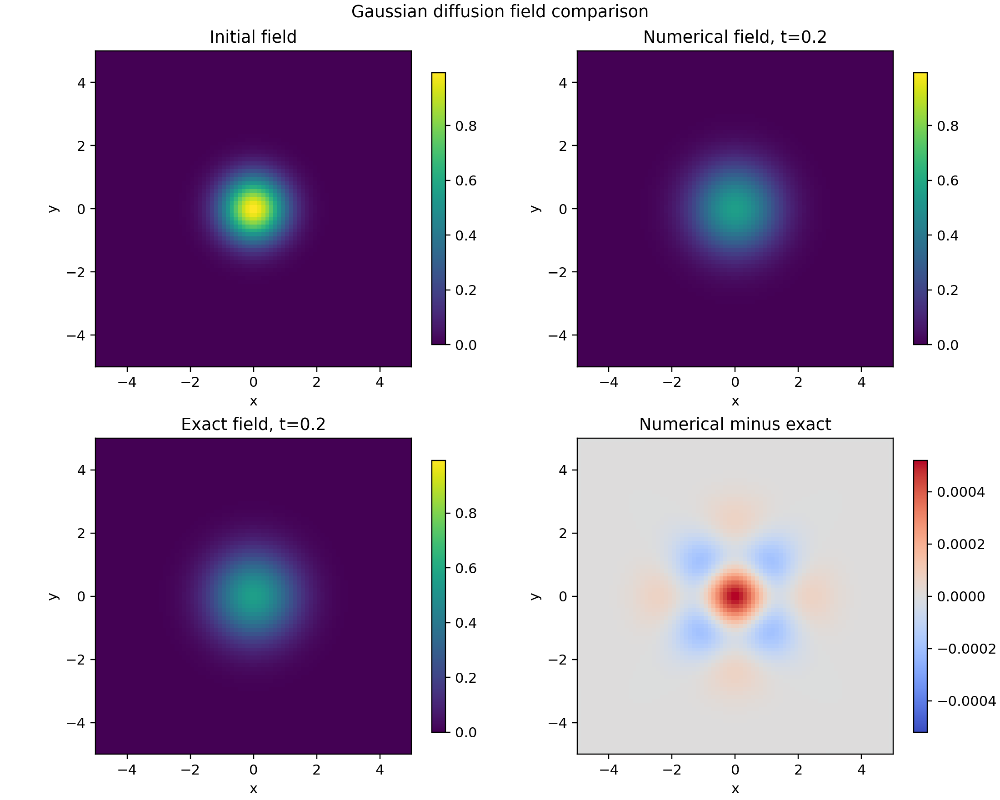
  <figcaption>图 7：四边形 Gaussian 算例 N=80 时的数值场与解析场对比</figcaption>
</figure>

<figure id="fig-diff-gaussian-quad-profile">
  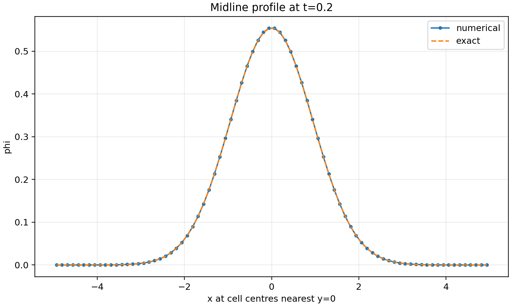
  <figcaption>图 8：四边形 Gaussian 算例 N=80 的中心剖面比较</figcaption>
</figure>

<figure id="fig-diff-gaussian-quad-history">
  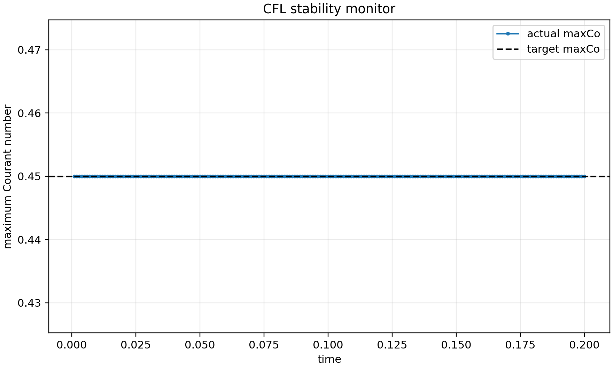
  <figcaption>图 9：四边形 Gaussian 算例 N=80 的时间推进历史</figcaption>
</figure>

各分辨率的四边形 Gaussian 结果分别保存在：

- 数据：`../../data/02_diffusion_equation/cases/03_gaussian_quad/Nxx/`
- 图片：`../../figures/02_diffusion_equation/cases/03_gaussian_quad/Nxx/`
- 配置：`../../scripts/configs/02_diffusion_equation/03_gaussian_quad.json`

## 7. 三角形网格结果与收敛性

### 7.1 三角形网格汇总

三角形网格实验的汇总结果如下：

| N | cells | $L_1$ | $L_2$ | $L_\infty$ | $L_1$ order | diffusionCo | final range |
|---:|---:|---:|---:|---:|---:|---:|---:|
| 10 | 200 | 1.37977266e-01 | 1.19901878e-01 | 9.25104202e-02 | - | 0.450000 | 3.82298406e-01 |
| 20 | 800 | 3.15624166e-02 | 2.80382358e-02 | 2.64574778e-02 | 2.128151 | 0.450000 | 3.89727852e-01 |
| 40 | 3200 | 6.10438198e-03 | 5.42097325e-03 | 5.22632423e-03 | 2.370291 | 0.450000 | 3.91721599e-01 |
| 80 | 12800 | 1.38536015e-03 | 1.22636955e-03 | 1.16943860e-03 | 2.139584 | 0.450000 | 3.92375518e-01 |

### 7.2 三角形网格图像

三角形网格的收敛图与全分辨率场对比图分别见[图 4](#fig-diff-tri-1)、
[图 5](#fig-diff-tri-2)和[图 6](#fig-diff-tri-3)。

<figure id="fig-diff-tri-1">
  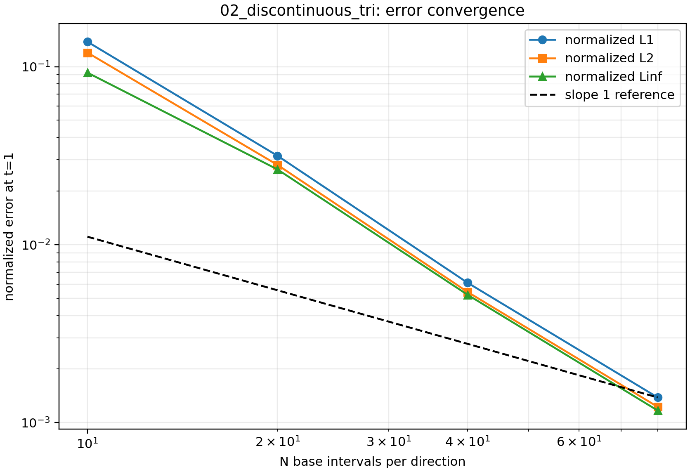
  <figcaption>图 4：三角形扩散误差收敛曲线</figcaption>
</figure>

该图使用三角形网格的真实单元体积进行误差加权；横坐标为名义网格尺度，纵坐标为归一化
误差。三角形网格的误差随分辨率提高而持续下降，如[图 4](#fig-diff-tri-1)所示。

<figure id="fig-diff-tri-2">
  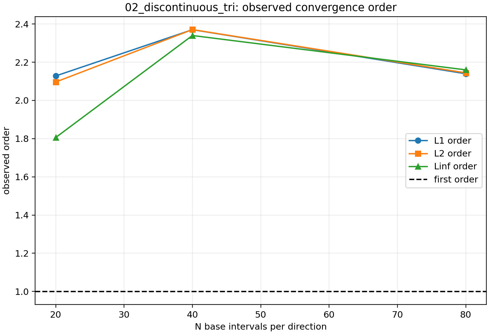
  <figcaption>图 5：三角形扩散收敛阶</figcaption>
</figure>

三角形的 $L_1$ 观察收敛阶与四边形相近，说明当前扩散求解器对两类网格都具有稳定的
网格加密响应；[图 5](#fig-diff-tri-2)给出了各分辨率间的观察阶变化。

<figure id="fig-diff-tri-3">
  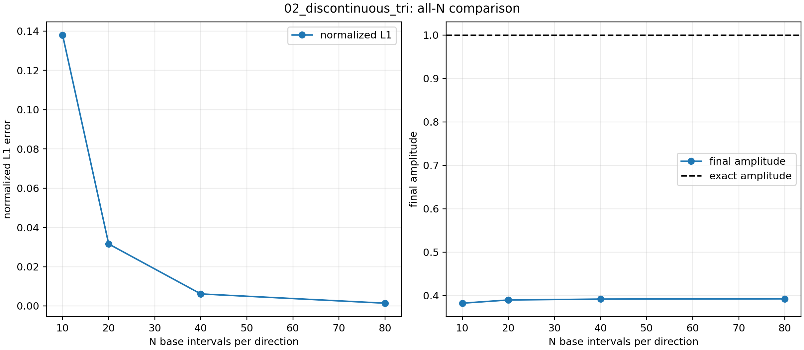
  <figcaption>图 6：三角形扩散全分辨率场对比</figcaption>
</figure>

全分辨率场对比图（[图 6](#fig-diff-tri-3)）表明，随着单元数增加，间断扩散后的过渡带
逐渐变窄，最终峰值更接近解析解。三角形网格图像中的纹理来自真实网格连接关系，
不是后处理伪影。

三角形网格下的单案例诊断图位于：

- `../../figures/02_diffusion_equation/cases/02_discontinuous_tri/N80/field_comparison.png`
- `../../figures/02_diffusion_equation/cases/02_discontinuous_tri/N80/diagonal_profile.png`
- `../../figures/02_diffusion_equation/cases/02_discontinuous_tri/N80/amplitude_history.png`

### 7.3 三角形 Gaussian 算例

三角形 Gaussian 算例使用 `04_gaussian_tri` 配置。网格由
`scripts/common/gmsh_tri_mesh.py` 生成，再通过 `gmshToFoam` 转换为 OpenFOAM 网格。
四个外边界经 `createPatch` 设置为普通 patch，并由 `codedFixedValue` 施加解析解边界值。

在 $t=0.2$ 时，三角形网格的误差结果如下：

| N | cells | $L_1$ | $L_2$ | $L_\infty$ | $L_1$ order |
|---:|---:|---:|---:|---:|---:|
| 10 | 200 | 8.56527570e-02 | 7.88658198e-02 | 6.23102270e-02 | - |
| 20 | 800 | 1.31905589e-02 | 1.27492974e-02 | 1.40744057e-02 | 2.698994 |
| 40 | 3200 | 3.00833713e-03 | 2.53647020e-03 | 2.50121390e-03 | 2.132468 |
| 80 | 12800 | 7.05600010e-04 | 5.68010939e-04 | 4.75446668e-04 | 2.092044 |

三角形网格的 $L_1$ 误差从 `8.5653e-2` 降至 `7.0560e-4`，整体下降约两个
数量级。后两个网格区间的观察收敛阶稳定在约 `2.1`，与当前线性梯度校正的
扩散离散相符。`N=10` 到 `N=20` 的 `2.70` 更适合解释为粗网格上的预渐近
或局部超收敛现象，而不是理论三阶精度。

图 10 展示三角形 Gaussian 场的数值解和解析解，图 11 展示对角线剖面，
图 12 展示时间推进过程。图中的轻微三角形纹理来自真实单元连接关系；
随着网格加密，数值轮廓逐渐接近解析 Gaussian 分布。

<figure id="fig-diff-gaussian-tri-field">
  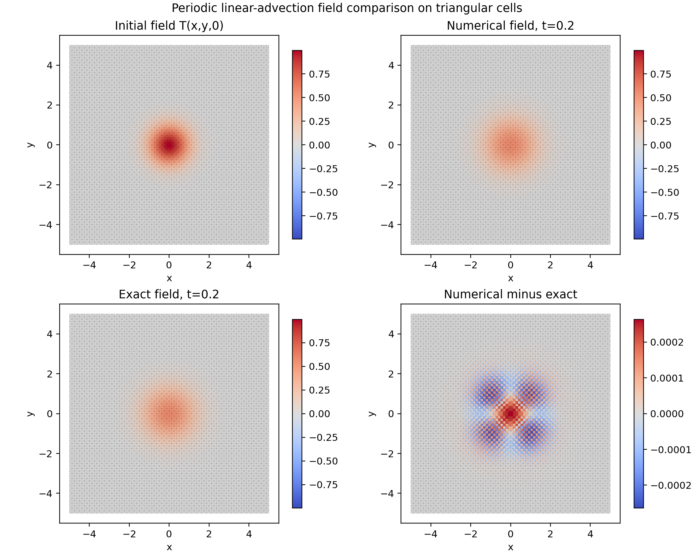
  <figcaption>图 10：三角形 Gaussian 算例 N=80 时的数值场与解析场对比</figcaption>
</figure>

<figure id="fig-diff-gaussian-tri-profile">
  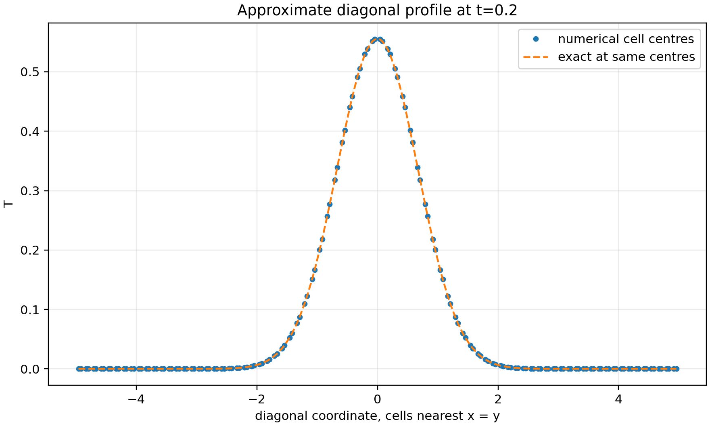
  <figcaption>图 11：三角形 Gaussian 算例 N=80 的对角线剖面比较</figcaption>
</figure>

<figure id="fig-diff-gaussian-tri-history">
  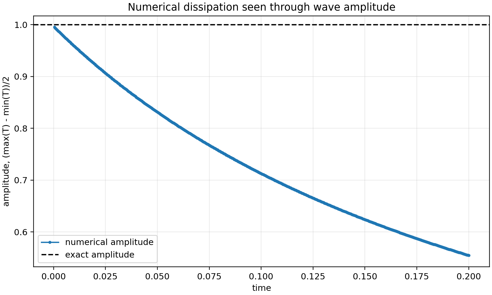
  <figcaption>图 12：三角形 Gaussian 算例 N=80 的时间推进历史</figcaption>
</figure>

各分辨率的三角形 Gaussian 结果分别保存在：

- 数据：`../../data/02_diffusion_equation/cases/04_gaussian_tri/Nxx/`
- 图片：`../../figures/02_diffusion_equation/cases/04_gaussian_tri/Nxx/`
- 配置：`../../scripts/configs/02_diffusion_equation/04_gaussian_tri.json`

## 8. 跨实验比较：参数变化如何产生图像现象

### $N$ 与误差、峰值和扩散宽度

随着 $N$ 增大，网格更细，误差显著下降，最终场的峰值更接近解析解。
这在四边形和三角形两组结果中都表现为：

- $L_1$ 单调下降；
- $L_2$ 和 $L_\infty$ 同步下降；
- 最终峰值趋于稳定；
- 间断附近的扩散层更窄、更平滑。

对于 Gaussian 算例，网格加密体现为数值 Gaussian 峰值和中心剖面逐渐接近解析解。
四边形 Gaussian 的 $L_1$ 误差由 `8.0861e-2` 降至 `7.4185e-4`，三角形
Gaussian 的 $L_1$ 误差由 `8.5653e-2` 降至 `7.0560e-4`。两种网格均正确表现出
Gaussian 解的扩散、展宽和中心峰值降低。

### 四边形和三角形为什么不能只按相同 $N$ 比较

这里的 $N$ 是每条边方向的单元数。对四边形网格，单元总数大约是 $N^2$；
对三角形棱柱网格，单元总数大约是 $2N^2$。

因此，同一个 $N$ 下，三角形网格通常单元更多，不能直接说它一定“更准”。
更公平的比较应基于：

- 实际单元数量；
- 实际网格尺度；
- 或相同计算成本。

本次 Gaussian 实验中，四边形 `N=80` 包含 `6400` 个单元，三角形 `N=80`
包含 `12800` 个单元。因此三角形在 `N=80` 时误差略低，不能直接解释为三角形
网格在相同计算成本下优于四边形网格。

### 为什么扩散会把间断初值抹平

扩散项的物理作用就是平滑梯度。初始的方块高值区在时间推进后会向外扩散，
边界层变宽，峰值下降，场变得越来越光滑。Gaussian 算例从一开始就是光滑分布，
扩散后中心峰值继续下降、空间宽度增加。
这正是图中数值结果的直接表现。

### 守恒性与稳定性分别说明什么

这里的几个量不能互相替代：

| 图或指标 | 它真正回答的问题 |
|---|---|
| 归一化质量误差 | 离散方案整体守恒性是否良好 |
| 误差图和收敛阶图 | 网格加密后误差下降是否符合预期 |
| 场对比图 | 间断或 Gaussian 扩散后的空间形状是否合理 |
| 时间历史 | 时间推进是否稳定到达终止时间 |

归一化质量误差接近机器精度，说明离散方案总体守恒性良好；无 `FOAM FATAL ERROR`，
说明求解器和后处理流程稳定；日志显示每个案例都推进到了目标终止时间。

## 9. 结果讨论

四边形与三角形两组结果都显示出清晰的二阶趋势。四边形组的 $L_1$ 观察收敛阶在
`1.87` 到 `2.39` 之间，三角形组在 `2.13` 到 `2.37` 之间。

Gaussian 算例同样表现出稳定的误差下降。四边形组的 $L_1$ 观察阶为
`1.998`、`2.144` 和 `2.626`；三角形组为 `2.699`、`2.132` 和 `2.092`。
两组最后两个网格区间均接近二阶。最粗网格区间出现高于二阶的观察值，
应理解为有限分辨率下的预渐近或局部超收敛现象，不能据此宣称格式具有三阶精度。

从扩散问题本身看，细网格会更准确地捕捉初始间断的扩散层或 Gaussian 的空间曲率，
因此最终图像更接近解析解。三角形组在相同 $N$ 下单元更多，所以误差可能更低，
但这不应被理解为纯粹的“网格类型优势”。
从更公平的角度，应按单元尺度或单元总数比较。

## 10. 局限性、风险与未完成事项

- 本报告已验证第二题的两个扩散算例；
- 解析误差基于当前对题目边界条件的工程化解释；
- 三角形网格与四边形网格的公平性比较仍应进一步统一单元总数或单元尺度；
- 当前未扩展到第二题其他可能的边界/初值变体；
- Gaussian 算例目前使用各分辨率的误差表和代表性诊断图，尚未生成独立的跨分辨率汇总图；
- 可增加 `N=160` 或进行时间步减半实验，进一步区分空间误差和时间离散误差；
- 本次报告聚焦求解器验证，不覆盖更高阶时间离散或隐式扩散格式。

## 11. 结论

本项目已经完成第二题两个扩散算例的学生版 OpenFOAM 求解器开发、四边形与三角形网格验证、
自动化批量运行和后处理分析。四组实验均展示了误差随网格加密下降的趋势。

结论可概括为：

1. 显式扩散求解器可以稳定推进到目标终止时间；
2. 误差随网格加密快速下降，观察收敛阶接近二阶；
3. 四边形与三角形网格都能正确复现间断扩散和 Gaussian 扩散的平滑化过程；
4. Gaussian 算例的细网格观察收敛阶接近二阶；
5. 当前实现满足第二题两个已实现算例的开发与验证目标，并且报告结构、图文节奏和证据组织方式
   已经与第一题保持一致。

## 12. 结果与报告完整性检查

| 检查项 | 结果 |
|---|---|
| 求解器 | 已编译并运行 |
| 四边形结果 | 已完成 |
| 三角形结果 | 已完成 |
| 收敛表 | 间断算例已生成，Gaussian 算例已在报告中整理 |
| 单案例图 | 已生成 |
| 汇总图 | 间断算例已生成，Gaussian 算例暂使用分辨率图组 |
| 守恒性 | 已检查 |
| 残余错误 | 无致命错误 |

## 13. 复现实验命令

### 最小复现命令

```bash
cd /home/a776/workdocuments/上交船舶/slover/student_project
source /opt/openfoam14/etc/bashrc
sh scripts/build_student_solver.sh
python3 scripts/run_study.py --config scripts/configs/02_diffusion_equation/01_discontinuous_quad.json --resolutions 10,20,40,80 --overwrite
python3 scripts/run_study.py --config scripts/configs/02_diffusion_equation/02_discontinuous_tri.json --resolutions 10,20,40,80 --overwrite
python3 scripts/run_study.py --config scripts/configs/02_diffusion_equation/03_gaussian_quad.json --resolutions 10,20,40,80 --overwrite
python3 scripts/run_study.py --config scripts/configs/02_diffusion_equation/04_gaussian_tri.json --resolutions 10,20,40,80 --overwrite
```

### 详细命令

- `scripts/build_student_solver.sh`：编译第二题求解器；
- `scripts/run_study.py`：准备、运行和后处理指定配置的全部分辨率；
- `--config`：JSON 配置入口；
- `--resolutions`：指定要跑的 `N`；
- `--overwrite`：允许重建已有 case。

## 14. 证据索引

第二题的证据索引见 `evidence_index.md`。
