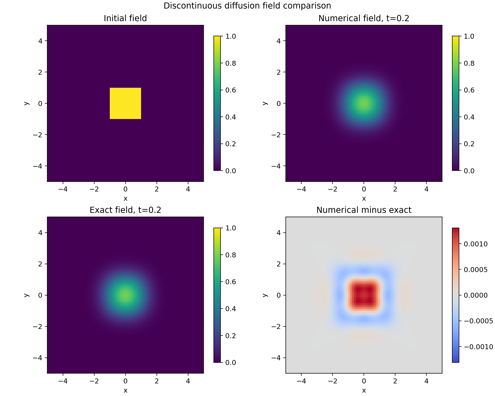
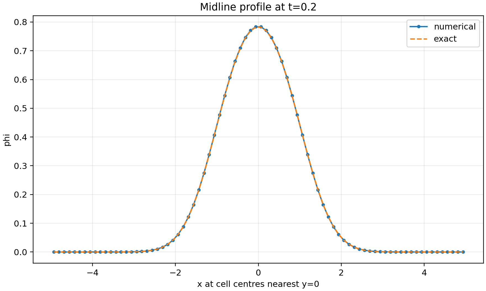
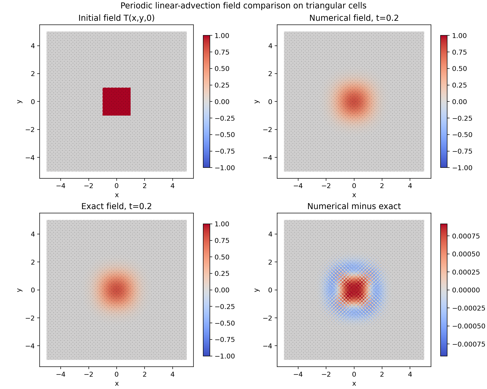
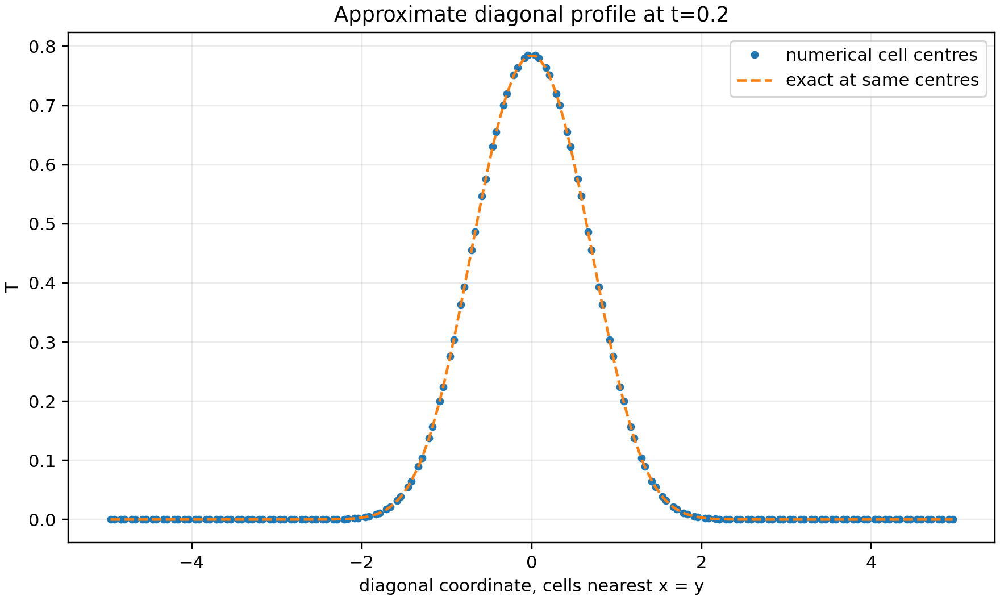

# 第二题：二维扩散方程有限体积显式求解器验证报告

**项目目录：** `/home/a776/workdocuments/上交船舶/slover/student_project`
**题目来源：** `../../pdf/training_examples_incomp.pdf`
**题目解答参考：** `../../pdf/题目解答.pdf`
**报告日期：** 2026-08-29
**求解器：** `explicitDiffusionFoamStudent`
**OpenFOAM 版本：** OpenFOAM 14

## 目录

- [研究概况](#研究概况)
- [1. 问题定义与研究目标](#1-问题定义与研究目标)
- [扩展实验矩阵](#扩展实验矩阵)
- [2. 假设、范围与验收标准](#2-假设范围与验收标准)
  - [2.1 基本假设](#21-基本假设)
  - [2.2 本报告范围](#22-本报告范围)
  - [2.3 验收标准](#23-验收标准)
- [3. 数学离散与求解器实现](#3-数学离散与求解器实现)
  - [3.1 有限体积半离散形式](#31-有限体积半离散形式)
  - [3.2 空间离散](#32-空间离散)
  - [3.3 时间离散](#33-时间离散)
  - [3.4 显式扩散时间步](#34-显式扩散时间步)
  - [3.5 误差定义与精确解](#35-误差定义与精确解)
- [4. 几何区域、初始条件和边界条件](#4-几何区域初始条件和边界条件)
  - [4.1 间断初值算例](#41-间断初值算例)
  - [4.2 Gaussian 算例](#42-gaussian-算例)
  - [4.3 四边形与三角形网格](#43-四边形与三角形网格)
- [5. 软件、网格和算例组织](#5-软件网格和算例组织)
- [6. 间断初值算例：结果与网格对比](#6-间断初值算例结果与网格对比)
  - [6.1 四边形网格](#61-四边形网格)
  - [6.2 三角形网格](#62-三角形网格)
- [7. Gaussian 算例：结果与网格对比](#7-gaussian-算例结果与网格对比)
  - [7.1 四边形网格](#71-四边形网格)
  - [7.2 三角形网格](#72-三角形网格)
- [8. 跨实验比较：参数变化如何产生图像现象](#8-跨实验比较参数变化如何产生图像现象)
  - [8.1 $N$ 与误差、峰值和扩散宽度](#81-n-与误差峰值和扩散宽度)
  - [8.2 间断初值与 Gaussian 初值的差异](#82-间断初值与-gaussian-初值的差异)
  - [8.3 四边形和三角形为什么不能只按相同 $N$ 比较](#83-四边形和三角形为什么不能只按相同-n-比较)
  - [8.4 边界条件对两个算例的作用](#84-边界条件对两个算例的作用)
- [9. 收敛、监测量与守恒性检查](#9-收敛监测量与守恒性检查)
- [10. 结果讨论](#10-结果讨论)
- [11. 复现实验命令](#11-复现实验命令)
- [12. 证据索引](#12-证据索引)

## 研究概况

| 项目 | 内容 |
|---|---|
| 研究类型 | 显式有限体积扩散求解器开发与数值验证 |
| 研究对象 | 二维扩散方程的间断初值算例和 Gaussian 初值算例 |
| 计算平台 | OpenFOAM 14 |
| 求解器族 | `02_diffusion_equation` |
| 求解器 | `explicitDiffusionFoamStudent` |
| 网格类型 | 均匀四边形网格、结构化三角形棱柱网格 |
| 空间格式 | `Gauss linear corrected` |
| 时间格式 | 显式前向 Euler |
| 主要考察量 | 归一化误差、观察收敛阶、质量误差、时间步稳定性、场图和剖面图 |


## 1. 问题定义与研究目标

第二题要求实现并验证二维扩散方程的显式有限体积求解器。控制方程为

$$\frac{\partial \phi}{\partial t}-\nabla\cdot(\mu\nabla\phi)=0.$$

其中 $\phi(x,y,t)$ 为扩散标量场，$\mu$ 为扩散系数。本项目使用 OpenFOAM 标量场
`phi` 表示未知量，扩散系数通过 `constant/transportProperties` 中的 `mu` 给出。

本报告覆盖两个算例：

1. 间断初值扩散：中心方块指示函数在 `[-5,5]^2` 上扩散，外边界采用齐次 Neumann 条件；
2. Gaussian 扩散：光滑 Gaussian 初值在 `[-5,5]^2` 上扩散，外边界采用解析解 Dirichlet 条件。

原题的第一个算例只写了 Neumann boundary conditions，未明确给出边界通量。本项目采用
齐次 Neumann 条件，即 $\partial\phi/\partial n=0$。第二个 Gaussian 算例中原题的径向
变量写法存在容易混淆之处，本项目按标准形式解释为 $r^2=x^2+y^2$。

原题要求与本项目交付内容的对应关系如下：

| 原题要求 | 本项目对应结果 | 报告位置 |
|---|---|---|
| 开发二维扩散方程求解器 | `explicitDiffusionFoamStudent` | 第 3、5 节 |
| 四边形网格误差和收敛阶 | 间断、Gaussian 两个算例均已完成 | 第 6.1、7.1 节 |
| 三角形网格误差和收敛阶 | 间断、Gaussian 两个算例均已完成 | 第 6.2、7.2 节 |
| 在 $t=0.2$ 报告误差 | 所有配置均推进到 `finalTime=0.2` | 第 6、7、9 节 |
| 后处理图像和结果分析 | 场对比、剖面、时间历史图 | 第 6-8 节 |

## 扩展实验矩阵

| 编号 | 算例 | 网格 | 边界条件 | 分辨率 | 主要输出 |
|---|---|---|---|---|---|
| 01 | 间断初值扩散 | 四边形 | 齐次 Neumann | $N=10,20,40,80$ | $L_1$、$L_2$、$L_\infty$、收敛阶、收敛图 |
| 02 | 间断初值扩散 | 三角形 | 齐次 Neumann | $N=10,20,40,80$ | $L_1$、$L_2$、$L_\infty$、收敛阶、收敛图 |
| 03 | Gaussian 扩散 | 四边形 | 解析解 Dirichlet | $N=10,20,40,80$ | 精确解误差、场对比、中心剖面 |
| 04 | Gaussian 扩散 | 三角形 | 解析解 Dirichlet | $N=10,20,40,80$ | 精确解误差、场对比、对角线剖面 |

这四组实验构成第二题当前版本的完整验证矩阵。间断算例用于检验扩散对非光滑初值的
平滑能力和守恒性，Gaussian 算例用于检验光滑解析解下的误差与收敛行为。

## 2. 假设、范围与验收标准

### 2.1 基本假设

1. 扩散系数 $\mu$ 为常数，本报告中取 $\mu=1$；
2. 不含对流项、反应项和源项；
3. 时间推进采用显式前向 Euler；
4. 空间离散采用 OpenFOAM 的 `fvc::laplacian(mu, phi)`；
5. 四边形网格由 `blockMesh` 生成；
6. 三角形网格由 Gmsh 生成三角形棱柱单元，再通过 `gmshToFoam` 转入 OpenFOAM；
7. 误差均使用单元体积加权归一化误差。

### 2.2 本报告范围

本报告只评价第二题扩散方程的教学型显式求解器和四组二维基准实验。报告不覆盖隐式扩散、
并行计算、复杂几何、非均匀扩散系数和工程船舶流场。

### 2.3 验收标准

| 验收项 | 标准 |
|---|---|
| 求解器编译 | 生成 `build/02_diffusion_equation/bin/explicitDiffusionFoamStudent` |
| 网格检查 | `summary.json` 中 `meshOK=true`；若要求逐行复核，则还需保留对应 `checkMesh` 日志 |
| 时间推进 | 正确到达 `t=0.2`，`finalTimeError=0` |
| 运行状态 | `summary.json` 中 `solverEnded=true`、`solverFatal=false`；完整日志证据另行说明 |
| 收敛性 | 误差随网格加密整体下降，观察收敛阶处于合理范围 |
| 物理合理性 | 扩散后峰值下降、场变平滑、无明显非物理发散 |
| 结果产物 | `data/02_diffusion_equation/` 和 `figures/02_diffusion_equation/` 下有可追溯输出 |

## 3. 数学离散与求解器实现

本节将有限体积公式与项目中的 OpenFOAM 求解器实现对应起来。控制体定义、扩散通量、
边界处理和显式时间步的手写推导参考 `../../pdf/题目解答.pdf`，并结合源码和生成后的
OpenFOAM case 进行核对。

### 3.1 有限体积半离散形式

对任意控制体 $\Omega_c$ 积分：

$$\int_{\Omega_c}\frac{\partial \phi}{\partial t}\,\mathrm d\Omega-\int_{\Omega_c}\nabla\cdot(\mu\nabla\phi)\,\mathrm d\Omega=0.$$

应用高斯定理：

$$V_c\frac{\mathrm d\phi_c}{\mathrm dt}-\sum_{f\in\partial\Omega_c}\mu_f(\nabla\phi)_f\cdot\mathbf S_f=0.$$

因此，扩散项通过所有面上的梯度通量贡献到单元残差。内部面通量由相邻单元共同贡献，
边界面通量由边界条件提供面值或法向梯度。

### 3.2 空间离散

本项目在求解器中使用 OpenFOAM 显式离散接口：

```cpp
fvc::laplacian(mu, phi)
```

对应的 `fvSchemes` 入口为：

```foam
laplacianSchemes
{
    laplacian(mu,phi) Gauss linear corrected;
}

snGradSchemes
{
    default corrected;
}
```

`Gauss linear corrected` 表示拉普拉斯项采用高斯积分、线性插值和非正交修正。这样做的
好处是求解器不手写每一个内部面和边界面的差分公式，而是把网格拓扑、面面积向量、
非正交修正和边界贡献交给 OpenFOAM 的有限体积库处理。

### 3.3 时间离散

时间推进采用显式前向 Euler：

$$\phi_c^{n+1}=\phi_c^n+\Delta t R_c^n.$$

其中 $R_c^n$ 是 OpenFOAM 已经除以单元体积后的扩散残差。这个写法与对流方程第一题保持
一致：残差代表单位体积意义下的时间变化率，而不是未除体积的积分通量。

### 3.4 显式扩散时间步

显式扩散格式需要满足稳定性限制。本项目使用 `diffusionCo` 控制时间步，并用
`maxDeltaT` 限制最大时间步。当前实验配置为：

```text
diffusionCo = 0.45
maxDeltaT   = 0.001
endTime     = 0.2
```

求解器根据面扩散系数构造时间步估计。以单元 $c$ 为例，代码中相当于先计算
`D_f=mu*|S_f|*deltaCoeff_f` 和 `A_c=sum(D_f)`，再使用：

$$\Delta t_{\mathrm{stab}}=\sigma\min_c\left(\frac{V_c}{A_c}\right),\qquad \Delta t=\min(\Delta t_{\mathrm{stab}},\mathrm{maxDeltaT},t_{\mathrm{end}}-t).$$

其中 $\sigma$ 即配置中的 `diffusionCo`。该估计是根据网格和扩散系数构造的显式安全步长，
并不是对带非正交修正项离散格式的普适稳定性定理；因此本报告还用时间历史、场范围和
求解是否正常结束进行数值核查。四边形网格的四个分辨率均受 `maxDeltaT=0.001`
控制，共 200 步到达 $t=0.2$；三角形网格的 `N=10,20,40` 也为 200 步，`N=80`
在稳定步长控制下使用约 `3.90625e-4` 的步长，共 512 步。最后一步会根据剩余时间
自动缩短，从而使终止时间严格落在 $t=0.2$。

### 3.5 误差定义与精确解

本报告采用单元体积加权归一化误差：

$$L_1=\frac{\sum_c V_c|\phi_c-\phi_c^{\mathrm{ex}}|}{\sum_c V_c|\phi_c^{\mathrm{ex}}|}.$$

$$L_2=\sqrt{\frac{\sum_c V_c(\phi_c-\phi_c^{\mathrm{ex}})^2}{\sum_c V_c(\phi_c^{\mathrm{ex}})^2}}.$$

$$L_\infty=\frac{\max_c|\phi_c-\phi_c^{\mathrm{ex}}|}{\max_c|\phi_c^{\mathrm{ex}}|}.$$

相邻网格的观察收敛阶为：

$$p=\frac{\log(E_N/E_{2N})}{\log 2}.$$

间断初值算例的解析解使用误差函数形式。对于 $\mu=1$：

$$\phi(x,y,t)=\frac14\left[\operatorname{erf}\left(\frac{1-x}{2\sqrt t}\right)-\operatorname{erf}\left(\frac{-1-x}{2\sqrt t}\right)\right]\left[\operatorname{erf}\left(\frac{1-y}{2\sqrt t}\right)-\operatorname{erf}\left(\frac{-1-y}{2\sqrt t}\right)\right].$$

需要严格区分参考解与计算边界：数值算例在有限区域 `[-5,5]^2` 上采用齐次 Neumann
边界，而上式对应无限域问题。因此这里的 $L_1$、$L_2$ 和 $L_\infty$ 是“相对于无限域
参考解的误差”，不是有限 Neumann 区域的严格边值问题误差。由于 $t=0.2$ 时扩散
尺度远小于中心到边界的距离，参考解在 $x=\pm5$ 或 $y=\pm5$ 附近的量级约为
$10^{-10}$ 或更小，有限域边界影响相对较弱；这一近似关系仍属于本报告的工程假设。

Gaussian 算例的原题参数固定为 $\mu=1$，并将径向变量解释为
$r^2=x^2+y^2$。因此本报告实际使用的初值和解析解为：

$$\phi(x,y,0)=\exp[-(x^2+y^2)].$$

$$\phi(x,y,t)=\frac{1}{1+4t}\exp\left[-\frac{x^2+y^2}{1+4t}\right].$$

为避免把题目中的 $\mu$ 同时误当作 Gaussian 指数参数，补充说明如下：若一般地取
初值 $\exp(-\alpha r^2)$、扩散系数为 $\mu$，则解析解的分母应为
$1+4\alpha\mu t$；本报告只对实际配置 $\alpha=\mu=1$ 的结果作结论。误差报告时间为
$t=0.2$。

## 4. 几何区域、初始条件和边界条件

### 4.1 间断初值算例

间断初值算例的计算域为 `[-5,5] \times [-5,5]`，初始条件为中心方块指示函数：

$$\phi(x,y,0)=\begin{cases}1,& |x|\le 1,\ |y|\le 1,\\0,& \text{otherwise}.\end{cases}$$

外边界采用齐次 Neumann 条件：

$$\frac{\partial\phi}{\partial n}=0.$$

四边形配置文件为 `../../scripts/configs/02_diffusion_equation/01_discontinuous_quad.json`，
三角形配置文件为 `../../scripts/configs/02_diffusion_equation/02_discontinuous_tri.json`。
在当前数据快照中，间断初值的四个四边形案例还保留了对应的网格和求解器日志；
三角形案例的结论主要依据 `summary.json`、CSV 和图件。

### 4.2 Gaussian 算例

Gaussian 算例使用同一个计算域 `[-5,5] \times [-5,5]`，初值为光滑 Gaussian 函数。
为了与解析解一致，四个外边界使用随时间变化的 Dirichlet 条件：

$$\phi_{\partial\Omega}(x,y,t)=\frac{1}{1+4t}\exp\left[-\frac{x^2+y^2}{1+4t}\right].$$

该边界在 OpenFOAM 字段文件中由 `codedFixedValue` 生成，边界类型为普通 `patch`，
而不是周期边界。四边形配置文件为
`../../scripts/configs/02_diffusion_equation/03_gaussian_quad.json`，三角形配置文件为
`../../scripts/configs/02_diffusion_equation/04_gaussian_tri.json`。

### 4.3 四边形与三角形网格

四边形网格直接使用 `blockMesh`，每条边方向有 $N$ 个单元，因此二维单元数量为 $N^2$。
三角形网格使用 Gmsh 对结构化方形面进行交替三角剖分，再沿厚度方向拉伸一层，
每个二维三角形对应一个三棱柱单元，因此这些案例的单元数量为 $2N^2$。例如 `N=80`
时，四边形网格有 `6400` 个单元，三角形网格有 `12800` 个单元。两类网格在
OpenFOAM 中都以厚度为 `0.1` 的薄三维网格表示，误差范数采用体积加权；由于范数已
归一化，统一厚度不会改变相对误差的比较。

因此，相同 $N$ 下的四边形和三角形不是完全相同计算成本的比较。报告中把它们作为网格
适配性和收敛趋势对比，而不是严格的性能优劣排名。

## 5. 软件、网格和算例组织

| 目录或文件 | 作用 |
|---|---|
| `UDF/solver/02_diffusion_equation/explicitDiffusionFoamStudent/` | 第二题扩散求解器源码 |
| `build/02_diffusion_equation/bin/explicitDiffusionFoamStudent` | 编译后的求解器 |
| `cases/02_diffusion_equation/01_discontinuous_quad/` | 间断初值四边形案例族 |
| `cases/02_diffusion_equation/02_discontinuous_tri/` | 间断初值三角形案例族 |
| `cases/02_diffusion_equation/03_gaussian_quad/` | Gaussian 四边形案例族 |
| `cases/02_diffusion_equation/04_gaussian_tri/` | Gaussian 三角形案例族 |
| `scripts/configs/02_diffusion_equation/` | 第二题 JSON 配置入口 |
| `data/02_diffusion_equation/` | 后处理数据、误差和汇总 |
| `figures/02_diffusion_equation/` | 场图、剖面图、时间历史和收敛图 |
| `report/02_diffusion_equation/` | 第二题报告 |

自动化流程由 `scripts/run_study.py` 驱动。它根据 JSON 配置准备 OpenFOAM case、生成网格、
运行求解器、后处理误差和绘图。这个组织方式与第一题报告保持一致，即所有结果都能从
配置、case、数据和图片反向追踪。

## 6. 间断初值算例：结果与网格对比

### 6.1 四边形网格

四边形间断初值算例的误差和收敛阶如下：

| N | cells | $L_1$ | $L_2$ | $L_\infty$ | $L_1$ order | final min | final max | steps | $\lvert M_T-M_0\rvert/M_0$ |
|---:|---:|---:|---:|---:|---:|---:|---:|---:|---:|
| 10 | 100 | 2.10899769e-01 | 1.72401247e-01 | 1.53398257e-01 | - | 2.1080e-09 | 6.95532415e-01 | 200 | 5.9647e-13 |
| 20 | 400 | 5.75007378e-02 | 4.81910462e-02 | 3.72870655e-02 | 1.874905 | 7.5446e-13 | 7.58195095e-01 | 200 | 4.4853e-13 |
| 40 | 1600 | 1.14966300e-02 | 9.71420627e-03 | 8.87081636e-03 | 2.322369 | 1.7811e-16 | 7.78449597e-01 | 200 | 5.8148e-14 |
| 80 | 6400 | 2.19619062e-03 | 1.83220745e-03 | 1.67248440e-03 | 2.388136 | 1.7018e-19 | 7.83335417e-01 | 200 | 3.4139e-14 |

误差随 $N$ 增大单调下降，$L_1$ 观察收敛阶从 `1.874905` 增至 `2.388136`；
最后一个区间的 $L_1$、$L_2$ 和 $L_\infty$ 观察阶分别为 `2.388136`、`2.406513`
和 `2.407074`。这些数值说明在当前时间步和空间离散下误差呈现接近二阶的下降趋势，
但它们是联合误差下的观察阶，不是仅由空间离散得到的严格理论阶数。

表中末态最大值随网格加密从 `0.695532` 增至 `0.783335`，逐渐接近解析解在中心
$(x,y)=(0,0)$、$t=0.2$ 处的 `0.785268`。这体现的是粗网格单元平均和界面分辨率
改善，而不是扩散过程中峰值随时间升高；同时，末态最小值始终只在舍入误差量级附近。

<figure id="fig-01">
  
  <figcaption>图 1：间断初值四边形网格误差收敛曲线</figcaption>
</figure>

图 1 显示 $L_1$、$L_2$ 和 $L_\infty$ 随网格加密整体下降，说明误差不是局部偶然改善，
而是在多个范数上同时改善。

<figure id="fig-02">
  
  <figcaption>图 2：间断初值四边形网格观察收敛阶</figcaption>
</figure>

图 2 的观察收敛阶高于一阶并逐渐接近二阶以上，符合扩散问题在网格加密后对平滑化解的
数值表现。初值间断会影响粗网格误差，但在 $t=0.2$ 时扩散已经产生较平滑的解。
由于四个四边形案例都受 `maxDeltaT=0.001` 控制，时间步没有随网格同步加密，
因此仍应将该观察阶理解为本组具体时间步设置下的收敛表现。

<figure id="fig-02a">
  
  <figcaption>图 2a：间断初值四边形网格不同分辨率的场对比</figcaption>
</figure>

图 2a 直接展示了四个分辨率的场形状变化：网格加密后方块边缘过渡带被更充分地解析，
数值场的中心平台和外部低值区域均更接近解析结果。

<figure id="fig-03">
  
  <figcaption>图 3：间断初值四边形网格 N=80 的数值场与解析场对比</figcaption>
</figure>

<figure id="fig-04">
  
  <figcaption>图 4：间断初值四边形网格 N=80 的中线剖面比较</figcaption>
</figure>

图 3 和图 4 表明，间断方块在扩散后变成平滑分布，数值解能捕捉中心峰值和过渡带。
误差主要集中在初始间断边缘扩散后的高曲率区域。

### 6.2 三角形网格

三角形间断初值算例的误差和收敛阶如下：

| N | cells | $L_1$ | $L_2$ | $L_\infty$ | $L_1$ order | final min | final max | steps | $\lvert M_T-M_0\rvert/M_0$ |
|---:|---:|---:|---:|---:|---:|---:|---:|---:|---:|
| 10 | 200 | 1.37977266e-01 | 1.19901878e-01 | 9.25104202e-02 | - | 1.1534e-10 | 7.64596813e-01 | 200 | 2.3384e-13 |
| 20 | 800 | 3.15624166e-02 | 2.80382358e-02 | 2.64574778e-02 | 2.128151 | 2.5311e-14 | 7.79455705e-01 | 200 | 5.6871e-13 |
| 40 | 3200 | 6.10438198e-03 | 5.42097325e-03 | 5.22632423e-03 | 2.370291 | 8.7863e-18 | 7.83443198e-01 | 200 | 5.5206e-13 |
| 80 | 12800 | 1.38536015e-03 | 1.22636955e-03 | 1.16943860e-03 | 2.139584 | 2.7168e-19 | 7.84751037e-01 | 512 | 3.4694e-15 |

三角形网格同样呈现稳定的误差下降。$L_1$ 观察阶在三个区间分别为
`2.128151`、`2.370291` 和 `2.139584`；最后一个区间的 $L_2$、$L_\infty$ 观察阶
分别为 `2.144158` 和 `2.159981`。相同 $N$ 下三角形单元数量约为四边形的两倍，
其误差不能直接与四边形按同一个 $N$ 做公平成本比较，但这组结果说明求解器能够在
三角形棱柱单元上稳定工作。

三角形 `N=80` 的末态最大值为 `0.784751`，比四边形 `N=80` 的 `0.783335` 更接近
解析中心值 `0.785268`；这个差异与单元数量、三角形剖分方向和局部几何误差共同有关，
不能单独解释为三角形格式在相同计算成本下更优。

<figure id="fig-05">
  
  <figcaption>图 5：间断初值三角形网格误差收敛曲线</figcaption>
</figure>

<figure id="fig-06">
  
  <figcaption>图 6：间断初值三角形网格观察收敛阶</figcaption>
</figure>

图 5 和图 6 表明，三角形网格下误差同样随网格加密下降，并且细网格观察阶保持在约二阶
附近。

<figure id="fig-06a">
  
  <figcaption>图 6a：间断初值三角形网格不同分辨率的场对比</figcaption>
</figure>

图 6a 显示，三角形网格的局部剖分纹理在粗网格上更明显；随着 $N$ 增大，纹理尺度
相对减小，整体场形状和方块边缘的扩散过渡带逐步接近解析解。

<figure id="fig-07">
  
  <figcaption>图 7：间断初值三角形网格 N=80 的数值场与解析场对比</figcaption>
</figure>

<figure id="fig-08">
  
  <figcaption>图 8：间断初值三角形网格 N=80 的对角线剖面比较</figcaption>
</figure>

图 7 和图 8 中的三角形纹理来自真实网格连接关系。随着网格加密，这种网格纹理对整体
误差的影响下降，剖面曲线逐渐接近解析解。

## 7. Gaussian 算例：结果与网格对比

### 7.1 四边形网格

四边形 Gaussian 算例的误差和收敛阶如下：

| N | cells | $L_1$ | $L_2$ | $L_\infty$ | $L_1$ order | final min | final max | steps | $\lvert M_T-M_0\rvert/M_0$ |
|---:|---:|---:|---:|---:|---:|---:|---:|---:|---:|
| 10 | 100 | 8.08607416e-02 | 6.22248177e-02 | 5.21787953e-02 | - | 2.1401e-08 | 4.42771526e-01 | 200 | 3.6691e-05 |
| 20 | 400 | 2.02429482e-02 | 1.93250425e-02 | 2.68987675e-02 | 1.998020 | 1.0885e-10 | 5.32225635e-01 | 200 | 3.7456e-06 |
| 40 | 1600 | 4.58095316e-03 | 4.30523118e-03 | 6.59251764e-03 | 2.143700 | 3.2437e-12 | 5.49593209e-01 | 200 | 8.0448e-07 |
| 80 | 6400 | 7.41846218e-04 | 6.43224181e-04 | 9.39301852e-04 | 2.626456 | 9.2855e-13 | 5.53669090e-01 | 200 | 3.5631e-07 |

Gaussian 初值是光滑函数，因此比间断初值更适合观察格式本身的收敛特征。四边形网格的
$L_1$ 误差从 `8.0861e-2` 降到 `7.4185e-4`，下降超过两个数量级。最后一个网格区间
的观察阶为 `2.626456`，对应的 $L_2$ 和 $L_\infty$ 观察阶分别为 `2.742697` 和
`2.811169`。这些数值应理解为有限网格区间中的局部表现，不能直接宣称格式为三阶；
尤其是 $L_\infty$ 在粗网格的前两个区间只有 `0.955924` 和 `2.028639`，说明
局部收敛阶会受到峰值解析和边界尾部误差的影响。

在 $t=0.2$ 时，解析解中心值为 $1/(1+4t)=0.555556$。四边形 `N=80` 的数值最大值
为 `0.553669`，与该值相差约 `1.89e-3`；同时归一化质量变化从 `3.6691e-5`
降至 `3.5631e-7`。这里的质量变化不是齐次 Neumann 情形下的守恒误差，而是解析
Dirichlet 边界允许的边界通量变化及其离散误差的综合结果。

<figure id="fig-09">
  
  <figcaption>图 9：Gaussian 四边形网格 N=80 的数值场与解析场对比</figcaption>
</figure>

<figure id="fig-10">
  
  <figcaption>图 10：Gaussian 四边形网格 N=80 的中线剖面比较</figcaption>
</figure>

<figure id="fig-11">
  
  <figcaption>图 11：Gaussian 四边形网格 N=80 的时间推进历史</figcaption>
</figure>

图 9 和图 10 表明，数值 Gaussian 峰值位置保持在中心附近，剖面形状与解析解接近。
图 11 显示四边形 `N=80` 使用 `deltaT=0.001` 共 200 步推进到 $t=0.2$；它反映的是
时间步历史，不单独构成空间收敛性证据。

### 7.2 三角形网格

三角形 Gaussian 算例的误差和收敛阶如下：

| N | cells | $L_1$ | $L_2$ | $L_\infty$ | $L_1$ order | final min | final max | steps | $\lvert M_T-M_0\rvert/M_0$ |
|---:|---:|---:|---:|---:|---:|---:|---:|---:|---:|
| 10 | 200 | 8.56527570e-02 | 7.88658198e-02 | 6.23102270e-02 | - | 2.5024e-09 | 5.19048993e-01 | 200 | 4.2040e-06 |
| 20 | 800 | 1.31905589e-02 | 1.27492974e-02 | 1.40744057e-02 | 2.698994 | 2.2598e-11 | 5.46252158e-01 | 200 | 9.1874e-07 |
| 40 | 3200 | 3.00833713e-03 | 2.53647020e-03 | 2.50121390e-03 | 2.132468 | 1.7949e-12 | 5.52664240e-01 | 200 | 3.9261e-07 |
| 80 | 12800 | 7.05600010e-04 | 5.68010939e-04 | 4.75446668e-04 | 2.092044 | 8.3525e-13 | 5.54748543e-01 | 512 | 2.9705e-07 |

三角形 Gaussian 的后两个网格区间观察阶为 `2.132468` 和 `2.092044`，更能代表当前
实验的渐近趋势；对应的 $L_2$ 观察阶为 `2.329524`、`2.158832`，$L_\infty$ 观察阶
为 `2.492374`、`2.395273`。`N=10` 到 `N=20` 的 $L_1$ 观察阶为 `2.698994`，
属于粗网格过渡阶段的预渐近现象。三角形 `N=80` 的最大值 `0.554749` 与解析中心值
`0.555556` 相差约 `8.07e-4`，小于四边形 `N=80` 的相应差值；鉴于三角形单元数量
更多，该结果只能作为本实验矩阵中的误差对照，不能直接转化为成本优劣结论。

<figure id="fig-12">
  
  <figcaption>图 12：Gaussian 三角形网格 N=80 的数值场与解析场对比</figcaption>
</figure>

<figure id="fig-13">
  
  <figcaption>图 13：Gaussian 三角形网格 N=80 的对角线剖面比较</figcaption>
</figure>

<figure id="fig-14">
  
  <figcaption>图 14：Gaussian 三角形网格 N=80 的振幅历史</figcaption>
</figure>

图 12 和图 13 表明，三角形网格能够正确复现 Gaussian 场扩散后的空间分布。
图 14 中最大值随时间下降，符合扩散过程使峰值降低的物理认识；`N=80` 的时间历史
显示使用约 `3.90625e-4` 的步长完成 512 步，说明细三角形网格的时间步约束确实
改变了运行步数。

## 8. 跨实验比较：参数变化如何产生图像现象

### 8.1 $N$ 与误差、峰值和扩散宽度

四组实验均显示网格加密后误差下降。四组算例的 $L_1$ 误差汇总如下：

| N | 间断-四边形 | 间断-三角形 | Gaussian-四边形 | Gaussian-三角形 |
|---:|---:|---:|---:|---:|
| 10 | 2.10899769e-01 | 1.37977266e-01 | 8.08607416e-02 | 8.56527570e-02 |
| 20 | 5.75007378e-02 | 3.15624166e-02 | 2.02429482e-02 | 1.31905589e-02 |
| 40 | 1.14966300e-02 | 6.10438198e-03 | 4.58095316e-03 | 3.00833713e-03 |
| 80 | 2.19619062e-03 | 1.38536015e-03 | 7.41846218e-04 | 7.05600010e-04 |

从 `N=10` 到 `N=80`，四组 $L_1$ 误差分别约降低 `96.0`、`99.6`、`109.0`
和 `121.4` 倍。间断初值算例中，网格加密主要改善方块边缘扩散层的解析；
Gaussian 算例中，网格加密主要改善中心峰值附近的曲率和远场尾部的解析。

从图像上看，$N$ 增大后有三个共同现象：

1. 数值场与解析场更接近；
2. 剖面曲线更平滑并更贴合解析解；
3. 误差集中区域逐渐缩小。

### 8.2 间断初值与 Gaussian 初值的差异

间断初值包含不连续界面，因此粗网格误差主要集中在方块边缘扩散后的高梯度区域。
Gaussian 初值从一开始就是光滑函数，因此更能反映空间离散格式在光滑解上的表现。
在本数据中，Gaussian 的 $L_1$ 误差在四个分辨率上均低于对应的间断初值结果，
但这只能说明本组测试的综合表现更好，不能把差异全部归因于初值正则性，因为两类
算例的边界条件也不同：前者为齐次 Neumann，后者为随时间变化的解析 Dirichlet。
Gaussian 在细网格区间大体呈现二阶趋势，但局部观察阶仍会受时间步和边界尾部影响。

### 8.3 四边形和三角形为什么不能只按相同 $N$ 比较

相同 $N$ 下，三角形网格单元数约为四边形的两倍。例如在 `N=80` 时：

| 算例 | 网格 | cells | $L_1$ |
|---|---|---:|---:|
| 间断初值 | 四边形 | 6400 | 2.19619062e-03 |
| 间断初值 | 三角形 | 12800 | 1.38536015e-03 |
| Gaussian | 四边形 | 6400 | 7.41846218e-04 |
| Gaussian | 三角形 | 12800 | 7.05600010e-04 |

三角形误差略小，但它使用了更多单元。因此，本报告只说“三角形网格也能稳定收敛”，不说
“三角形在相同成本下更优”。更公平的比较应基于相同单元数量、相同最小网格尺度或相同
计算成本。

### 8.4 边界条件对两个算例的作用

间断初值算例采用齐次 Neumann 边界，代表边界法向通量为零。由于计算域足够大，
在 $t=0.2$ 时扩散主体仍集中在中心区域，边界对结果影响较弱。
因此本节间断初值的误差表使用的是无限域参考解误差，而非严格有限域 Neumann
解析解误差。

Gaussian 算例采用解析解 Dirichlet 边界，目的是让有限计算域边界与无限域解析 Gaussian
解保持一致。当前四个 Gaussian 配置的外边界均由普通 `patch` 配合 `codedFixedValue`
施加；三角形配置通过 `createPatchDict` 将 Gmsh 的外边界源面重建为普通外边界，
避免把非周期问题误设为 cyclic。四个分辨率的运行状态以对应 `summary.json` 中的
数据级标记为准。

## 9. 收敛、监测量与守恒性检查

所有已完成案例均满足：

```text
meshOK = true
solverEnded = true
solverFatal = false
finalTime = 0.2
finalTimeError = 0.0
```

间断初值算例的质量误差接近浮点舍入误差量级。Gaussian 算例由于使用有限域解析 Dirichlet
边界，边界存在极小通量交换，`N=80` 的归一化质量误差约为 `3e-7`，仍然远小于主要误差量级。

扩散过程的物理监测也合理：最大值随时间下降，场逐渐变宽、变平滑，没有出现发散、
负值主导或非物理振荡。三角形 `N=80` 的时间步数增加到 512，说明显式扩散时间步控制
确实对细网格起作用。

这些判断来自：

- `data/02_diffusion_equation/cases/*/N*/summary.json`
- `data/02_diffusion_equation/cases/*/N*/time_history.csv`
- `data/02_diffusion_equation/cases/*/N*/field_data.csv`
- `data/02_diffusion_equation/cases/*/N*/error_field.csv`

## 10. 结果讨论

本项目的结果与有限体积显式扩散计算的一般认识一致：

1. 网格加密后误差下降；
2. 间断初值会被扩散项平滑，误差主要集中在扩散层附近；
3. Gaussian 光滑解在细网格上表现出接近二阶的观察收敛；
4. `Gauss linear corrected` 能够在四边形和三角形网格上稳定工作；
5. 显式扩散时间步控制对细网格是必要的；
6. 相同 $N$ 下的四边形与三角形不能直接作为相同成本比较。

从结果可信度看，四组实验均到达目标终止时间，误差范数随网格加密整体下降，代表性图像
也与扩散物理一致。因此，第二题当前结果可以作为教学型求解器验证交付。需要保留的
限定是：间断算例的误差相对于无限域参考解，Gaussian 算例的质量变化受解析 Dirichlet
边界影响，且三组案例族当前没有保留逐行可复核的完整运行日志。


## 11. 复现实验命令

从项目根目录执行：

```bash
cd /home/a776/workdocuments/上交船舶/slover/student_project
source /opt/openfoam14/etc/bashrc
```

编译求解器：

```bash
sh scripts/build_student_solver.sh
```

运行第二题间断初值四边形：

```bash
python3 scripts/run_study.py \
    --config scripts/configs/02_diffusion_equation/01_discontinuous_quad.json \
    --resolutions 10,20,40,80 \
    --overwrite
```

运行第二题间断初值三角形：

```bash
python3 scripts/run_study.py \
    --config scripts/configs/02_diffusion_equation/02_discontinuous_tri.json \
    --resolutions 10,20,40,80 \
    --overwrite
```

运行第二题 Gaussian 四边形：

```bash
python3 scripts/run_study.py \
    --config scripts/configs/02_diffusion_equation/03_gaussian_quad.json \
    --resolutions 10,20,40,80 \
    --overwrite
```

运行第二题 Gaussian 三角形：

```bash
python3 scripts/run_study.py \
    --config scripts/configs/02_diffusion_equation/04_gaussian_tri.json \
    --resolutions 10,20,40,80 \
    --overwrite
```

重新收集和分析间断初值四边形结果：

```bash
python3 scripts/collect_results.py \
    --config scripts/configs/02_diffusion_equation/01_discontinuous_quad.json \
    --resolutions 10,20,40,80

python3 scripts/analyze_study.py \
    --config scripts/configs/02_diffusion_equation/01_discontinuous_quad.json

python3 scripts/plot_study.py \
    --config scripts/configs/02_diffusion_equation/01_discontinuous_quad.json
```

## 12. 证据索引

报告所引用的题目、配置、源码、运行目录、汇总数据和图片的详细对应关系见同目录下的
[evidence_index.md](evidence_index.md)。
