# 第三题：二维对流-扩散方程有限体积求解器验证报告

**项目目录：** `/home/a776/workdocuments/上交船舶/slover/student_project`  
**题目来源：** `../../pdf/题目解答.pdf`
**理论推导：** `../../pdf/题目解答.pdf`
**报告日期：** 2026-08-29  
**求解器：** `explicitAdvectionDiffusionFoamStudent`  
**OpenFOAM 版本：** OpenFOAM 14

## 目录

- [研究概况](#研究概况)
- [1. 问题定义与研究目标](#1-问题定义与研究目标)
- [2. 假设、范围与验收标准](#2-假设范围与验收标准)
  - [2.1 基本假设](#21-基本假设)
  - [2.2 本报告范围](#22-本报告范围)
  - [2.3 验收标准](#23-验收标准)
- [3. 数学模型与求解器实现](#3-数学模型与求解器实现)
  - [3.1 有限体积半离散形式](#31-有限体积半离散形式)
  - [3.2 空间离散](#32-空间离散)
  - [3.3 时间离散](#33-时间离散)
  - [3.4 误差定义](#34-误差定义)
- [4. 几何区域、初始条件和边界条件](#4-几何区域初始条件和边界条件)
  - [4.1 正弦波算例](#41-正弦波算例)
  - [4.2 旋转尖峰算例](#42-旋转尖峰算例)
- [5. 软件、网格和算例组织](#5-软件网格和算例组织)
- [6. 正弦波算例：结果与误差定义](#6-正弦波算例结果与误差定义)
  - [6.1 四边形网格](#61-四边形网格)
  - [6.2 三角形网格](#62-三角形网格)
- [7. 旋转尖峰算例：结果与边界对比](#7-旋转尖峰算例结果与边界对比)
  - [7.1 零 Dirichlet 近似边界](#71-零-dirichlet-近似边界)
    - [7.1.1 四边形网格](#711-四边形网格)
    - [7.1.2 三角形网格](#712-三角形网格)
  - [7.2 解析 Dirichlet 边界](#72-解析-dirichlet-边界)
    - [7.2.1 四边形网格](#721-四边形网格)
    - [7.2.2 三角形网格](#722-三角形网格)
- [8. 跨实验比较](#8-跨实验比较)
- [9. 收敛、监测量与守恒性检查](#9-收敛监测量与守恒性检查)
- [10. 结果讨论](#10-结果讨论)

## 研究概况

| 项目 | 内容 |
|---|---|
| 研究类型 | 显式有限体积对流-扩散求解器验证 |
| 研究对象 | 周期正弦波平移、旋转尖峰平流扩散 |
| 计算平台 | OpenFOAM 14 |
| 求解器族 | `03_advection_diffusion_equation` |
| 网格类型 | 结构化四边形、三角形棱柱 |
| 核心指标 | 归一化误差、观察收敛阶、稳定性、守恒性、场图 |

本报告中的参数来自 `scripts/configs/03_advection_diffusion_equation/` 下的 JSON 配置文件，
运行结果来自 `data/03_advection_diffusion_equation/`、`figures/03_advection_diffusion_equation/`
和 `cases/03_advection_diffusion_equation/` 下的结果目录。

## 1. 问题定义与研究目标

第三题对应二维对流-扩散方程：

$$
\frac{\partial \phi}{\partial t}
+\nabla\cdot(\boldsymbol{U}\phi)
-\nabla\cdot(\mu\nabla\phi)=0.
$$

其中 $\phi$ 为标量场，$\boldsymbol{U}$ 为给定速度场，$\mu$ 为扩散系数。
本项目使用学生版 OpenFOAM 求解器 `explicitAdvectionDiffusionFoamStudent` 完成显式有限体积离散，
并对两个基准算例族做了网格与边界条件扩展：

1. 周期正弦波平移，用于检查周期边界、误差定义和网格收敛；
2. 旋转尖峰平流扩散，用于检查长时间旋转、边界处理和轮廓保持能力。

原题要求与本项目交付内容的对应关系如下：

| 原题要求 | 本项目对应结果 | 报告位置 |
|---|---|---|
| 实现二维对流-扩散求解器 | `explicitAdvectionDiffusionFoamStudent` | 第 3、5 节 |
| 正弦波平移并报告误差 | 四边形、三角形网格均完成 | 第 6 节 |
| 网格收敛性分析 | 四组正弦波实验均完成 | 第 6 节 |
| 旋转尖峰一周后的轮廓 | 四组旋转尖峰实验均完成 | 第 7 节 |
| 记录稳定性、守恒性与后处理图 | `summary.json`、CSV 和图片均已生成 | 第 9、13 节 |

## 2. 假设、范围与验收标准

### 2.1 基本假设

- $\mu$ 为常数；
- 速度场由题面给定，不再求解动量方程；
- 正弦波算例使用周期边界；
- 旋转尖峰算例使用零 Dirichlet 近似边界和解析 Dirichlet 两个版本；
- 时间推进采用显式前向 Euler；
- 对流项采用 `Gauss upwind`，扩散项采用 `Gauss linear corrected`；
- 正弦波算例在 $t=1$ 时的解析振幅极小，因此主误差指标采用初始场归一化误差。

### 2.2 本报告范围

- 仅覆盖第三题；
- 不覆盖其他题的扩散、Poisson 和 Navier-Stokes 结果；
- 不讨论更高阶时间推进或高阶重构；
- 不把病态的解析相对误差当作主收敛指标。

### 2.3 验收标准

| 验收项 | 标准 |
|---|---|
| 求解器编译 | 生成 `build/03_advection_diffusion_equation/bin/explicitAdvectionDiffusionFoamStudent` |
| 网格检查 | `meshOK=true`，无致命错误 |
| 求解结束 | `solverEnded=true` 且 `solverFatal=false` |
| 时间精度 | `finalTimeError=0` |
| 稳定性 | `maxCo` 不超过配置目标 |
| 误差可追溯 | 主误差、旧误差和归一化方式均有记录 |
| 图表可追溯 | 结果图、收敛图和单案例图均存在 |

## 3. 数学模型与求解器实现

### 3.1 有限体积半离散形式

对任意控制体 $\Omega_c$ 积分后得到：

$$V_c\frac{\mathrm d\phi_c}{\mathrm dt}+\sum_{f\in\partial\Omega_c}F_{cf}\phi_f-\sum_{f\in\partial\Omega_c}\mu_f(\nabla\phi)_f\cdot\boldsymbol{S}_f=0.$$

其中 $F_{cf}=\boldsymbol{U}_f\cdot\boldsymbol{S}_f$，$V_c$ 为单元体积。
扩散面通量本身为 $-\mu\nabla\phi\cdot\boldsymbol{S}$；因此在控制方程左端应带负号。
移项后，源码实际构造的显式右端残差为：

$$R_\phi=-\nabla\cdot(\boldsymbol{U}\phi)+\nabla\cdot(\mu\nabla\phi).$$

这与求解器中的实现一致：

```cpp
Rphi = -fvc::div(faceFlux, phi) + fvc::laplacian(mu, phi);
```

### 3.2 空间离散

对流项采用一阶迎风：

```foam
div(faceFlux,phi) Gauss upwind;
```

扩散项采用线性修正拉普拉斯：

```foam
laplacian(mu,phi) Gauss linear corrected;
```

这种组合在稳态上较稳健，但会引入一定数值耗散，因此旋转尖峰算例会随着时间和网格粗细表现出明显的峰值衰减差异。

### 3.3 时间离散

时间推进采用显式前向 Euler：

$$
\phi_c^{n+1}=\phi_c^n+\Delta t\,R_c^n,
$$

其中 $R_c^n$ 是有限体积残差。稳定时间步由 `advectionDiffusionCo` 和 `maxDeltaT`
共同控制，配置值统一为 `0.45` 和 `0.001`。

### 3.4 误差定义

正弦波算例在 $t=1$ 时的解析振幅为：

$$
\exp(-8\pi^2)\approx 5.1225\times10^{-35},
$$

因此使用解析解范数做分母会得到病态的相对误差。报告中采用的主指标是
`initialFieldNormalized`，即以初始场尺度归一化的误差；旧的 `exactFieldNormalized`
仅保留为诊断量和历史记录。

旋转尖峰算例的目标时间为 $t=2\pi$，解析解不趋于零，故常规的 exact-relative 误差是可用的，
但在固定零边界版本中边界解析值仍接近指数小量，因此与解析 Dirichlet 版本的差异极小。
从 N80 的摘要看，两种边界版本的 `normalizedMassError` 仅相差 $10^{-5}$ 量级，说明这里的主误差仍然来自网格离散与一阶迎风耗散，而不是边界函数本身。

## 4. 几何区域、初始条件和边界条件

### 4.1 正弦波算例

| 项目 | 内容 |
|---|---|
| 计算域 | $[0,1]\times[0,1]$ |
| 初始条件 | $\phi(x,y,0)=\sin(2\pi(x+y))$ |
| 速度场 | $\boldsymbol{U}=(1,1,0)$ |
| 扩散系数 | $\mu=1$ |
| 边界条件 | 周期边界 `periodicXY` |
| 目标时间 | $t=1$ |

### 4.2 旋转尖峰算例

| 项目 | 内容 |
|---|---|
| 计算域 | $[-1,1]\times[-1,1]$ |
| 初始条件 | 旋转尖峰，中心位于 $(0,0.5)$ |
| 速度场 | $\boldsymbol{U}=(-y,x,0)$ |
| 扩散系数 | $\mu=10^{-3}$ |
| 扩散起始时间 | $t_0=\pi/2$ |
| 目标时间 | $t=2\pi$ |
| 边界条件 A | 零 Dirichlet 近似 |
| 边界条件 B | 解析 Dirichlet |

解析中心运动可写为：

$$
x_c=x_0\cos\tau-y_0\sin\tau,\qquad
y_c=x_0\sin\tau+y_0\cos\tau.
$$

## 5. 软件、网格和算例组织

| caseName | 网格 | 后端 | 边界/特征 | 分辨率 | 结果目录 |
|---|---|---|---|---|---|
| `01_sine_wave_quad_upwind` | 四边形 | `blockMesh` | 周期边界 | $N=10,20,40,80$ | `data/03_advection_diffusion_equation/analysis/01_sine_wave_quad_upwind` |
| `02_sine_wave_tri_upwind` | 三角形棱柱 | `gmsh` | 周期边界 | $N=10,20,40,80$ | `data/03_advection_diffusion_equation/analysis/02_sine_wave_tri_upwind` |
| `03_rotating_peak_quad_upwind` | 四边形 | `blockMesh` | 零 Dirichlet 近似 | $N=20,40,80$ | `data/03_advection_diffusion_equation/analysis/03_rotating_peak_quad_upwind` |
| `04_rotating_peak_tri_upwind` | 三角形棱柱 | `gmsh` | 零 Dirichlet 近似 | $N=20,40,80$ | `data/03_advection_diffusion_equation/analysis/04_rotating_peak_tri_upwind` |
| `05_rotating_peak_quad_analyticDirichlet_upwind` | 四边形 | `blockMesh` | 解析 Dirichlet | $N=20,40,80$ | `data/03_advection_diffusion_equation/analysis/05_rotating_peak_quad_analyticDirichlet_upwind` |
| `06_rotating_peak_tri_analyticDirichlet_upwind` | 三角形棱柱 | `gmsh` | 解析 Dirichlet | $N=20,40,80$ | `data/03_advection_diffusion_equation/analysis/06_rotating_peak_tri_analyticDirichlet_upwind` |

求解器编译产物位于：

```text
build/03_advection_diffusion_equation/bin/explicitAdvectionDiffusionFoamStudent
```

病态相对误差的历史归档保存在：

```text
data/03_advection_diffusion_equation/pathological_relative_error/
```

## 6. 正弦波算例：结果与误差定义

### 6.1 四边形网格

四边形网格的主结果如下。由于 $t=1$ 时解析解振幅已接近双精度舍入量级，`exactFieldNormalized`
会被极小分母放大；因此这里以 `initialFieldNormalized` 作为主收敛指标。

| N | cells | primary L1 | primary L2 | primary Linf | legacy exact-relative L1 | L1 order | max AD stability | final amplitude |
|---:|---:|---:|---:|---:|---:|---:|---:|---:|
| 10 | 100 | 7.08267795e-17 | 6.16547370e-17 | 4.58400546e-17 | 1.38265979e+18 | - | 0.420000 | 0.00000000e+00 |
| 20 | 400 | 1.02593995e-17 | 9.16061063e-18 | 6.47752990e-18 | 2.00281013e+17 | 2.787349 | 0.450000 | 0.00000000e+00 |
| 40 | 1600 | 1.28036115e-17 | 1.15035886e-17 | 8.13426547e-18 | 2.49948381e+17 | -0.319605 | 0.450000 | 0.00000000e+00 |
| 80 | 6400 | 3.60168888e-17 | 3.24099223e-17 | 2.29172758e-17 | 7.03111229e+17 | -1.492123 | 0.450000 | 0.00000000e+00 |

<figure id="fig-01">
  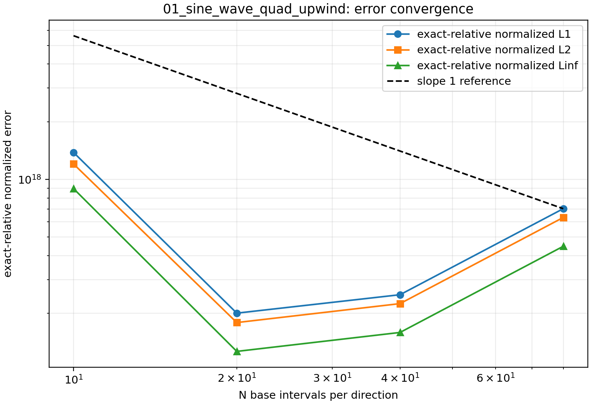
  <figcaption>图 1：四边形正弦波初始场归一化误差，$t=1$</figcaption>
</figure>

[图 1](#fig-01)的横坐标为每方向网格数 $N$，纵坐标为以初始场范数归一化的 $L_1$、$L_2$、
$L_\infty$ 误差。四条数据均在 $10^{-17}$ 量级，并不呈现可用于拟合阶数的单调区间；
这是终态解析振幅只有 $5.12\times10^{-35}$ 后的舍入误差平台，而不是网格收敛失败。

<figure id="fig-02">
  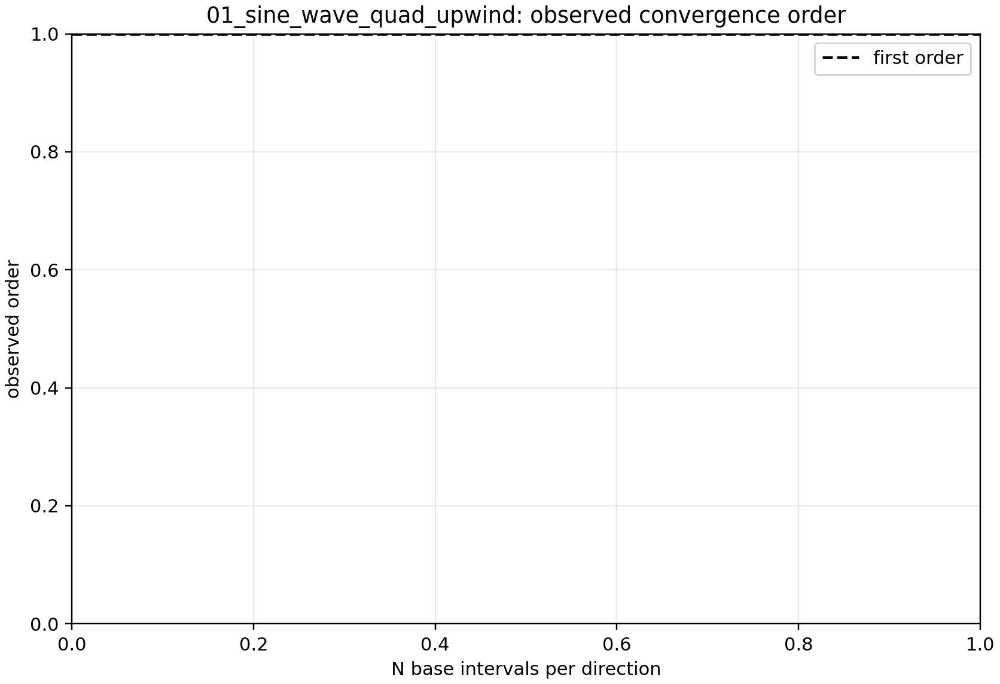
  <figcaption>图 2：四边形正弦波观察收敛阶，$t=1$</figcaption>
</figure>

[图 2](#fig-02)中 $N=20$ 的表观高阶和随后的负阶来自相邻的舍入量级误差相除，不能解释为
格式真实达到高阶或出现反常发散。因此，本案例只检验周期边界、解析衰减和终态残差尺度，
不把图中的观察阶作为一阶迎风格式的收敛性证据。

<figure id="fig-03">
  
  <figcaption>图 3：四边形正弦波各分辨率历史诊断图，$N=10,20,40,80$</figcaption>
</figure>

[图 3](#fig-03)左图使用的是已归档的 exact-relative 指标，右图显示最终记录的半振幅。
由于终态的数值场和解析场都接近零，左图的 $10^{17}\sim10^{18}$ 量级和右图的
`finalAmplitude=0` 都是浮点尺度效应，不能据此比较网格优劣；主指标应以表中的
`initialFieldNormalized` 和下述场对比为准。

<figure id="fig-04">
  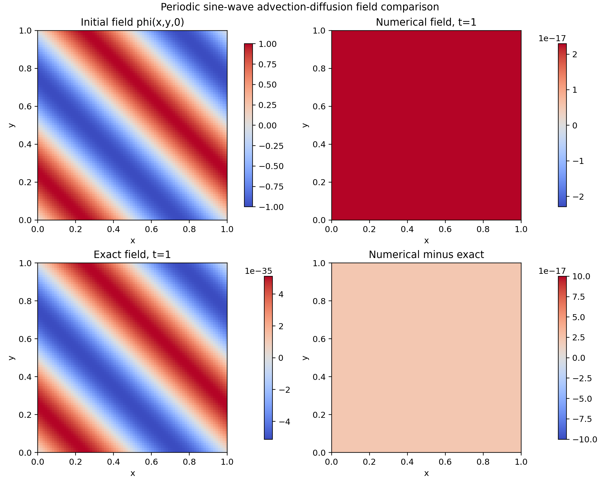
  <figcaption>图 4：四边形正弦波场对比，$N=80$，$t=1$</figcaption>
</figure>

[图 4](#fig-04)中初始场振幅为 1；物理扩散使解析终场降至 $10^{-35}$，数值终场则保留了
约 $2.29\times10^{-17}$ 的均匀舍入残差。右下角误差色标为 $10^{-17}$，与表中
`absoluteLinf=2.29172758\times10^{-17}` 一致。因此图中的单色终场并不表示“数值场等于初始场”，
而是两个终态都已小到无法再用解析终场做相对归一化。

<figure id="fig-05">
  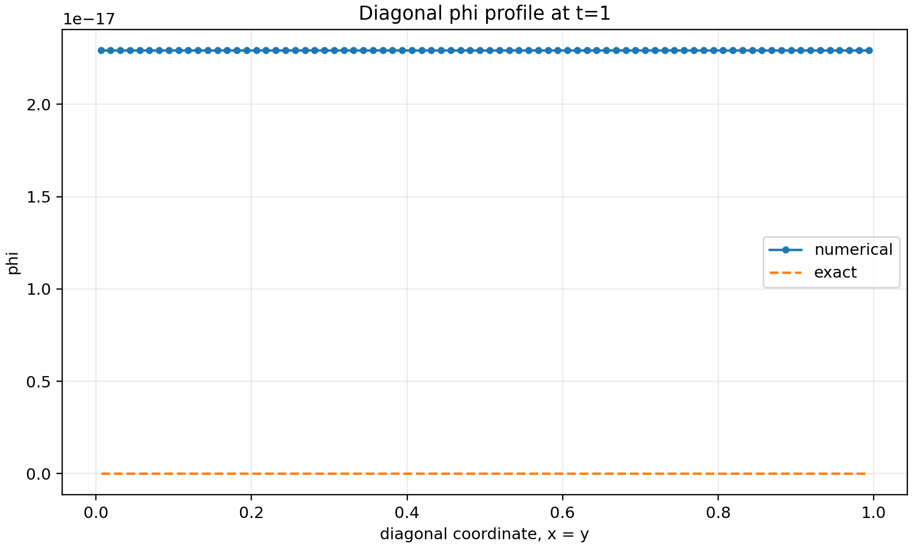
  <figcaption>图 5：四边形正弦波对角线剖面，$N=80$，$t=1$</figcaption>
</figure>

[图 5](#fig-05)沿 $x=y$ 给出数值值和解析值。解析曲线贴近零轴，数值曲线约为
$2.29\times10^{-17}$，再次确认残差属于机器精度而非未衰减的正弦波形。

<figure id="fig-06">
  
  <figcaption>图 6：四边形正弦波振幅历史，$N=80$</figcaption>
</figure>

[图 6](#fig-06)显示数值振幅与 $\exp(-8\pi^2\mu t)$ 的解析衰减在早期一致，并在接近零后
共同受到绘图分辨率和浮点精度限制。该图说明终态“零振幅”首先是强物理扩散的结果，
而不是数值计算把初始波形错误删除。

<figure id="fig-07">
  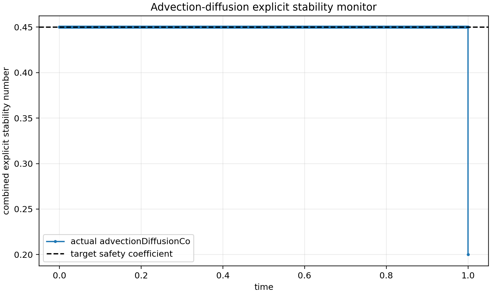
  <figcaption>图 7：四边形正弦波显式稳定性监测，$N=80$</figcaption>
</figure>

[图 7](#fig-07)中组合显式稳定数不超过目标值 `0.45`，末步为准确到达 $t=1$ 而缩短。
因此终态的微小残差不能归因于时间步越过稳定界。

### 6.2 三角形网格

三角形棱柱网格在相同名义分辨率下拥有更多单元，因此它和四边形网格的对比不是严格的一对一。
尽管如此，主误差仍然可以用于检查趋势。

| N | cells | primary L1 | primary L2 | primary Linf | legacy exact-relative L1 | L1 order | max AD stability | final amplitude |
|---:|---:|---:|---:|---:|---:|---:|---:|---:|
| 10 | 200 | 1.19786979e-13 | 1.06657398e-13 | 7.58335939e-14 | 2.33844658e+21 | - | 0.450000 | 0.00000000e+00 |
| 20 | 800 | 8.58242571e-14 | 7.64172536e-14 | 5.43327990e-14 | 1.67543619e+21 | 0.481014 | 0.450000 | 0.00000000e+00 |
| 40 | 3200 | 7.36434762e-14 | 6.61204182e-14 | 4.67541961e-14 | 1.43764653e+21 | 0.220828 | 0.450000 | 0.00000000e+00 |
| 80 | 12800 | 8.63561970e-14 | 7.76945886e-14 | 5.49383704e-14 | 1.68582057e+21 | -0.229742 | 0.450000 | 0.00000000e+00 |

<figure id="fig-08">
  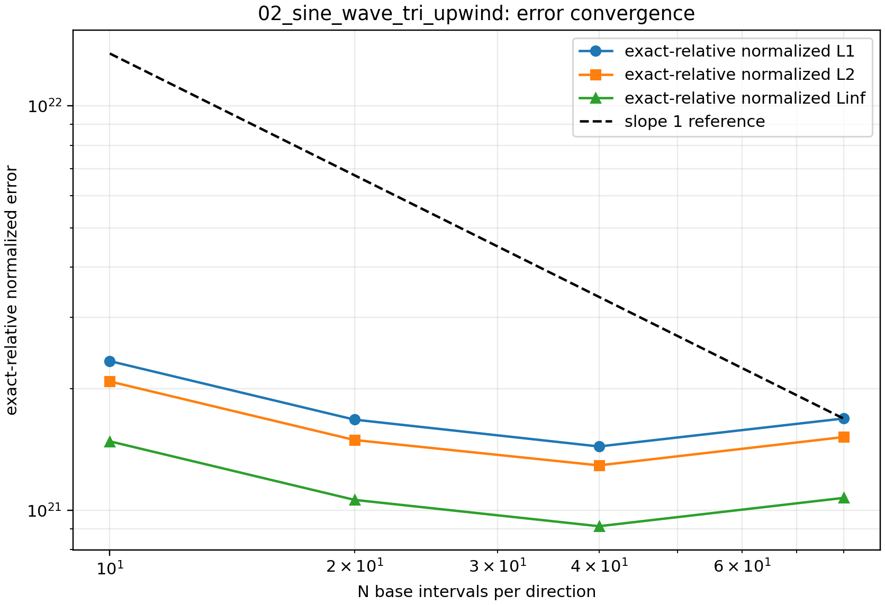
  <figcaption>图 8：三角形正弦波初始场归一化误差，$t=1$</figcaption>
</figure>

[图 8](#fig-08)对应表中的 $10^{-13}\sim10^{-14}$ 主误差。误差比四边形支路高，
但仍远低于初始场尺度；由于三角形案例在同一 $N$ 下有两倍单元数、且两类网格的浮点
累积路径不同，不能把这组差异解释为三角形拓扑本身较差。

<figure id="fig-09">
  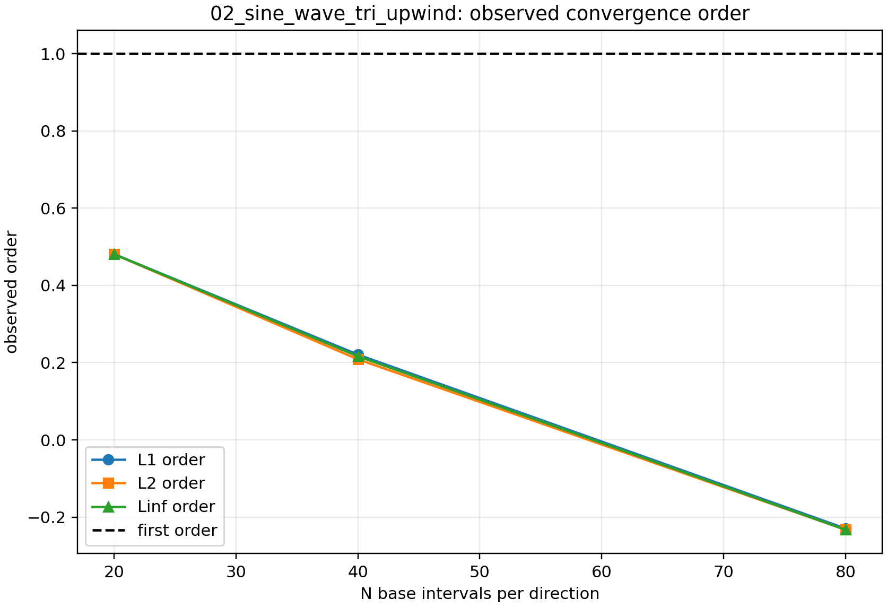
  <figcaption>图 9：三角形正弦波观察收敛阶，$t=1$</figcaption>
</figure>

[图 9](#fig-09)的阶数从正值转为负值，同样属于误差平台上的比值波动。它与四边形的
[图 2](#fig-02)共同说明：在本题给定的 $\mu=1,t=1$ 下，正弦波终态不适合用于定量验证
空间格式阶数。

<figure id="fig-10">
  
  <figcaption>图 10：三角形正弦波各分辨率历史诊断图，$N=10,20,40,80$</figcaption>
</figure>

[图 10](#fig-10)保留 exact-relative 的历史趋势和终态振幅记录，用于追溯旧输出；
其 $10^{21}$ 量级并非真实误差放大，而是用约 $10^{-35}$ 的解析范数作分母所致。

<figure id="fig-11">
  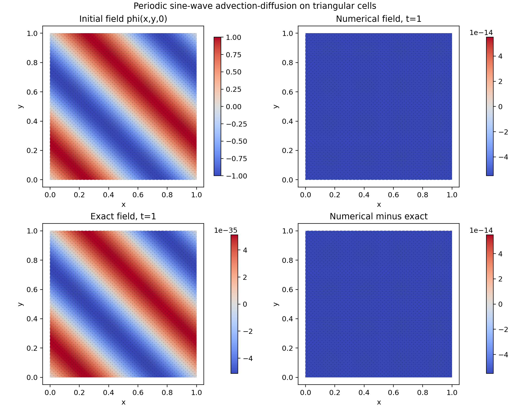
  <figcaption>图 11：三角形正弦波场对比，$N=80$，$t=1$</figcaption>
</figure>

[图 11](#fig-11)中的三角形纹理来自真实单元连接和单元中心采样。数值终场的量级约为
$5.49\times10^{-14}$，解析终场约为 $10^{-35}$；误差图与表中 `absoluteLinf` 一致，
没有出现可见的高频振荡或非有界增长。

<figure id="fig-12">
  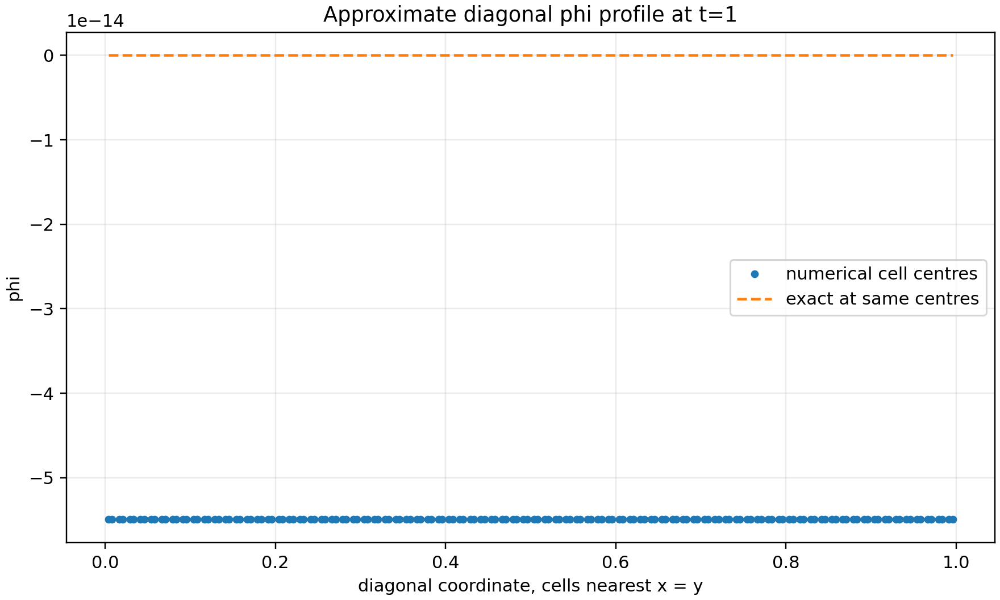
  <figcaption>图 12：三角形正弦波近似对角线剖面，$N=80$，$t=1$</figcaption>
</figure>

[图 12](#fig-12)从最接近 $x=y$ 的三角形单元中心取样，数值残差约为
$-5.49\times10^{-14}$，而解析值接近零。由于该图是非结构网格上的近似采样，
其用途是检查残差尺度和局部网格采样，不应从中提取收敛阶。

<figure id="fig-13">
  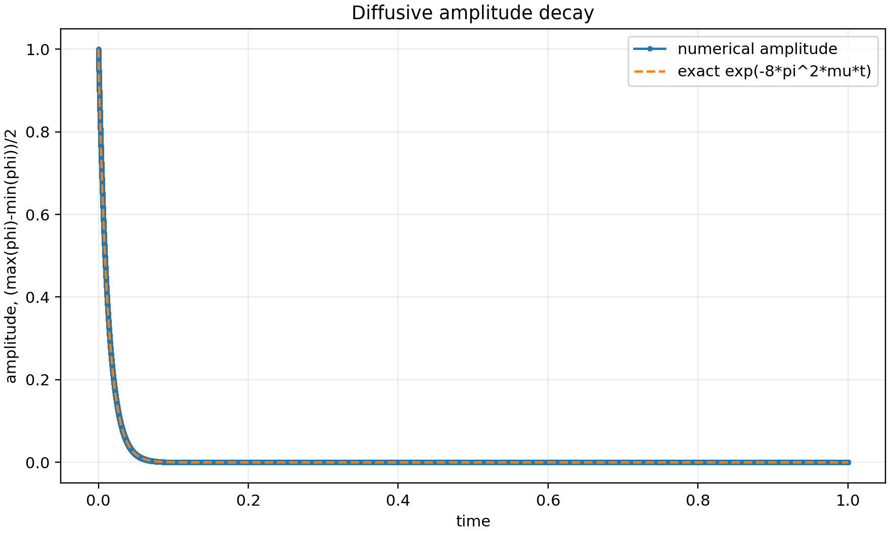
  <figcaption>图 13：三角形正弦波振幅历史，$N=80$</figcaption>
</figure>

[图 13](#fig-13)给出同样的快速扩散衰减。它与 [图 6](#fig-06) 的差别主要出现在
已接近零的末段，因此不应把末段的浮点残差解释为两类网格对物理衰减规律的差异。

<figure id="fig-14">
  
  <figcaption>图 14：三角形正弦波显式稳定性监测，$N=80$</figcaption>
</figure>

[图 14](#fig-14)的稳定数不超过 `0.45`，最后一步缩短至约 `0.35`。三角形终态残差较大
不是由稳定性超限引起，而是在极低绝对量级上由离散和浮点运算共同留下的差异。

## 7. 旋转尖峰算例：结果与边界对比

### 7.1 零 Dirichlet 近似边界

旋转尖峰表中的“最终场幅值”统一定义为 `finalAmplitude=max(phi)-min(phi)`。终态最小值
接近零时，该值接近数值峰值，但二者在定义上不完全相同。各图均为 $\tau=2\pi$ 的结果；
此时解析解已经包含从 $t_0=\pi/2$ 到 $t_0+\tau$ 的物理扩散。

#### 7.1.1 四边形网格

| mesh | N | cells | L1 | L2 | Linf | L1 order | max AD stability | 最终场幅值 $\max\phi-\min\phi$ |
|---|---:|---:|---:|---:|---:|---:|---:|---:|
| quad | 20 | 400 | 1.40608448e+00 | 8.98362860e-01 | 9.18814661e-01 | - | 0.019600 | 9.56166034e-01 |
| quad | 40 | 1600 | 1.18431251e+00 | 8.08418833e-01 | 8.60954387e-01 | 0.247633 | 0.041400 | 1.44494434e+00 |
| quad | 80 | 6400 | 9.25823408e-01 | 6.77071988e-01 | 7.55348183e-01 | 0.355241 | 0.088600 | 2.52847506e+00 |

<figure id="fig-15">
  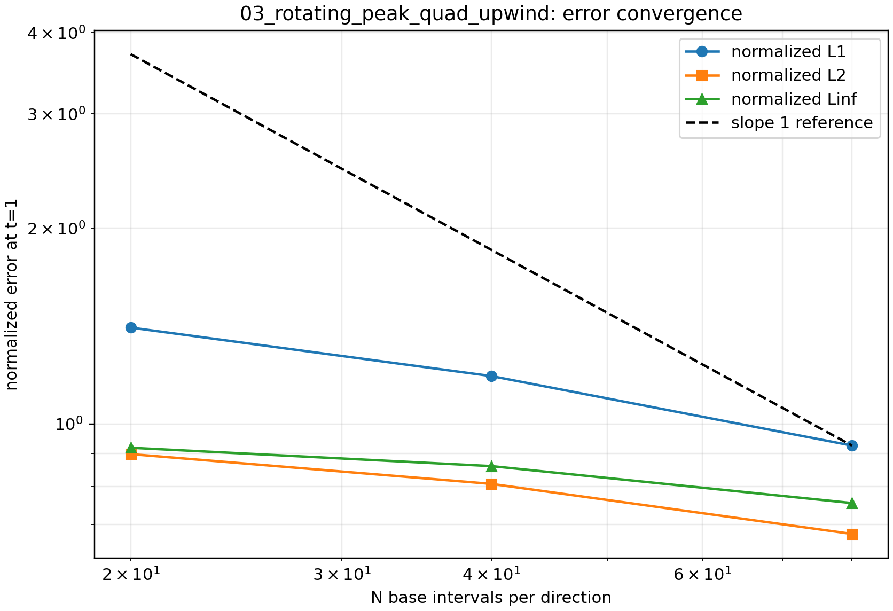
  <figcaption>图 15：零 Dirichlet 四边形旋转尖峰误差收敛图，$\tau=2\pi$</figcaption>
</figure>

[图 15](#fig-15)显示四边形网格从 $N=20$ 加密到 $N=80$ 后，归一化 $L_1$ 从
1.4061 降至 0.9258，$L_2$ 和 $L_\infty$ 也同步下降。误差未达到一阶，是因为尖峰很窄、
经历一整圈旋转，且误差同时包含一阶迎风、时间推进、扩散离散和有限分辨率效应。

<figure id="fig-16">
  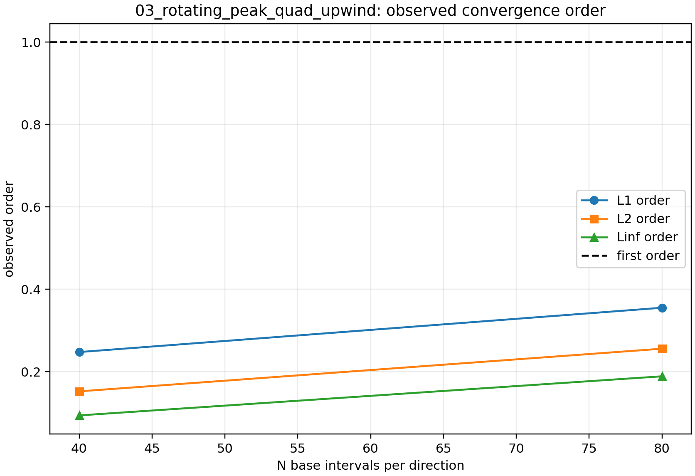
  <figcaption>图 16：零 Dirichlet 四边形旋转尖峰观察收敛阶</figcaption>
</figure>

[图 16](#fig-16)给出的 $L_1$ 观察阶为 0.2476 和 0.3552，低于一阶参考线。
这表明网格加密确实减弱误差，但当前三档网格尚未显示稳定的渐近一阶区间，不能把单个
区间的斜率当作格式理论阶数。

<figure id="fig-17">
  
  <figcaption>图 17：零 Dirichlet 四边形旋转尖峰各分辨率比较</figcaption>
</figure>

[图 17](#fig-17)把误差与最终场幅值并列。随 $N$ 增大，误差下降而场幅值从 0.9562 增至
2.5285；这与粗网格把尖峰过度涂抹、细网格能保留更多局部梯度的现象一致。

<figure id="fig-18">
  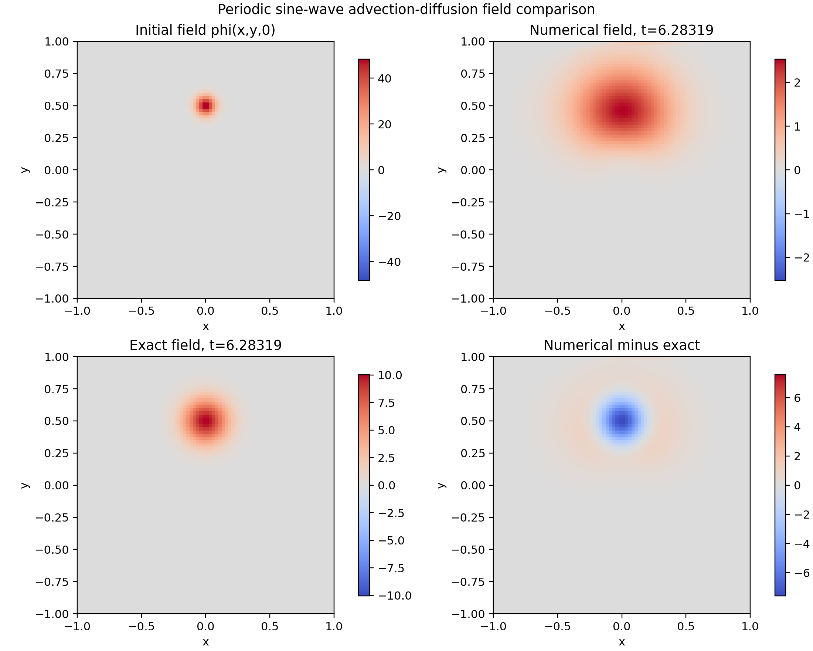
  <figcaption>图 18：零 Dirichlet 四边形旋转尖峰场对比，$N=80$，$\tau=2\pi$</figcaption>
</figure>

[图 18](#fig-18)的数值峰仍位于理论返回位置附近 $(0,0.5)$，但峰顶显著低于解析场，
并在周围形成较宽的正误差环。误差场中心为负、外围为正，正是峰值向周围扩散的形态，
而不是整体旋转相位发生明显偏移。

<figure id="fig-19">
  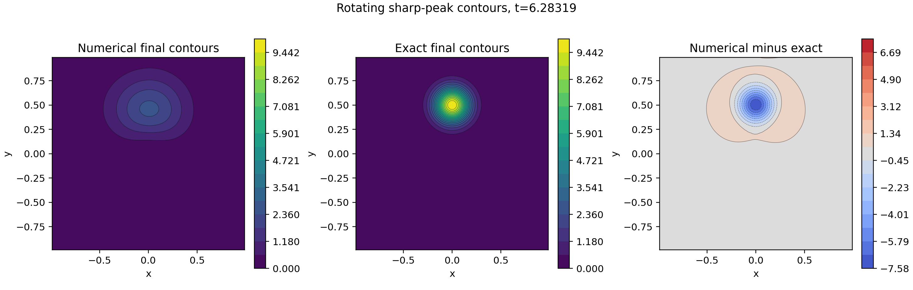
  <figcaption>图 19：零 Dirichlet 四边形旋转尖峰最终等值线，$N=80$，$\tau=2\pi$</figcaption>
</figure>

[图 19](#fig-19)在同一色标下比较数值、解析和误差等值线。解析峰值约为 10.1，而数值最终
场幅值为 2.5285；数值等值线更疏、影响区域更大，量化了 [图 18](#fig-18) 中的峰顶削弱与
轮廓展宽。

<figure id="fig-20">
  
  <figcaption>图 20：零 Dirichlet 四边形旋转尖峰水平剖面，$N=80$，$y\approx0.5$</figcaption>
</figure>

[图 20](#fig-20)沿最接近峰心的 $y=0.5$ 单元中心行取样，因此可直接比较峰顶和峰宽。
数值曲线峰顶约为 2.5，远小于解析峰顶约 10，同时尾部更宽；这说明在物理扩散以外，
一阶迎风还引入了明显的附加数值耗散。

<figure id="fig-21">
  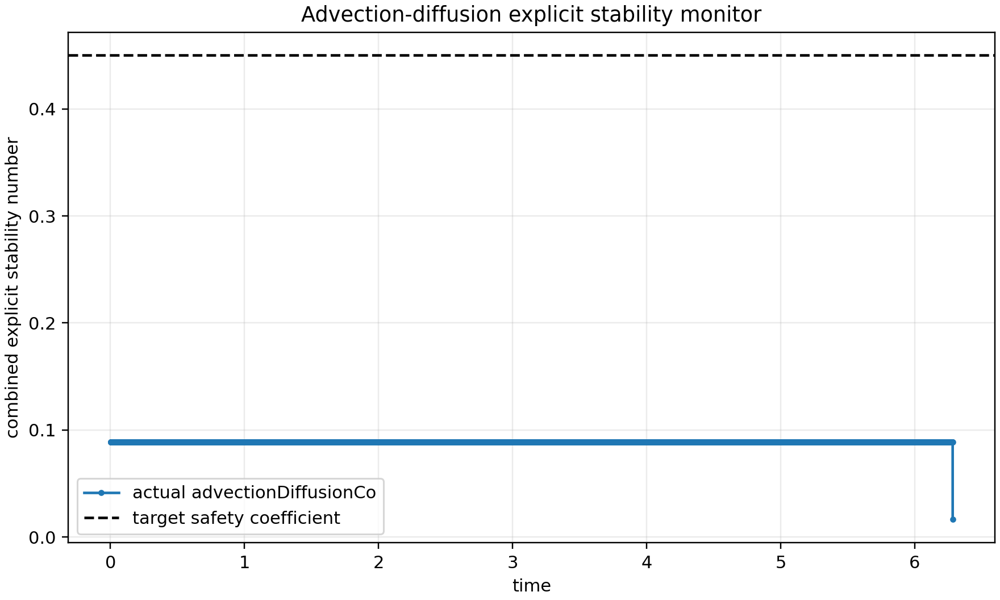
  <figcaption>图 21：零 Dirichlet 四边形旋转尖峰显式稳定性监测，$N=80$</figcaption>
</figure>

[图 21](#fig-21)的组合显式稳定数保持在约 0.0886，低于目标安全系数 0.45；末步进一步缩短。
因此峰值损失发生在稳定时间推进内，主要应解释为物理扩散加一阶迎风数值耗散，而非 CFL 失稳。
该组的 `normalizedMassError=3.8769\times10^{-2}` 记录的是总量变化，不能与局部峰值下降混为同一个量。

#### 7.1.2 三角形网格

| mesh | N | cells | L1 | L2 | Linf | L1 order | max AD stability | 最终场幅值 $\max\phi-\min\phi$ |
|---|---:|---:|---:|---:|---:|---:|---:|---:|
| tri | 20 | 800 | 1.19539683e+00 | 8.18553217e-01 | 8.56290059e-01 | - | 0.037500 | 1.35683540e+00 |
| tri | 40 | 3200 | 9.64529767e-01 | 6.91538442e-01 | 7.66065187e-01 | 0.309592 | 0.082000 | 2.41685858e+00 |
| tri | 80 | 12800 | 6.98100525e-01 | 5.40216938e-01 | 6.28465430e-01 | 0.466391 | 0.180000 | 3.80476206e+00 |

<figure id="fig-22">
  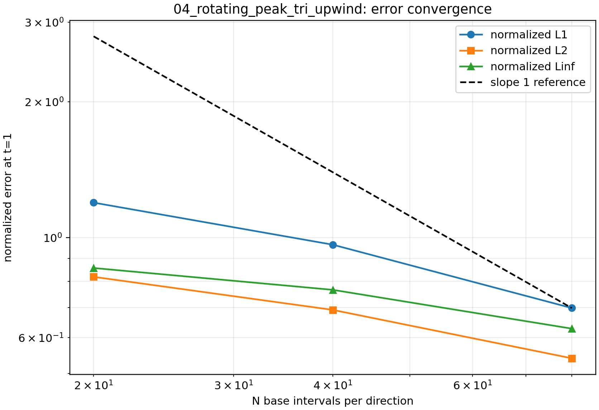
  <figcaption>图 22：零 Dirichlet 三角形旋转尖峰误差收敛图，$\tau=2\pi$</figcaption>
</figure>

[图 22](#fig-22)中 $L_1$ 从 1.1954 降至 0.6981，三档网格均呈下降趋势。相同名义 $N$
下三角形网格拥有两倍单元数，因此该改善同时反映实际单元尺度更细和局部面方向变化，
不能单独归因于网格拓扑。

<figure id="fig-23">
  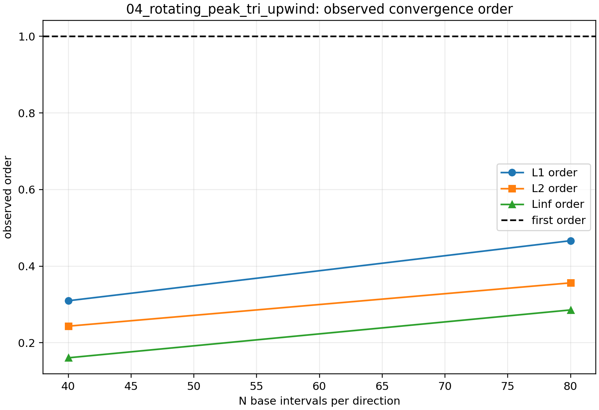
  <figcaption>图 23：零 Dirichlet 三角形旋转尖峰观察收敛阶</figcaption>
</figure>

[图 23](#fig-23)中 $L_1$ 观察阶为 0.3096 和 0.4664，略高于对应四边形支路的
0.2476 和 0.3552，但仍不足以证明三角形格式具有更高的渐近阶。比较中应同时保留单元数
不同、对流方向与局部三角形面方向不同这两个条件。

<figure id="fig-24">
  
  <figcaption>图 24：零 Dirichlet 三角形旋转尖峰各分辨率比较</figcaption>
</figure>

[图 24](#fig-24)显示 $N=20,40,80$ 的最终场幅值为 1.3568、2.4169、3.8048，并随误差
降低而提升。这与更细网格对尖峰梯度分辨更充分相符。

<figure id="fig-25">
  
  <figcaption>图 25：零 Dirichlet 三角形旋转尖峰场对比，$N=80$，$\tau=2\pi$</figcaption>
</figure>

[图 25](#fig-25)显示数值峰仍绕正确位置分布，且峰值高于 [图 18](#fig-18) 的四边形结果；
误差场依然呈中心负、外围正，说明主误差仍是局部削峰和展宽。图中的细三角形纹理是网格
可视化结果，而非额外物理波动。

<figure id="fig-26">
  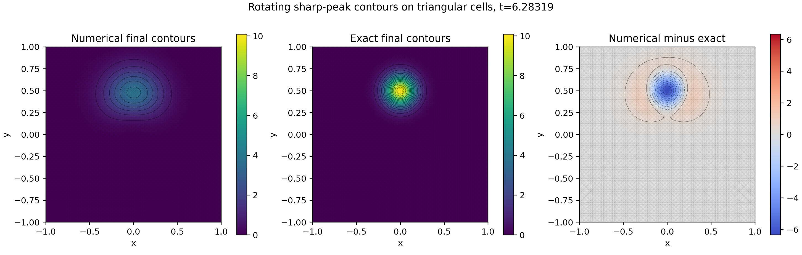
  <figcaption>图 26：零 Dirichlet 三角形旋转尖峰最终等值线，$N=80$，$\tau=2\pi$</figcaption>
</figure>

[图 26](#fig-26)中的数值等值线相较解析等值线仍更宽，但中心高值区比四边形 N80 更集中；
这与表中较小的 $L_1=0.6981$ 和较高的最终场幅值 3.8048 一致。

<figure id="fig-27">
  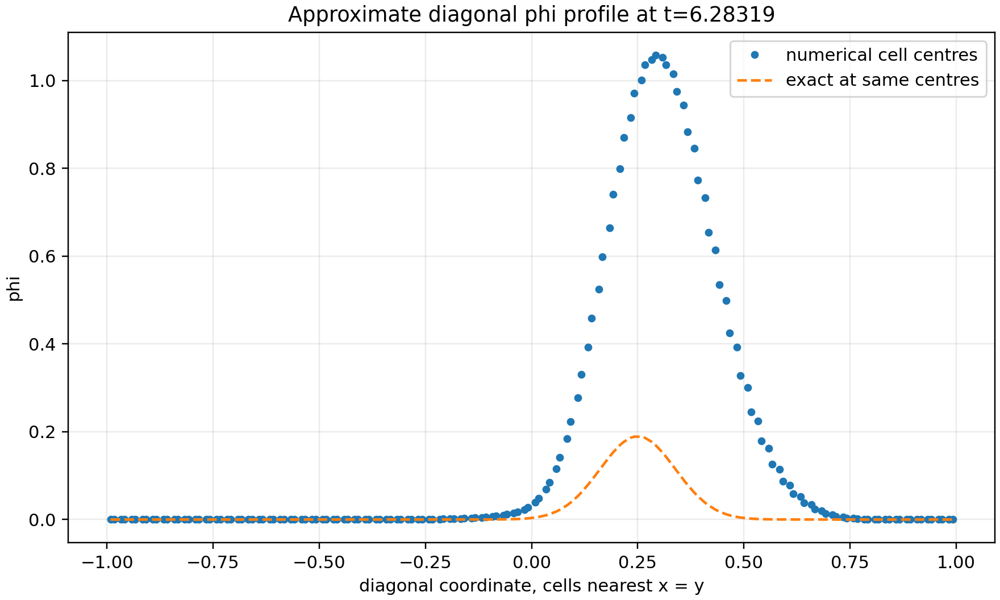
  <figcaption>图 27：零 Dirichlet 三角形旋转尖峰近似对角线剖面，$N=80$</figcaption>
</figure>

[图 27](#fig-27)取最接近 $x=y$ 的三角形单元中心，不经过峰心 $(0,0.5)$，因此不能把图中
局部最大值当作真实峰值，也不宜仅用此图定量判断峰宽。它主要用于观察非结构网格采样下
的局部误差；峰顶与全场误差应以 [图 25](#fig-25)、[图 26](#fig-26) 和表中结果为准。

<figure id="fig-28">
  
  <figcaption>图 28：零 Dirichlet 三角形旋转尖峰显式稳定性监测，$N=80$</figcaption>
</figure>

[图 28](#fig-28)的最大稳定数为 0.18，仍低于目标 0.45。N80 的
`normalizedMassError=1.0128\times10^{-2}` 小于四边形的 $3.8769\times10^{-2}$，
但质量误差的减小并不自动等价于每个局部峰值都准确，仍需结合全场误差和轮廓判断。

### 7.2 解析 Dirichlet 边界

#### 7.2.1 四边形网格

| mesh | N | cells | L1 | L2 | Linf | L1 order | max AD stability | 最终场幅值 $\max\phi-\min\phi$ |
|---|---:|---:|---:|---:|---:|---:|---:|---:|
| quad | 20 | 400 | 1.40607172e+00 | 8.98359847e-01 | 9.18814400e-01 | - | 0.019600 | 9.55678954e-01 |
| quad | 40 | 1600 | 1.18430865e+00 | 8.08417165e-01 | 8.60954333e-01 | 0.247625 | 0.041400 | 1.44494442e+00 |
| quad | 80 | 6400 | 9.25832748e-01 | 6.77072332e-01 | 7.55348178e-01 | 0.355222 | 0.088600 | 2.52847507e+00 |

<figure id="fig-29">
  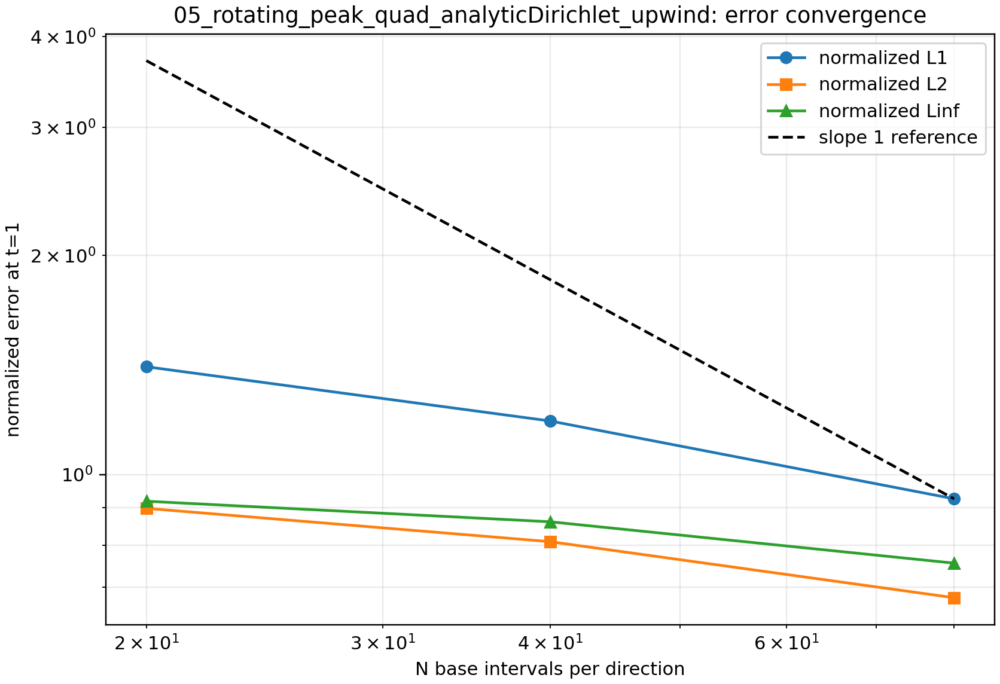
  <figcaption>图 29：解析 Dirichlet 四边形旋转尖峰误差收敛图，$\tau=2\pi$</figcaption>
</figure>

[图 29](#fig-29)与 [图 15](#fig-15) 几乎重合：$N=80$ 的 $L_1$ 为 0.9258327，
仅比零 Dirichlet 近似多 $1.28\times10^{-5}$。这表明在当前计算域和时间窗内，
解析边界值的修正远小于内部离散造成的误差。

<figure id="fig-30">
  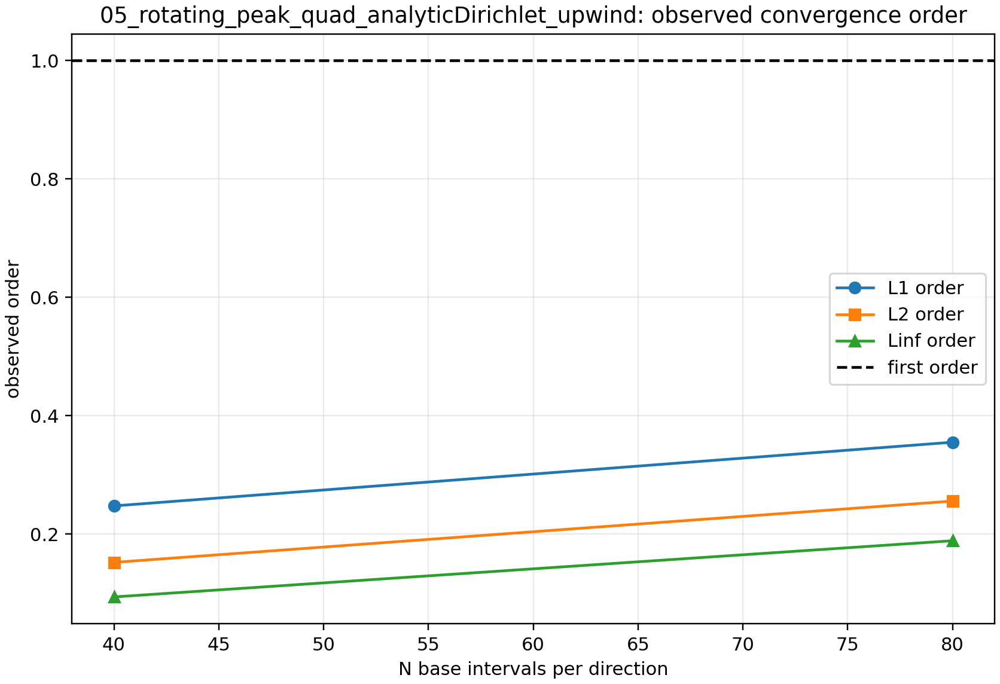
  <figcaption>图 30：解析 Dirichlet 四边形旋转尖峰观察收敛阶</figcaption>
</figure>

[图 30](#fig-30)中的 $L_1$ 阶为 0.2476、0.3552，与 [图 16](#fig-16) 的差别仅在
小数末位。边界条件替换没有改变当前网格区间的主要收敛特征。

<figure id="fig-31">
  
  <figcaption>图 31：解析 Dirichlet 四边形旋转尖峰各分辨率比较</figcaption>
</figure>

[图 31](#fig-31)的最终场幅值随网格加密从 0.9557 提升至 2.5285，与零边界的
[图 17](#fig-17) 同样一致。这说明当前分辨率下的峰值恢复主要由网格加密决定。

<figure id="fig-32">
  
  <figcaption>图 32：解析 Dirichlet 四边形旋转尖峰场对比，$N=80$，$\tau=2\pi$</figcaption>
</figure>

[图 32](#fig-32)仍显示中心负误差及外围正误差环，形态与 [图 18](#fig-18) 一致。
解析边界并未消除中心削峰，说明该现象并非边界零值人为截断所主导。

<figure id="fig-33">
  
  <figcaption>图 33：解析 Dirichlet 四边形旋转尖峰最终等值线，$N=80$，$\tau=2\pi$</figcaption>
</figure>

[图 33](#fig-33)中数值等值线的展宽程度与零边界版本基本一致，和表中的
`finalAmplitude` 差 $1.50\times10^{-8}$ 相吻合。

<figure id="fig-34">
  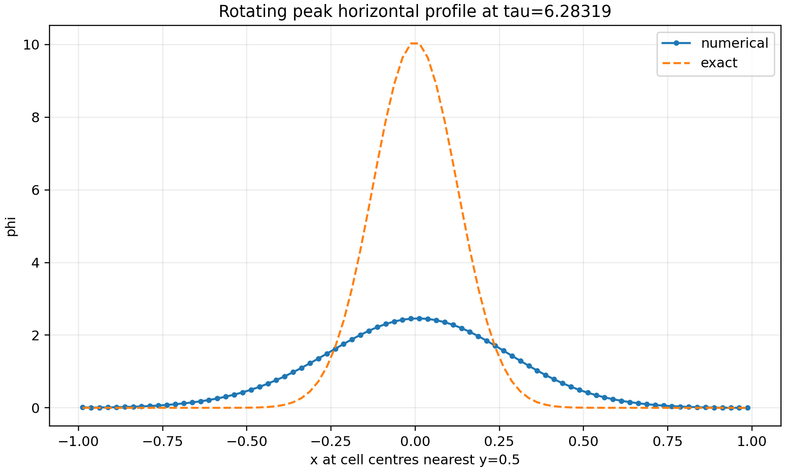
  <figcaption>图 34：解析 Dirichlet 四边形旋转尖峰水平剖面，$N=80$，$y\approx0.5$</figcaption>
</figure>

[图 34](#fig-34)的水平剖面与 [图 20](#fig-20) 基本重合：数值峰约为 2.5、解析峰约为
10，且数值尾部更宽。它从一维剖面再次确认边界条件替换没有改变主导的数值耗散现象。

<figure id="fig-35">
  
  <figcaption>图 35：解析 Dirichlet 四边形旋转尖峰显式稳定性监测，$N=80$</figcaption>
</figure>

[图 35](#fig-35)的稳定历史与 [图 21](#fig-21) 相同，最大值为 0.0886。边界处理不同而
时间步控制相同，使两组轮廓的接近程度可以直接归因于边界影响较小，而不是 CFL 条件改变。

#### 7.2.2 三角形网格

| mesh | N | cells | L1 | L2 | Linf | L1 order | max AD stability | 最终场幅值 $\max\phi-\min\phi$ |
|---|---:|---:|---:|---:|---:|---:|---:|---:|
| tri | 20 | 800 | 1.19538875e+00 | 8.18551697e-01 | 8.56290027e-01 | - | 0.037500 | 1.35683543e+00 |
| tri | 40 | 3200 | 9.64533219e-01 | 6.91538344e-01 | 7.66065183e-01 | 0.309577 | 0.082000 | 2.41685859e+00 |
| tri | 80 | 12800 | 6.98117857e-01 | 5.40217692e-01 | 6.28465430e-01 | 0.466360 | 0.180000 | 3.80476207e+00 |

<figure id="fig-36">
  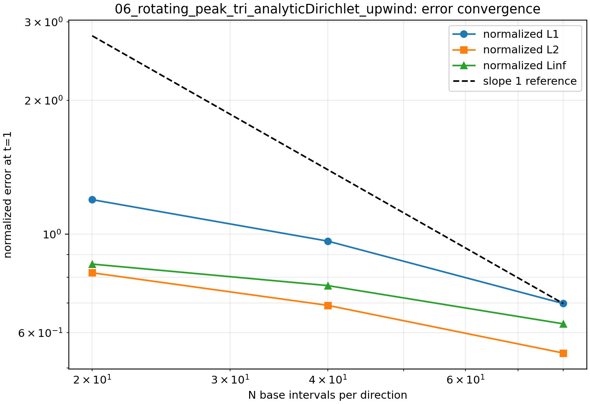
  <figcaption>图 36：解析 Dirichlet 三角形旋转尖峰误差收敛图，$\tau=2\pi$</figcaption>
</figure>

[图 36](#fig-36)的误差曲线与 [图 22](#fig-22) 基本一致，N80 的 $L_1=0.6981179$，
与零边界版本只差 $8.08\times10^{-6}$。解析 Dirichlet 对三角形网格的全场误差同样只产生
次要影响。

<figure id="fig-37">
  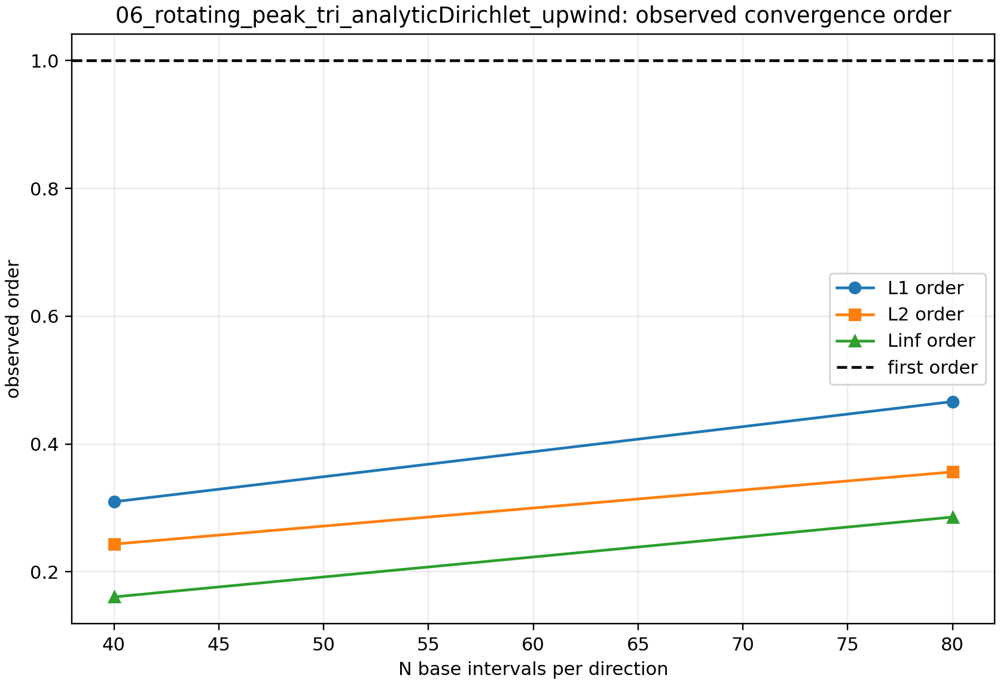
  <figcaption>图 37：解析 Dirichlet 三角形旋转尖峰观察收敛阶</figcaption>
</figure>

[图 37](#fig-37)中的观察阶 0.3096、0.4664 与零边界组几乎相同，进一步排除边界条件
变化是当前收敛曲线主要来源的可能。

<figure id="fig-38">
  
  <figcaption>图 38：解析 Dirichlet 三角形旋转尖峰各分辨率比较</figcaption>
</figure>

[图 38](#fig-38)中最终场幅值仍从 1.3568 增至 3.8048，网格加密趋势与 [图 24](#fig-24)
相同。最细网格的最终场幅值差仅为 $1.85\times10^{-9}$，小于图像可辨分辨率。

<figure id="fig-39">
  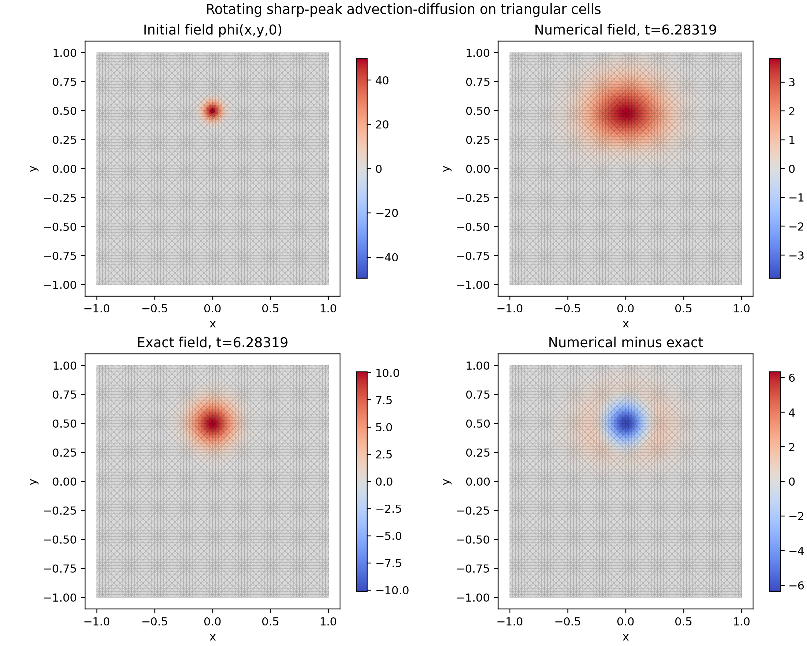
  <figcaption>图 39：解析 Dirichlet 三角形旋转尖峰场对比，$N=80$，$\tau=2\pi$</figcaption>
</figure>

[图 39](#fig-39)的峰心、外围误差环和三角形网格纹理均与 [图 25](#fig-25) 对应。
数值场较解析场偏低的核心区域仍最突出，说明边界改进没有改变一阶迎风对中心峰值的耗散。

<figure id="fig-40">
  
  <figcaption>图 40：解析 Dirichlet 三角形旋转尖峰最终等值线，$N=80$，$\tau=2\pi$</figcaption>
</figure>

[图 40](#fig-40)的数值等值线仍较解析解展宽。与 [图 26](#fig-26) 的近乎一致说明，本题
边界影响在当前域尺度下较小，而内部对流扩散离散控制了可见轮廓差异。

<figure id="fig-41">
  
  <figcaption>图 41：解析 Dirichlet 三角形旋转尖峰近似对角线剖面，$N=80$</figcaption>
</figure>

[图 41](#fig-41)仍是接近 $x=y$ 的非峰心采样，不能替代峰值剖面；其作用是检查局部采样下
数值值与同一单元中心解析值的差别。用于峰值保留的主证据仍是 [图 39](#fig-39)、
[图 40](#fig-40) 和最终场幅值。

<figure id="fig-42">
  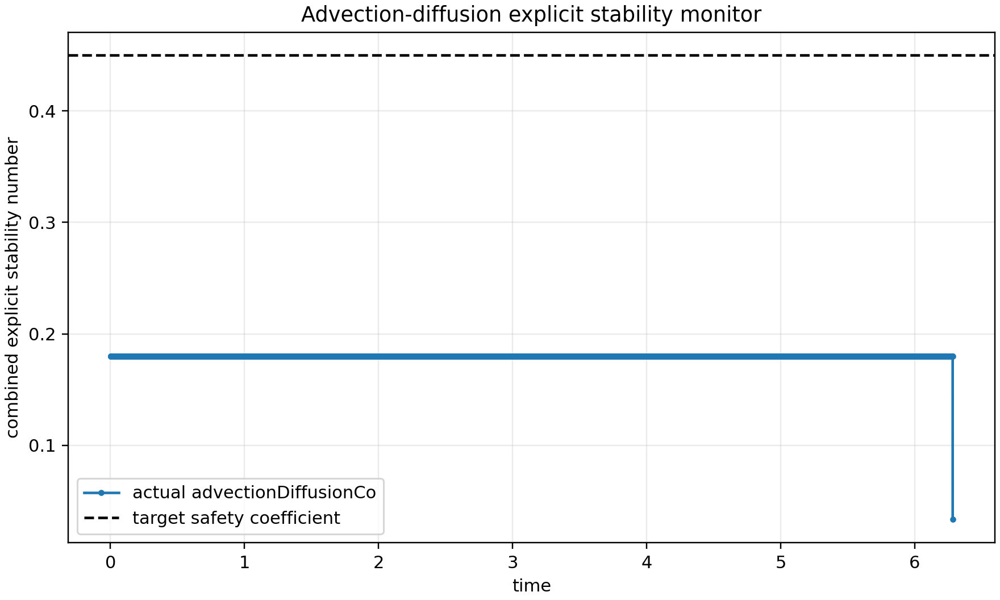
  <figcaption>图 42：解析 Dirichlet 三角形旋转尖峰显式稳定性监测，$N=80$</figcaption>
</figure>

[图 42](#fig-42)的最大稳定数为 0.18，与 [图 28](#fig-28) 相同。两个边界版本的
`normalizedMassError` 差为 $1.74\times10^{-5}$，属于小的边界修正，而非主导误差来源。

四边形和三角形在解析边界与零边界之间的差异都只有 $10^{-5}$ 量级。这说明对于当前域、
扩散系数和旋转周期，边界处的解析尾部相对中心峰值较小，边界处理的差别几乎不影响主结果。

下表把零 Dirichlet 近似与解析 Dirichlet 的 N80 结果直接对照起来：

| mesh | $L1$ difference | normalizedMassError difference | finalAmplitude difference |
|---|---:|---:|---:|
| quad | $1.2762165\times10^{-5}$ | $9.6199226\times10^{-6}$ | $1.5020000\times10^{-8}$ |
| tri | $8.0763799\times10^{-6}$ | $1.7385108\times10^{-5}$ | $1.8500000\times10^{-9}$ |

这组差值进一步说明：边界函数从近似零换成解析零附近值以后，主误差几乎不变，真正控制解质量的仍然是网格分辨率和一阶离散的数值耗散。

## 8. 跨实验比较

1. **正弦波的病态收敛**
   四边形 `initialNormalizedL1` 仅从 `7.08\times10^{-17}` 变化到 `3.60\times10^{-17}`，三角形则从 `1.20\times10^{-13}` 变化到 `8.64\times10^{-14}`。对应的 [图 4](#fig-04) 和 [图 11](#fig-11) 都显示，数值终场已经进入浮点残差平台；而 [图 3](#fig-03) 和 [图 10](#fig-10) 中的 exact-relative 误差却被压缩的解析范数放大到 $10^{18}\sim10^{21}$。因此，这一组的关键现象不是“误差有多大”，而是“解析解在 $t=1$ 后已低到不能再用自身范数做分母”。

2. **四边形与三角形不能只按同一个 $N$ 比较**
   四边形 $N=80$ 只有 6400 个单元，三角形 $N=80$ 有 12800 个单元。前者在正弦波中已经进入舍入平台，后者仍保留 $10^{-13}$ 量级的初始场归一化误差；在旋转尖峰中，三角形又比四边形保留更多峰值。也就是说，名义 $N$ 只是每边划分数，不是单元数本身，比较时必须同时看图像、单元数和剖面取样方式。

3. **旋转尖峰的突出现象是峰值钝化而不是中心漂移**
   [图 18](#fig-18)、[图 25](#fig-25)、[图 32](#fig-32) 和 [图 39](#fig-39) 的误差场都呈现“中心负、外围正”的环状结构，说明数值解在峰心处被削低，并把质量向外扩散。四边形 N80 的最终场幅值是 2.5285，三角形 N80 是 3.8048；相应的解析峰值接近 10.1。峰心位置仍与理论轨迹一致，因此主误差更像是局部扩散和一阶迎风耗散，而不是整体平移相位错误。

4. **边界条件的影响确实很小，但不是零**
   零 Dirichlet 与解析 Dirichlet 的 N80 差值只有 $10^{-5}$ 量级，`normalizedMassError` 的变化也只在 $10^{-5}$ 附近；四边形的 `finalAmplitude` 仅差 $1.50\times10^{-8}$，三角形仅差 $1.85\times10^{-9}$。这说明边界处理是二级修正项，主导误差仍然来自内部离散和网格分辨率。

5. **稳定性与守恒性说明了什么，不说明什么**
   [图 7](#fig-07)、[图 14](#fig-14)、[图 21](#fig-21)、[图 28](#fig-28)、[图 35](#fig-35) 和 [图 42](#fig-42) 都表明显式稳定数始终受控，`solverEnded=true` 且 `solverFatal=false`。这说明求解链路是稳定的，但并不意味着没有数值耗散。正弦波的质量误差几乎是舍入误差，而旋转尖峰的质量误差和峰值削弱则是物理扩散与一阶格式共同作用的结果。


## 9. 结果讨论

第三题求解器在所有配置上都稳定结束，并给出了可追溯的收敛与场图证据。  
正弦波问题在 $t=1$ 时已经把解析振幅压到 $10^{-35}$ 量级，因此 `exactFieldNormalized` 不再适合作为主误差；`field_comparison` 和病态误差图共同说明，这个问题更适合用初始场归一化来判断求解质量。
旋转尖峰问题则更直接地反映了网格与边界设置的作用：`contour_final` 和剖面图都显示，网格越细，峰值保留越多、轮廓越窄；零边界与解析边界的差异则始终远小于网格效应本身。


## 10. 证据索引

报告所引用的题目、配置、源码、运行目录、汇总数据和图片的详细对应关系见同目录下的
[evidence_index.md](evidence_index.md)。
