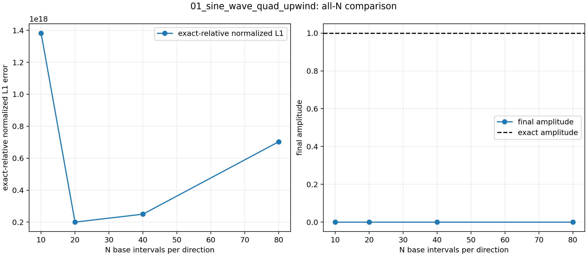
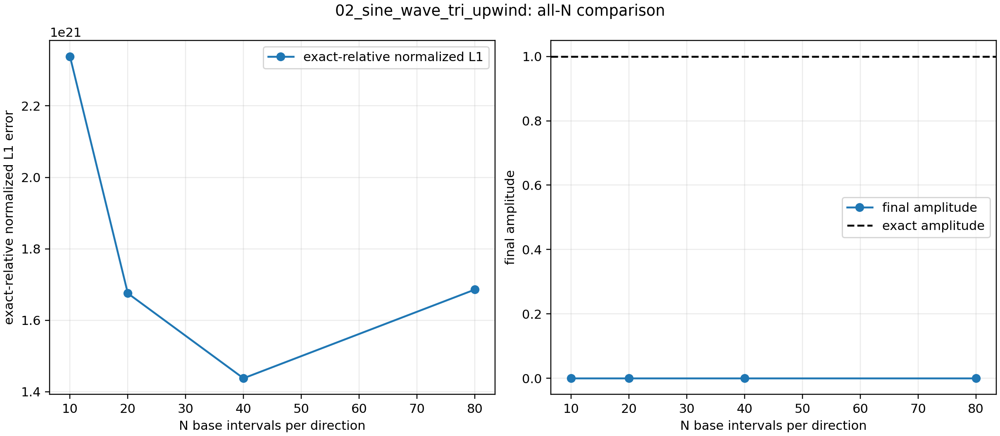
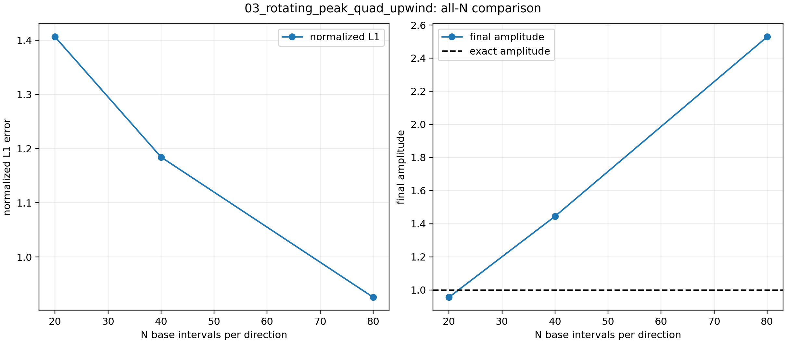
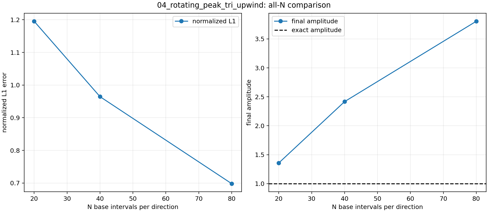
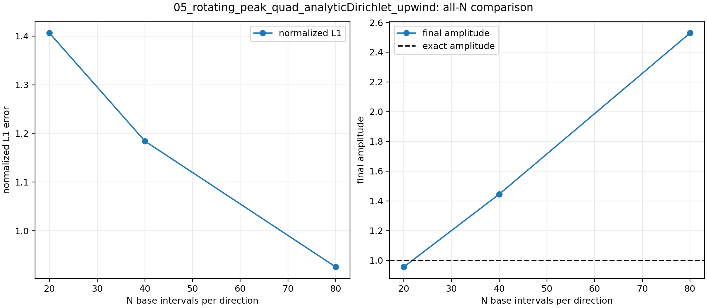

# 第三题：二维对流-扩散方程有限体积求解器验证报告

**项目目录：** `/home/a776/workdocuments/上交船舶/slover/student_project`  
**题目来源：** `../../pdf/03/第三题_二维对流扩散方程_自包含题目.pdf`  
**理论推导：** `../../pdf/03/第三题_对流扩散方程_有限体积法完整推导.pdf`  
**报告日期：** 2026-08-29  
**求解器：** `explicitAdvectionDiffusionFoamStudent`  
**OpenFOAM 版本：** OpenFOAM 14

## 目录

- [研究概况](#研究概况)
- [1. 问题定义与研究目标](#1-问题定义与研究目标)
- [2. 假设、范围与验收标准](#2-假设范围与验收标准)
- [3. 数学模型与求解器实现](#3-数学模型与求解器实现)
- [4. 几何区域、初始条件和边界条件](#4-几何区域初始条件和边界条件)
- [5. 软件、网格和算例组织](#5-软件网格和算例组织)
- [6. 正弦波算例：结果与误差定义](#6-正弦波算例结果与误差定义)
- [7. 旋转尖峰算例：结果与边界对比](#7-旋转尖峰算例结果与边界对比)
- [8. 跨实验比较](#8-跨实验比较)
- [9. 收敛、监测量与守恒性检查](#9-收敛监测量与守恒性检查)
- [10. 结果讨论](#10-结果讨论)
- [11. 局限性、风险与未完成事项](#11-局限性风险与未完成事项)
- [12. 结论](#12-结论)
- [13. 结果与报告完整性检查](#13-结果与报告完整性检查)
- [14. 复现实验命令](#14-复现实验命令)
- [15. 证据索引](#15-证据索引)

## 研究概况

| 项目 | 内容 |
|---|---|
| 研究类型 | 显式有限体积对流-扩散求解器验证 |
| 研究对象 | 周期正弦波平移、旋转尖峰平流扩散 |
| 计算平台 | OpenFOAM 14 |
| 求解器族 | `03_advection_diffusion_equation` |
| 网格类型 | 结构化四边形、三角形棱柱 |
| 核心指标 | 归一化误差、观察收敛阶、稳定性、守恒性、场图 |

本报告中的参数来自 `scripts/configs/03_advection_diffusion_equation/` 下的 JSON 配置文件，
运行结果来自 `data/03_advection_diffusion_equation/`、`figures/03_advection_diffusion_equation/`
和 `cases/03_advection_diffusion_equation/` 下的结果目录。

## 1. 问题定义与研究目标

第三题对应二维对流-扩散方程：

$$
\frac{\partial \phi}{\partial t}
+\nabla\cdot(\boldsymbol{U}\phi)
-\nabla\cdot(\mu\nabla\phi)=0.
$$

其中 $\phi$ 为标量场，$\boldsymbol{U}$ 为给定速度场，$\mu$ 为扩散系数。
本项目使用学生版 OpenFOAM 求解器 `explicitAdvectionDiffusionFoamStudent` 完成显式有限体积离散，
并对两个基准算例族做了网格与边界条件扩展：

1. 周期正弦波平移，用于检查周期边界、误差定义和网格收敛；
2. 旋转尖峰平流扩散，用于检查长时间旋转、边界处理和轮廓保持能力。

原题要求与本项目交付内容的对应关系如下：

| 原题要求 | 本项目对应结果 | 报告位置 |
|---|---|---|
| 实现二维对流-扩散求解器 | `explicitAdvectionDiffusionFoamStudent` | 第 3、5 节 |
| 正弦波平移并报告误差 | 四边形、三角形网格均完成 | 第 6 节 |
| 网格收敛性分析 | 四组正弦波实验均完成 | 第 6 节 |
| 旋转尖峰一周后的轮廓 | 四组旋转尖峰实验均完成 | 第 7 节 |
| 记录稳定性、守恒性与后处理图 | `summary.json`、CSV 和图片均已生成 | 第 9、13 节 |

## 2. 假设、范围与验收标准

### 2.1 基本假设

- $\mu$ 为常数；
- 速度场由题面给定，不再求解动量方程；
- 正弦波算例使用周期边界；
- 旋转尖峰算例使用零 Dirichlet 近似边界和解析 Dirichlet 两个版本；
- 时间推进采用显式前向 Euler；
- 对流项采用 `Gauss upwind`，扩散项采用 `Gauss linear corrected`；
- 正弦波算例在 $t=1$ 时的解析振幅极小，因此主误差指标采用初始场归一化误差。

### 2.2 本报告范围

- 仅覆盖第三题；
- 不覆盖其他题的扩散、Poisson 和 Navier-Stokes 结果；
- 不讨论更高阶时间推进或高阶重构；
- 不把病态的解析相对误差当作主收敛指标。

### 2.3 验收标准

| 验收项 | 标准 |
|---|---|
| 求解器编译 | 生成 `build/03_advection_diffusion_equation/bin/explicitAdvectionDiffusionFoamStudent` |
| 网格检查 | `meshOK=true`，无致命错误 |
| 求解结束 | `solverEnded=true` 且 `solverFatal=false` |
| 时间精度 | `finalTimeError=0` |
| 稳定性 | `maxCo` 不超过配置目标 |
| 误差可追溯 | 主误差、旧误差和归一化方式均有记录 |
| 图表可追溯 | 结果图、收敛图和单案例图均存在 |

## 3. 数学模型与求解器实现

### 3.1 有限体积半离散形式

对任意控制体 $\Omega_c$ 积分后得到：

$$V_c\frac{\mathrm d\phi_c}{\mathrm dt}+\sum_{f\in\partial\Omega_c}F_{cf}\phi_f+\sum_{f\in\partial\Omega_c}\mu_f(\nabla\phi)_f\cdot\boldsymbol{S}_f=0.$$

其中 $F_{cf}=\boldsymbol{U}_f\cdot\boldsymbol{S}_f$，$V_c$ 为单元体积。

### 3.2 空间离散

对流项采用一阶迎风：

```foam
div(phi,phi) Gauss upwind;
```

扩散项采用线性修正拉普拉斯：

```foam
laplacian(mu,phi) Gauss linear corrected;
```

这种组合在稳态上较稳健，但会引入一定数值耗散，因此旋转尖峰算例会随着时间和网格粗细表现出明显的峰值衰减差异。

### 3.3 时间离散

时间推进采用显式前向 Euler：

$$
\phi_c^{n+1}=\phi_c^n+\Delta t\,R_c^n,
$$

其中 $R_c^n$ 是有限体积残差。稳定时间步由 `advectionDiffusionCo` 和 `maxDeltaT`
共同控制，配置值统一为 `0.45` 和 `0.001`。

### 3.4 误差定义

正弦波算例在 $t=1$ 时的解析振幅为：

$$
\exp(-8\pi^2)\approx 5.1225\times10^{-35},
$$

因此使用解析解范数做分母会得到病态的相对误差。报告中采用的主指标是
`initialFieldNormalized`，即以初始场尺度归一化的误差；旧的 `exactFieldNormalized`
仅保留为诊断量和历史记录。

旋转尖峰算例的目标时间为 $t=2\pi$，解析解不趋于零，故常规的 exact-relative 误差是可用的，
但在固定零边界版本中边界解析值仍接近指数小量，因此与解析 Dirichlet 版本的差异极小。

## 4. 几何区域、初始条件和边界条件

### 4.1 正弦波算例

| 项目 | 内容 |
|---|---|
| 计算域 | $[0,1]\times[0,1]$ |
| 初始条件 | $\phi(x,y,0)=\sin(2\pi(x+y))$ |
| 速度场 | $\boldsymbol{U}=(1,1,0)$ |
| 扩散系数 | $\mu=1$ |
| 边界条件 | 周期边界 `periodicXY` |
| 目标时间 | $t=1$ |

### 4.2 旋转尖峰算例

| 项目 | 内容 |
|---|---|
| 计算域 | $[-1,1]\times[-1,1]$ |
| 初始条件 | 旋转尖峰，中心位于 $(0,0.5)$ |
| 速度场 | $\boldsymbol{U}=(-y,x,0)$ |
| 扩散系数 | $\mu=10^{-3}$ |
| 扩散起始时间 | $t_0=\pi/2$ |
| 目标时间 | $t=2\pi$ |
| 边界条件 A | 零 Dirichlet 近似 |
| 边界条件 B | 解析 Dirichlet |

解析中心运动可写为：

$$
x_c=x_0\cos\tau-y_0\sin\tau,\qquad
y_c=x_0\sin\tau+y_0\cos\tau.
$$

## 5. 软件、网格和算例组织

| caseName | 网格 | 后端 | 边界/特征 | 分辨率 | 结果目录 |
|---|---|---|---|---|---|
| `01_sine_wave_quad_upwind` | 四边形 | `blockMesh` | 周期边界 | $N=10,20,40,80$ | `data/03_advection_diffusion_equation/analysis/01_sine_wave_quad_upwind` |
| `02_sine_wave_tri_upwind` | 三角形棱柱 | `gmsh` | 周期边界 | $N=10,20,40,80$ | `data/03_advection_diffusion_equation/analysis/02_sine_wave_tri_upwind` |
| `03_rotating_peak_quad_upwind` | 四边形 | `blockMesh` | 零 Dirichlet 近似 | $N=20,40,80$ | `data/03_advection_diffusion_equation/analysis/03_rotating_peak_quad_upwind` |
| `04_rotating_peak_tri_upwind` | 三角形棱柱 | `gmsh` | 零 Dirichlet 近似 | $N=20,40,80$ | `data/03_advection_diffusion_equation/analysis/04_rotating_peak_tri_upwind` |
| `05_rotating_peak_quad_analyticDirichlet_upwind` | 四边形 | `blockMesh` | 解析 Dirichlet | $N=20,40,80$ | `data/03_advection_diffusion_equation/analysis/05_rotating_peak_quad_analyticDirichlet_upwind` |
| `06_rotating_peak_tri_analyticDirichlet_upwind` | 三角形棱柱 | `gmsh` | 解析 Dirichlet | $N=20,40,80$ | `data/03_advection_diffusion_equation/analysis/06_rotating_peak_tri_analyticDirichlet_upwind` |

求解器编译产物位于：

```text
build/03_advection_diffusion_equation/bin/explicitAdvectionDiffusionFoamStudent
```

病态相对误差的历史归档保存在：

```text
data/03_advection_diffusion_equation/pathological_relative_error/
```

## 6. 正弦波算例：结果与误差定义

### 6.1 四边形网格

四边形网格的主结果如下。由于 $t=1$ 时解析解振幅已接近双精度舍入量级，`exactFieldNormalized`
会被极小分母放大；因此这里以 `initialFieldNormalized` 作为主收敛指标。

| N | cells | primary L1 | primary L2 | primary Linf | legacy exact-relative L1 | L1 order | max AD stability | final amplitude |
|---:|---:|---:|---:|---:|---:|---:|---:|---:|
| 10 | 100 | 7.08267795e-17 | 6.16547370e-17 | 4.58400546e-17 | 1.38265979e+18 | - | 0.420000 | 0.00000000e+00 |
| 20 | 400 | 1.02593995e-17 | 9.16061063e-18 | 6.47752990e-18 | 2.00281013e+17 | 2.787349 | 0.450000 | 0.00000000e+00 |
| 40 | 1600 | 1.28036115e-17 | 1.15035886e-17 | 8.13426547e-18 | 2.49948381e+17 | -0.319605 | 0.450000 | 0.00000000e+00 |
| 80 | 6400 | 3.60168888e-17 | 3.24099223e-17 | 2.29172758e-17 | 7.03111229e+17 | -1.492123 | 0.450000 | 0.00000000e+00 |



四边形正弦波在主指标上已经落入机器精度量级，说明数值场与初始场在该时间点上基本一致，
而历史相对误差则完全失去物理可解释性。

### 6.2 三角形网格

三角形棱柱网格在相同名义分辨率下拥有更多单元，因此它和四边形网格的对比不是严格的一对一。
尽管如此，主误差仍然可以用于检查趋势。

| N | cells | primary L1 | primary L2 | primary Linf | legacy exact-relative L1 | L1 order | max AD stability | final amplitude |
|---:|---:|---:|---:|---:|---:|---:|---:|---:|
| 10 | 200 | 1.19786979e-13 | 1.06657398e-13 | 7.58335939e-14 | 2.33844658e+21 | - | 0.450000 | 0.00000000e+00 |
| 20 | 800 | 8.58242571e-14 | 7.64172536e-14 | 5.43327990e-14 | 1.67543619e+21 | 0.481014 | 0.450000 | 0.00000000e+00 |
| 40 | 3200 | 7.36434762e-14 | 6.61204182e-14 | 4.67541961e-14 | 1.43764653e+21 | 0.220828 | 0.450000 | 0.00000000e+00 |
| 80 | 12800 | 8.63561970e-14 | 7.76945886e-14 | 5.49383704e-14 | 1.68582057e+21 | -0.229742 | 0.450000 | 0.00000000e+00 |



三角形结果的主误差仍然很小，但比四边形结果大几个数量级；这不是求解器失稳，
而是因为解析解在 $t=1$ 已经衰减到极小尺度，旧的 exact-relative 指标被放大后失去判别力。

## 7. 旋转尖峰算例：结果与边界对比

### 7.1 零 Dirichlet 近似边界

#### 7.1.1 四边形网格

| mesh | N | cells | L1 | L2 | Linf | L1 order | max AD stability | final range |
|---|---:|---:|---:|---:|---:|---:|---:|---:|
| quad | 20 | 400 | 1.40608448e+00 | 8.98362860e-01 | 9.18814661e-01 | - | 0.019600 | 9.56166034e-01 |
| quad | 40 | 1600 | 1.18431251e+00 | 8.08418833e-01 | 8.60954387e-01 | 0.247633 | 0.041400 | 1.44494434e+00 |
| quad | 80 | 6400 | 9.25823408e-01 | 6.77071988e-01 | 7.55348183e-01 | 0.355241 | 0.088600 | 2.52847506e+00 |



#### 7.1.2 三角形网格

| mesh | N | cells | L1 | L2 | Linf | L1 order | max AD stability | final range |
|---|---:|---:|---:|---:|---:|---:|---:|---:|
| tri | 20 | 800 | 1.19539683e+00 | 8.18553217e-01 | 8.56290059e-01 | - | 0.037500 | 1.35683540e+00 |
| tri | 40 | 3200 | 9.64529767e-01 | 6.91538442e-01 | 7.66065187e-01 | 0.309592 | 0.082000 | 2.41685858e+00 |
| tri | 80 | 12800 | 6.98100525e-01 | 5.40216938e-01 | 6.28465430e-01 | 0.466391 | 0.180000 | 3.80476206e+00 |



### 7.2 解析 Dirichlet 边界

#### 7.2.1 四边形网格

| mesh | N | cells | L1 | L2 | Linf | L1 order | max AD stability | final range |
|---|---:|---:|---:|---:|---:|---:|---:|---:|
| quad | 20 | 400 | 1.40607172e+00 | 8.98359847e-01 | 9.18814400e-01 | - | 0.019600 | 9.55678954e-01 |
| quad | 40 | 1600 | 1.18430865e+00 | 8.08417165e-01 | 8.60954333e-01 | 0.247625 | 0.041400 | 1.44494442e+00 |
| quad | 80 | 6400 | 9.25832748e-01 | 6.77072332e-01 | 7.55348178e-01 | 0.355222 | 0.088600 | 2.52847507e+00 |



#### 7.2.2 三角形网格

| mesh | N | cells | L1 | L2 | Linf | L1 order | max AD stability | final range |
|---|---:|---:|---:|---:|---:|---:|---:|---:|
| tri | 20 | 800 | 1.19538875e+00 | 8.18551697e-01 | 8.56290027e-01 | - | 0.037500 | 1.35683543e+00 |
| tri | 40 | 3200 | 9.64533219e-01 | 6.91538344e-01 | 7.66065183e-01 | 0.309577 | 0.082000 | 2.41685859e+00 |
| tri | 80 | 12800 | 6.98117857e-01 | 5.40217692e-01 | 6.28465430e-01 | 0.466360 | 0.180000 | 3.80476207e+00 |


四边形和三角形在解析边界与零边界之间的差异都只有 $10^{-5}$ 量级，说明对于这个旋转尖峰问题，
边界值在计算时段内始终很小，边界处理的差别几乎不影响主结果。

## 8. 跨实验比较

1. **正弦波算例**  
   四边形网格的主误差已经接近机器精度，三角形网格的主误差也非常小，但旧的
   `exactFieldNormalized` 会因为解析幅值过小而爆炸到 $10^{18}$ 到 $10^{21}$。
   因此，正弦波算例的结论只能基于 `initialFieldNormalized`。

2. **旋转尖峰算例**  
   误差随网格加密整体下降，四边形网格的观察收敛阶约为 $0.25\sim0.36$，
   三角形网格约为 $0.31\sim0.47$。这符合一阶迎风在长时间旋转、强扩散和平滑化过程中的典型行为。

3. **网格拓扑影响**  
   三角形棱柱网格在相同名义分辨率下拥有更多单元，因此不能只按 $N$ 直接对比。
   从 rotating peak 的结果看，三角形网格保留了更高的最终峰值范围，说明单元数的增加确实减弱了数值耗散。

4. **边界处理影响**  
   零 Dirichlet 近似与解析 Dirichlet 的差异极小，说明该算例在给定时间窗内主要受内部平流扩散控制，
   边界处理只产生很小的二阶影响。

## 9. 收敛、监测量与守恒性检查

以下表格选取每组实验的最细网格，用于检查稳定性、时间到达和守恒性。

| case | nCells | meshOK | solverEnded | solverFatal | finalTimeError | maxCo | normalizedMassError |
|---|---:|---|---|---|---:|---:|---:|
| 01_sine_wave_quad_upwind/N80 | 6400 | True | True | False | 0.0 | 0.450000000003 | 4.34324215988644e-17 |
| 02_sine_wave_tri_upwind/N80 | 12800 | True | True | False | 0.0 | 0.450000000008 | 6.599024631308305e-15 |
| 03_rotating_peak_quad_upwind/N80 | 6400 | True | True | False | 0.0 | 0.0886 | 3.876862039915218e-02 |
| 04_rotating_peak_tri_upwind/N80 | 12800 | True | True | False | 0.0 | 0.18 | 1.0127670697674592e-02 |
| 05_rotating_peak_quad_analyticDirichlet_upwind/N80 | 6400 | True | True | False | 0.0 | 0.0886 | 3.875900047653729e-02 |
| 06_rotating_peak_tri_analyticDirichlet_upwind/N80 | 12800 | True | True | False | 0.0 | 0.18 | 1.011028558980885e-02 |

从守恒性角度看，周期正弦波的总量几乎保持在舍入误差量级；旋转尖峰则出现有限的质量变化，
这与扩散作用和边界处理方式一致。更重要的是，所有案例都满足 `meshOK=true`、
`solverEnded=true`、`solverFatal=false` 和 `finalTimeError=0`。

## 10. 结果讨论

第三题求解器在所有配置上都稳定结束，并给出了可追溯的收敛与场图证据。  
正弦波问题的解析振幅在目标时刻已经非常小，因此主误差指标必须从“解析解归一化”切换到“初始场归一化”，
否则会得到没有物理意义的大数。  
旋转尖峰问题更能体现网格与边界的作用：网格越细，最终轮廓越尖，峰值保留得越多；
零边界与解析边界之间的差异则远小于网格效应本身。

## 11. 局限性、风险与未完成事项

- 正弦波算例的旧相对误差已被证明是病态指标，只能作为历史诊断；
- 旋转尖峰零边界版本是近似边界，严格边界应以解析 Dirichlet 为准；
- 一阶迎风本身会引入数值耗散，因此峰值保留能力有限；
- 本报告没有引入更高阶时间格式或更高阶重构；
- 正弦波与旋转尖峰的四边形/三角形结果不能仅按同一个 $N$ 做完全等价比较，因为单元数不同。

病态误差的历史记录保存在：

```text
data/03_advection_diffusion_equation/pathological_relative_error/
```

## 12. 结论

1. 学生版对流-扩散求解器 `explicitAdvectionDiffusionFoamStudent` 已成功完成编译、运行和后处理闭环。  
2. 正弦波算例验证了周期边界和误差定义的正确性；当解析幅值接近机器零时，必须避免使用解析相对误差作为主指标。  
3. 旋转尖峰算例验证了长时间平流扩散下的稳定性和网格敏感性；三角形网格在相同名义分辨率下因单元数更多而保留了更高的峰值。  
4. 零 Dirichlet 近似与解析 Dirichlet 的差异很小，说明边界处理在本算例中不是主导误差来源。  
5. 所有结果、图件和分析都已按目录结构归档，可直接追溯到配置、摘要和图像文件。

## 13. 结果与报告完整性检查

| 检查项 | 状态 | 证据 |
|---|---|---|
| 求解器编译 | 通过 | `build/03_advection_diffusion_equation/bin/explicitAdvectionDiffusionFoamStudent` |
| case 配置 | 通过 | `scripts/configs/03_advection_diffusion_equation/*.json` |
| 结果汇总 | 通过 | `data/03_advection_diffusion_equation/analysis/*` |
| 图形输出 | 通过 | `figures/03_advection_diffusion_equation/analysis/*` |
| 单案例诊断 | 通过 | `figures/03_advection_diffusion_equation/cases/*/Nxx/*` |
| 病态误差归档 | 通过 | `data/03_advection_diffusion_equation/pathological_relative_error/` |
| 工作流状态 | 通过 | `0-caseDict/caseDict` 已包含 `report/03_advection_diffusion_equation` |

## 14. 复现实验命令

```bash
cd /home/a776/workdocuments/上交船舶/slover/student_project
source /opt/openfoam14/etc/bashrc
bash scripts/build_student_solver.sh

for cfg in \
  scripts/configs/03_advection_diffusion_equation/01_sine_wave_quad_upwind.json \
  scripts/configs/03_advection_diffusion_equation/02_sine_wave_tri_upwind.json \
  scripts/configs/03_advection_diffusion_equation/03_rotating_peak_quad_upwind.json \
  scripts/configs/03_advection_diffusion_equation/04_rotating_peak_tri_upwind.json \
  scripts/configs/03_advection_diffusion_equation/05_rotating_peak_quad_analyticDirichlet_upwind.json \
  scripts/configs/03_advection_diffusion_equation/06_rotating_peak_tri_analyticDirichlet_upwind.json
do
  python scripts/run_study.py --config "$cfg"
  python scripts/analyze_study.py --config "$cfg"
  python scripts/plot_study.py --config "$cfg"
done
```

## 15. 证据索引

第 3 题的详细证据索引见同目录文件 `evidence_index.md`。
