# 第四题：Poisson 方程制造解验证报告

**项目目录：** `/home/a776/workdocuments/上交船舶/slover/student_project`  
**题目来源：** `../../pdf/training_examples_incomp.pdf`  
**报告日期：** 2026-08-29  
**求解器：** `poissonFoamStudent`  
**OpenFOAM 版本：** OpenFOAM 14

## 目录

- [研究概况](#研究概况)
- [1. 问题定义与研究目标](#1-问题定义与研究目标)
- [2. 假设、范围与验收标准](#2-假设范围与验收标准)
  - [2.1 基本假设](#21-基本假设)
  - [2.2 本报告范围](#22-本报告范围)
  - [2.3 验收标准](#23-验收标准)
- [3. 数学模型与数值离散](#3-数学模型与数值离散)
  - [3.1 有限体积积分形式](#31-有限体积积分形式)
  - [3.2 空间离散](#32-空间离散)
  - [3.3 误差定义](#33-误差定义)
- [4. 几何、网格与边界条件](#4-几何网格与边界条件)
  - [4.1 共同设置](#41-共同设置)
  - [4.2 四边形网格](#42-四边形网格)
  - [4.3 三角形网格](#43-三角形网格)
- [5. 软件、算例与配置](#5-软件算例与配置)
- [6. 结果与收敛性分析](#6-结果与收敛性分析)
  - [6.1 四边形网格](#61-四边形网格)
  - [6.2 三角形网格](#62-三角形网格)
  - [6.3 跨网格比较](#63-跨网格比较)
- [7. 结果讨论](#7-结果讨论)
- [8. 局限性、风险与未完成事项](#8-局限性风险与未完成事项)
- [9. 结论](#9-结论)
- [10. 证据索引](#10-证据索引)

## 研究概况

| 项目 | 内容 |
|---|---|
| 研究类型 | 制造解 Poisson 方程验证 |
| 研究对象 | 标量场 `phi` 的稳态拉普拉斯方程 |
| 计算平台 | OpenFOAM 14 |
| 求解器族 | `04_poisson_equation` |
| 网格类型 | 结构化四边形、三角形棱柱 |
| 核心指标 | `normalizedL1`、`normalizedL2`、`normalizedLinf`、观察收敛阶、场图 |

本报告中的问题定义、离散参数和结果指标均来自
`0-caseDict/caseDict`、`scripts/configs/04_poisson_equation/`、
`data/04_poisson_equation/` 与 `figures/04_poisson_equation/`。

## 1. 问题定义与研究目标

第四题的控制方程为稳态 Poisson 方程：

$$
\nabla^2 \phi = \omega .
$$

题面给出的制造解为

$$
\phi_{\mathrm{exact}}(x,y)=\cos(\pi x)\cos(\pi y),
\qquad
\omega(x,y)=-2\pi^2\cos(\pi x)\cos(\pi y).
$$

本项目使用学生版求解器 `poissonFoamStudent`，
在二维域 $[0,1]\times[0,1]$ 上分别采用四边形网格和三角形网格完成验证，
目标是确认：

1. 制造解与源项在数值实现中一致；
2. `GAMG` 线性求解器能够稳定收敛；
3. 网格加密后误差应当呈现接近二阶的下降趋势；
4. 结果图、日志和汇总文件能够完整追溯。

## 2. 假设、范围与验收标准

### 2.1 基本假设

- 二维物理模型通过厚度为 `0.1` 的薄层挤出网格在 OpenFOAM 中实现，后处理仍按二维结果解释；
- `phi` 与 `omega` 的制造解关系严格由题面给定；
- 四条边均采用制造解 Dirichlet 边界；
- 空间离散采用 OpenFOAM 的有限体积拉普拉斯格式；
- 线性求解容差统一取 `1e-12`；
- 非正交修正步数统一取 `2`；
- 该问题为稳态问题，`endTime = 0`，没有真实时间演化。

### 2.2 本报告范围

- 仅覆盖第四题制造解 Poisson 方程；
- 不讨论其他题的对流、扩散或 Navier-Stokes 结果；
- 不引入额外的高阶格式或自适应网格；
- 不把稳态问题中的 `timeHistory` 解释为物理时间历程。

### 2.3 验收标准

| 验收项 | 标准 |
|---|---|
| 求解器编译 | 生成 `build/04_poisson_equation/bin/poissonFoamStudent` |
| 网格检查 | `meshOK=true`，无致命错误 |
| 求解结束 | `solverEnded=true` 且 `solverFatal=false` |
| 时间设置 | `finalTimeError=0.0` |
| 误差趋势 | 网格加密后误差下降 |
| 收敛阶 | 观察收敛阶接近 2 |
| 图表可追溯 | 结果图、收敛图和单案例图均存在 |

## 3. 数学模型与数值离散

### 3.1 有限体积积分形式

对任意控制体 $\Omega_c$ 积分，可得

$$
\int_{\Omega_c}\nabla^2\phi\,\mathrm dV
=
\int_{\Omega_c}\omega\,\mathrm dV.
$$

离散后写为

$$
\sum_{f\in\partial\Omega_c} (\nabla\phi)_f\cdot\mathbf S_f
=
\omega_c V_c,
$$

其中 $V_c$ 为单元体积，$\mathbf S_f$ 为面面积矢量。

### 3.2 空间离散

本题统一采用 OpenFOAM 的线性修正拉普拉斯格式：

```foam
laplacian(phi) Gauss linear corrected;
```

线性方程组使用 `GAMG` 求解，容差为 `1e-12`。
非正交网格通过 `2` 次 corrector 处理。

### 3.3 误差定义

分析脚本将主误差记为 `normalizedL1`，并同时输出 `normalizedL2` 与 `normalizedLinf`。
对于本题，解析解峰值为 1，因此主指标与常规相对误差在量级上是一致的，
但 `normalizedL1` 的定义更便于与后续案例统一比较。

观察收敛阶按下式计算：

$$
p=\frac{\log(E_N/E_{2N})}{\log 2},
$$

其中 $E_N$ 表示分辨率为 $N$ 时的主误差。

## 4. 几何、网格与边界条件

### 4.1 共同设置

| 项目 | 内容 |
|---|---|
| 计算域 | $[0,1]\times[0,1]$ |
| 解析解 | $\cos(\pi x)\cos(\pi y)$ |
| 源项 | $-2\pi^2\cos(\pi x)\cos(\pi y)$ |
| 边界条件 | 制造解 Dirichlet |
| 目标时间 | `0.0` |
| 网格分辨率 | `10, 20, 40, 80` |
| 分辨率含义 | 每个方向的单元数 `cellsPerEdge` |

### 4.2 四边形网格

四边形网格由 `blockMesh` 生成，适合检查规则网格下的离散一致性。

### 4.3 三角形网格

三角形棱柱网格由 `gmsh` 生成，用于检验非结构化网格下的稳定性与收敛趋势。

## 5. 软件、算例与配置

| caseName | 网格 | 后端 | 结果目录 |
|---|---|---|---|
| `01_poisson_manufactured_quad` | 四边形 | `blockMesh` | `data/04_poisson_equation/analysis/01_poisson_manufactured_quad` |
| `02_poisson_manufactured_tri` | 三角形棱柱 | `gmsh` | `data/04_poisson_equation/analysis/02_poisson_manufactured_tri` |

关键配置文件为：

```text
scripts/configs/04_poisson_equation/01_poisson_manufactured_quad.json
scripts/configs/04_poisson_equation/02_poisson_manufactured_tri.json
```

求解器构建产物位于：

```text
build/04_poisson_equation/bin/poissonFoamStudent
```

## 6. 结果与收敛性分析

### 6.1 四边形网格

四边形网格的主结果如下。

| N | cells | normalizedL1 | normalizedL2 | normalizedLinf | L1 order | final amplitude |
|---:|---:|---:|---:|---:|---:|---:|
| 10 | 100 | 1.15905514e-02 | 1.17346968e-02 | 1.21824184e-02 | - | 9.87412552e-01 |
| 20 | 400 | 2.89260159e-03 | 2.92926304e-03 | 3.06911968e-03 | 2.002510 | 9.96894397e-01 |
| 40 | 1600 | 7.22882207e-04 | 7.32097795e-04 | 7.69770057e-04 | 2.000535 | 9.99227250e-01 |
| 80 | 6400 | 1.80704727e-04 | 1.83012082e-04 | 1.92663105e-04 | 2.000126 | 9.99807107e-01 |

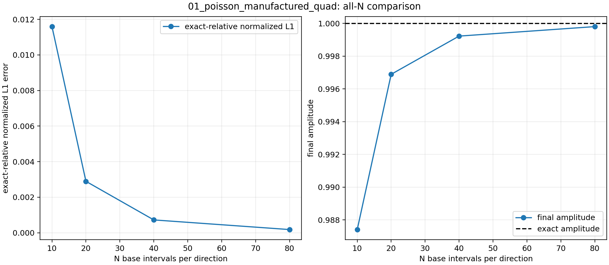

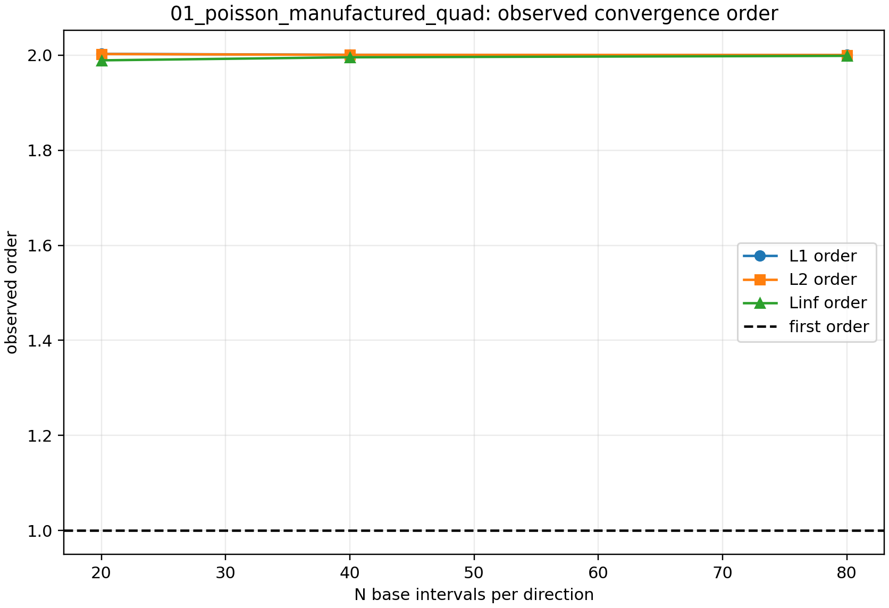

四边形案例中，`normalizedL1` 从 `1.15905514e-02` 下降到 `1.80704727e-04`，
观察收敛阶几乎严格维持在 2 附近。
这里的 `final amplitude` 对应 `summary.json` 中的 `finalAmplitude`，并与 `maxAbsFinal` 基本一致；
它衡量的是终场峰值保持，而不是区间宽度。
从 N10 到 N80，四边形网格的 `normalizedL1` 下降约 `64.14` 倍，这与二阶方法在 8 倍线性加密下应表现出的量级一致。

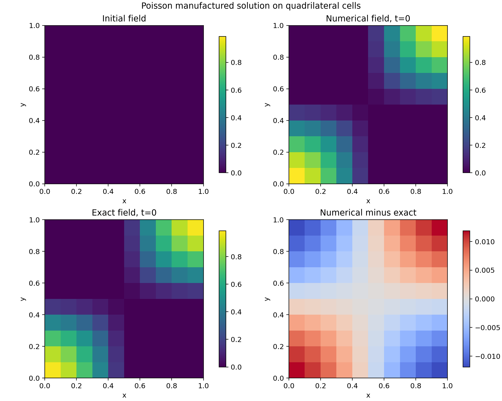

N10 时数值场已经恢复出正确的四象限符号，但单元块状感仍然明显，误差场呈现清晰的对称偏差，
幅值仍在 `1e-2` 量级，说明粗网格下的主导误差来自截断离散而不是求解不稳定。


N20 时数值场与精确场的重合程度明显提高，误差图中的四象限结构仍在，但振幅已经收缩，
这表明网格加密后误差开始按预期单调下降。

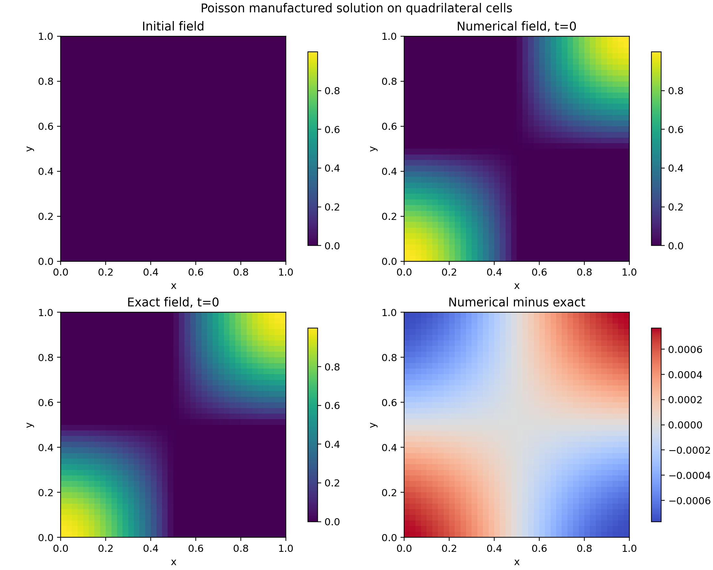

N40 时数值场几乎与精确场重合，误差图已经退化为低幅值的平滑残差，
说明该问题在规则四边形网格上确实呈现出稳定的二阶收敛特征。

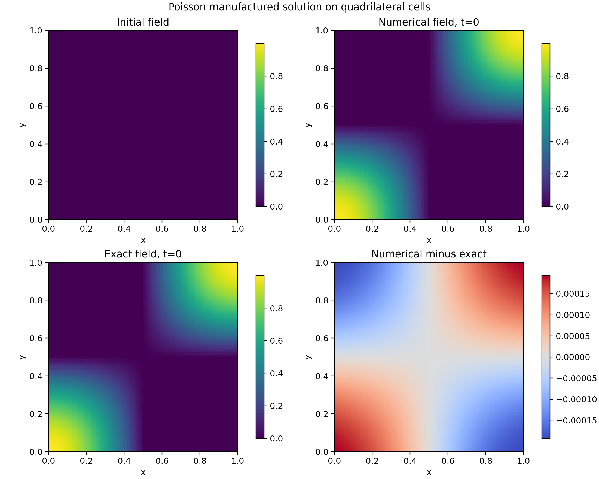

N80 的残差已经压到 `1e-4` 量级，误差图只剩很弱的对称残留，
与表中的 `normalizedL1=1.80704727e-04` 和 `normalizedLinf=1.92663105e-04` 一致。

### 6.2 三角形网格

三角形棱柱网格的主结果如下。

| N | cells | normalizedL1 | normalizedL2 | normalizedLinf | L1 order | final amplitude |
|---:|---:|---:|---:|---:|---:|---:|
| 10 | 200 | 1.62756935e-02 | 1.66062528e-02 | 2.01094667e-02 | - | 9.90299674e-01 |
| 20 | 800 | 4.32113274e-03 | 5.39470605e-03 | 1.01705048e-02 | 1.913238 | 9.97570291e-01 |
| 40 | 3200 | 1.13073669e-03 | 1.82904937e-03 | 5.07689629e-03 | 1.934147 | 9.99392489e-01 |
| 80 | 12800 | 2.91732900e-04 | 6.32795448e-04 | 2.53737917e-03 | 1.954543 | 9.99848131e-01 |

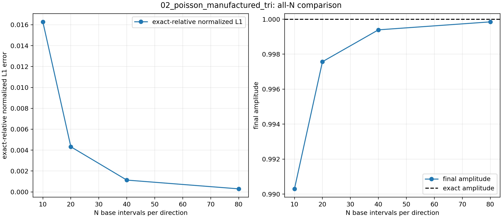

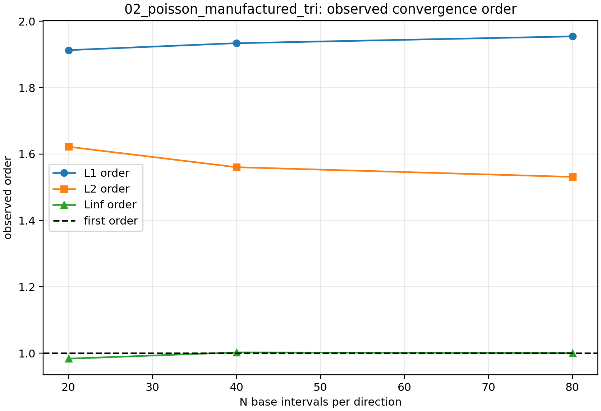

三角形案例的 `normalizedL1` 从 `1.62756935e-02` 下降到 `2.91732900e-04`，
观察收敛阶从 `1.913238` 逐步提升到 `1.954543`，与二阶趋势一致。
这里的 `final amplitude` 同样对应 `summary.json` 的 `finalAmplitude`，
它与 `maxAbsFinal` 只在最后几位上有微小差别。
从 N10 到 N80，三角形网格的 `normalizedL1` 下降约 `55.79` 倍。该降幅略弱于四边形，但仍然清楚地支持近二阶收敛判断。

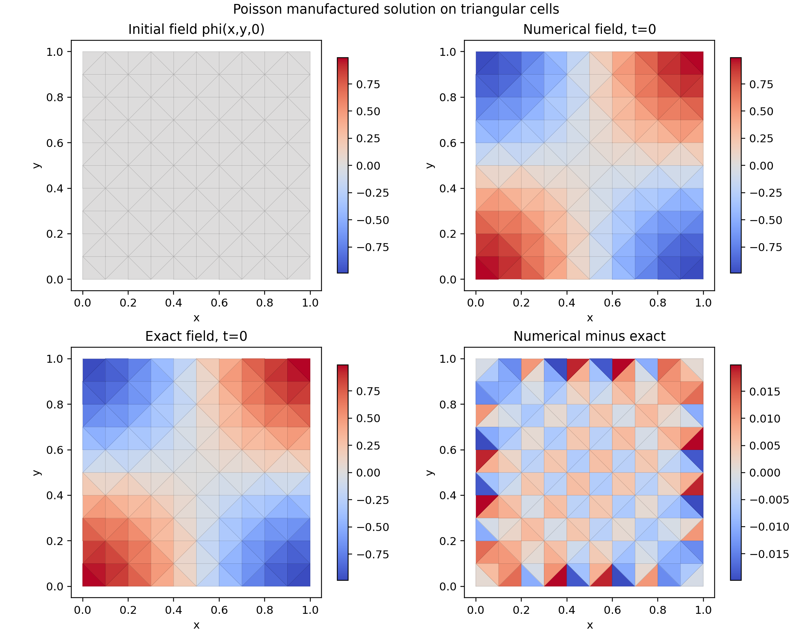

N10 的三角形网格已经能重建出正确的全局符号分布，但单元边界痕迹更明显，
误差场在边界和角点形成了更强的条带结构，`normalizedLinf` 也因此达到 `2.01094667e-02`。

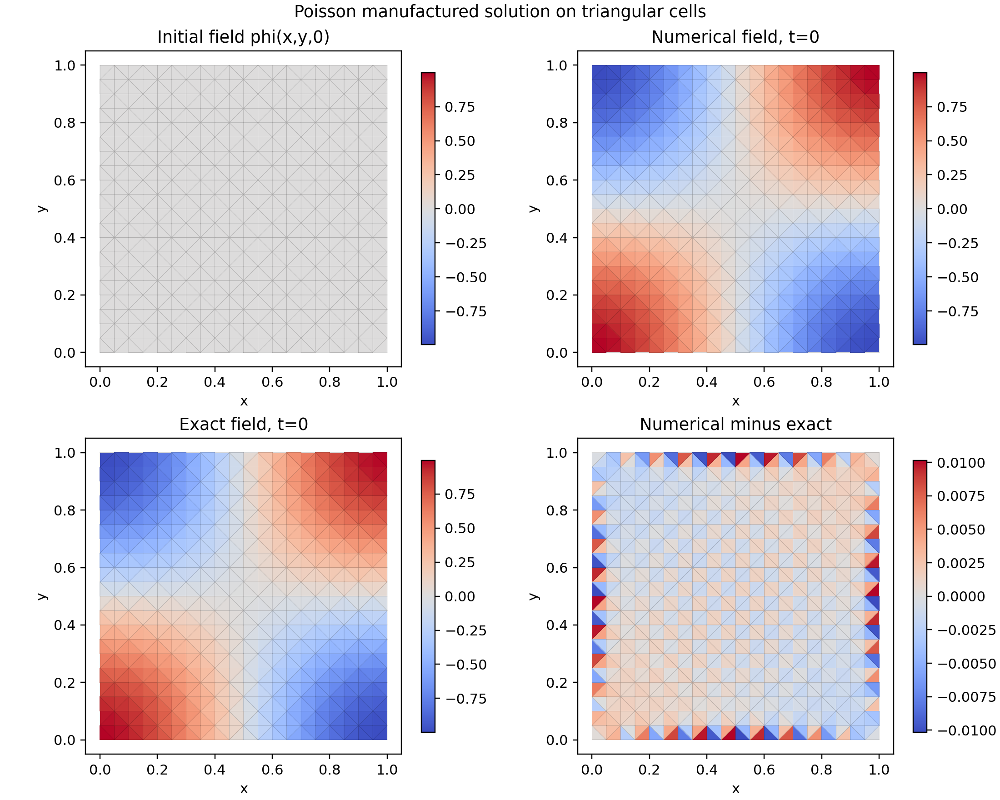

N20 时域内主场形状已经较为平滑，但边界附近仍可看到窄带误差，
说明三角形网格在相同名义分辨率下仍然更受边界离散影响。

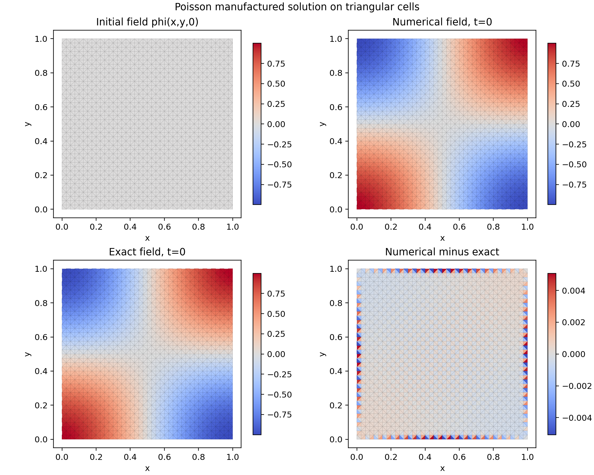

N40 时误差主要收缩到边界附近，域内大部分区域已经与精确场高度一致，
这与 `normalizedL1=1.13073669e-03` 的下降趋势一致。

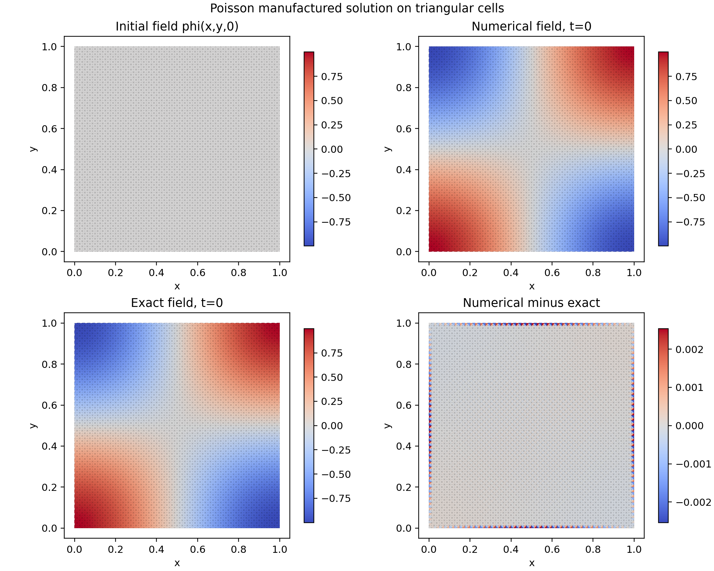

N80 时数值场已经非常接近精确场，但边界条带仍未完全消失，
因此 `normalizedLinf` 仍保持在 `2.53737917e-03`，明显高于四边形网格。

### 6.3 跨网格比较

| 网格 | N80 `normalizedL1` | N80 `normalizedL2` | N80 `normalizedLinf` | 最终观察阶 |
|---|---:|---:|---:|---:|
| 四边形 | 1.80704727e-04 | 1.83012082e-04 | 1.92663105e-04 | 2.000126 |
| 三角形 | 2.91732900e-04 | 6.32795448e-04 | 2.53737917e-03 | 1.954543 |

四边形网格在相同名义分辨率下误差更小。以 N80 为例，三角形的 `normalizedL1`
比四边形大约 `1.61` 倍，`normalizedL2` 约大 `3.46` 倍，而 `normalizedLinf`
约大 `13.17` 倍，说明三角形网格的局部极值误差更敏感，误差并不是均匀抬升，
而是更容易在边界和角点附近聚集。

同时，三角形 N80 的 `finalAmplitude` 略高于四边形 N80，但它的 `Linf` 明显更差，
这说明“峰值保留”和“整体误差”并不完全同步，不能只凭单一指标判断网格优劣。
两者都表现出稳定、单调的收敛行为，因此差别主要来自网格几何和离散 stencil，
不是求解流程本身的不稳定。

## 7. 结果讨论

本题是制造解验证，因此结论应优先围绕离散一致性与收敛性，而不是物理复杂性。
从结果看，四边形网格几乎给出理想的二阶收敛，三角形网格也在加密后逼近二阶。
这说明 `Gauss linear corrected` 拉普拉斯离散与 `GAMG` 线性求解器的组合在该问题上是可靠的。

从场图看，四边形网格的误差主要表现为平滑的四象限残差，而三角形网格的误差更集中在边界和角点附近，
这与 `Linf` 的差异一致。`final amplitude` 在最细网格上已经非常接近 1，
说明终场幅值保持良好，但它只是辅助指标，不能替代 `normalizedL1` 和 `normalizedLinf`。
两组最细网格的 `maxFinal` 与 `minFinal` 也基本关于 0 对称，说明数值解没有引入可见的整体偏置。
`finalTimeError=0.0`、`meshOK=true`、`solverEnded=true` 和 `solverFatal=false`
共同说明求解流程完整闭合，且没有数值发散或中断。

## 8. 局限性、风险与未完成事项

- 这是一道制造解题，不代表真实工程 Poisson 源项的复杂性；
- 仅验证了单一线性方程、单一拉普拉斯离散和单一求解器配置；
- 三角形网格的单元数与四边形网格在同一名义分辨率下并不等价，不能直接按 `N` 做一对一物理比较；
- 本题为稳态问题，`time_history.csv` 只反映一次稳态求解记录，不含物理时间演化；
- 若后续要迁移到更强非正交、非均匀材料或混合边界问题，还需要额外验证。

## 9. 结论

1. 第四题制造解 Poisson 方程已成功完成数值验证，求解器、网格与后处理链路均可追溯。  
2. 四边形网格的主误差从 `1.15905514e-02` 下降到 `1.80704727e-04`，观察收敛阶接近 2。  
3. 三角形棱柱网格的主误差从 `1.62756935e-02` 下降到 `2.91732900e-04`，观察收敛阶逐步逼近 2。  
4. 结果没有显示数值发散、求解中断或明显的边界失配，报告中的图表和日志均已归档。

## 10. 证据索引

报告所引用的题目、配置、源码、运行目录、汇总数据和图片的详细对应关系见同目录下的
[evidence_index.md](evidence_index.md)。

