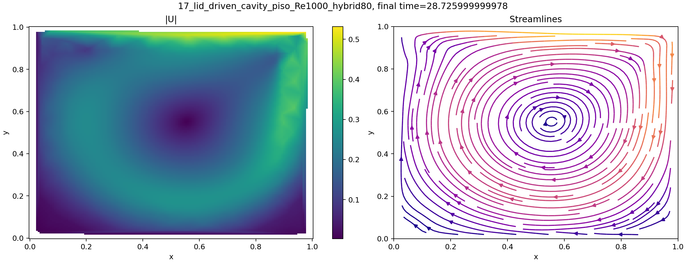
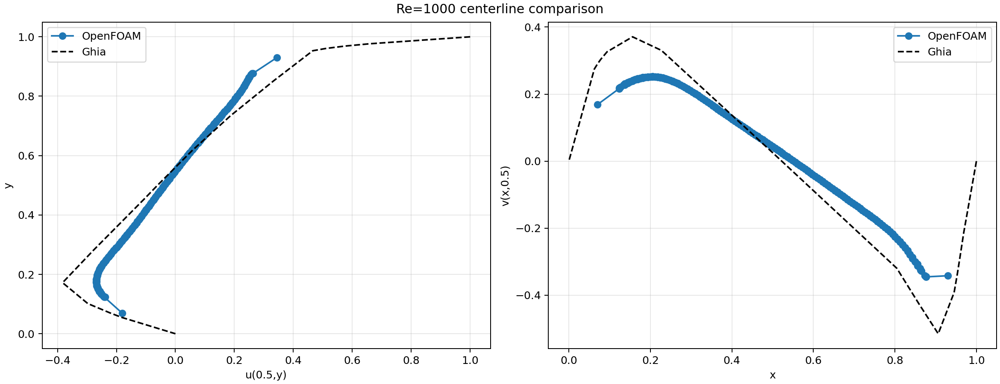
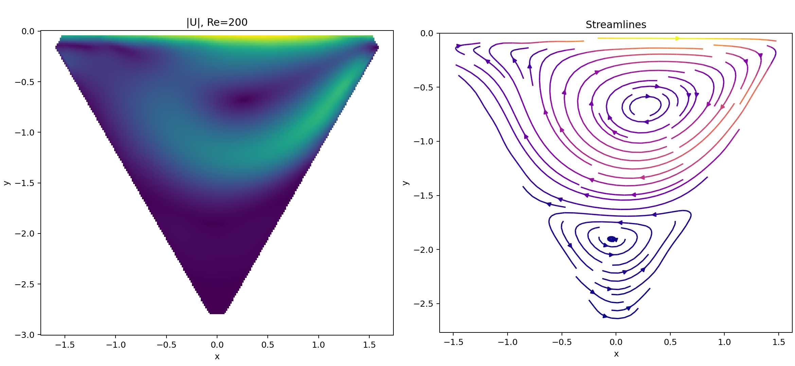
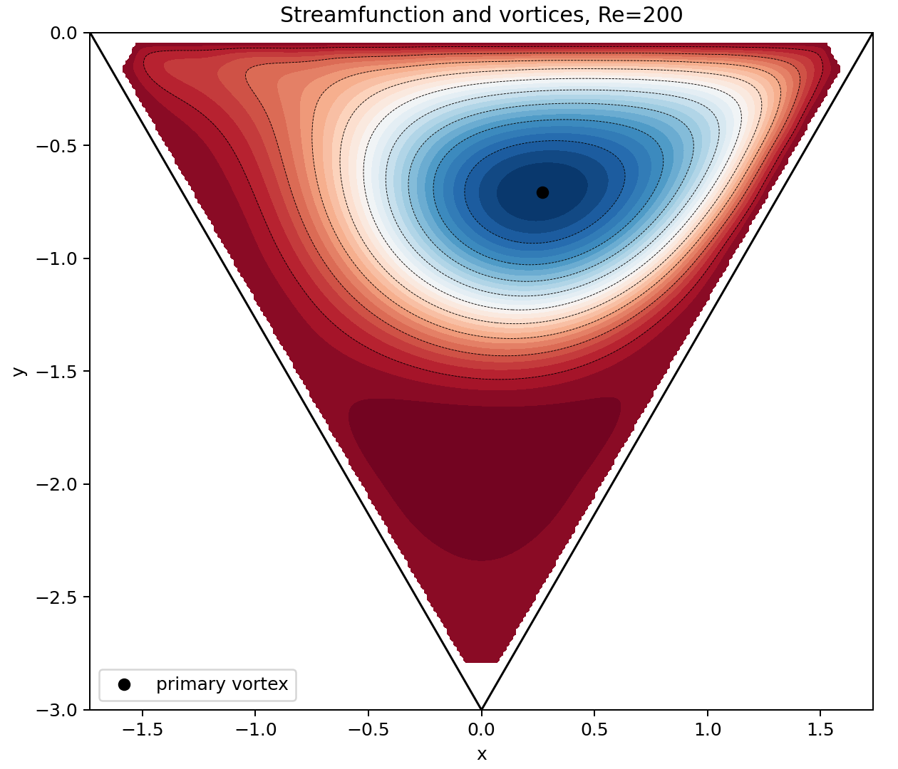

# 第五题：不可压 Navier-Stokes 方程 PISO 法报告

**项目目录：** `/home/a776/workdocuments/上交船舶/slover/student_project`  
**题目来源：** `../../../pdf/training_examples_incomp.pdf`  
**报告日期：** 2026-08-28  
**算法：** PISO 法  
**求解器：** `pisoFoamStudent`  
**OpenFOAM 版本：** OpenFOAM 14

## 目录

- [研究概况](#研究概况)
- [1. 问题定义与研究目标](#1-问题定义与研究目标)
- [2. 假设、范围与验收标准](#2-假设范围与验收标准)
  - [2.1 基本假设](#21-基本假设)
  - [2.2 报告范围](#22-报告范围)
  - [2.3 验收标准](#23-验收标准)
- [3. 数学模型与 PISO 实现](#3-数学模型与-piso-实现)
  - [3.1 动量预测方程](#31-动量预测方程)
  - [3.2 压力-速度耦合](#32-压力-速度耦合)
  - [3.3 PISO 校正循环](#33-piso-校正循环)
- [4. 几何、边界条件与混合网格](#4-几何边界条件与混合网格)
  - [4.1 方腔](#41-方腔)
  - [4.2 等边三角腔](#42-等边三角腔)
- [5. 算例覆盖与配置](#5-算例覆盖与配置)
  - [5.1 方腔](#51-方腔)
  - [5.2 三角腔](#52-三角腔)
  - [5.3 共同数值参数](#53-共同数值参数)
- [6. 方腔结果](#6-方腔结果)
  - [6.1 中心线误差](#61-中心线误差)
  - [6.2 场与流线](#62-场与流线)
- [7. 三角腔结果](#7-三角腔结果)
  - [7.1 主涡位置与流函数](#71-主涡位置与流函数)
  - [7.2 三角腔场图](#72-三角腔场图)
- [8. 稳态性、网格与验证讨论](#8-稳态性网格与验证讨论)
  - [8.1 稳态和不可压约束](#81-稳态和不可压约束)
  - [8.2 网格质量](#82-网格质量)
  - [8.3 与参考数据的关系](#83-与参考数据的关系)
- [9. 局限性与风险](#9-局限性与风险)
- [10. 结论](#10-结论)
- [11. 复现实验命令](#11-复现实验命令)
- [12. 证据索引](#12-证据索引)

## 研究概况

| 项目 | 内容 |
|---|---|
| 研究类型 | 不可压 Navier-Stokes 方程 PISO 法验证 |
| 研究对象 | 方腔与等边三角腔顶盖驱动流 |
| 算法 | PISO pressure-velocity coupling |
| 求解器 | `pisoFoamStudent` |
| 网格 | 混合四边形/三角形棱柱网格 |
| 方腔参考 | Ghia 等方腔中心线数据 |
| 三角腔参考 | Kohno、Erturk 等文献数据 |
| 当前状态 | 已归档 PISO 子集具备完整运行和后处理证据 |

本报告只讨论 PISO 法，不把压力投影法结果混入本报告。
参数来自 `scripts/configs/05_navier_stokes_equation/`，
结果摘要来自 `data/05_navier_stokes_equation/cases/`，
图件和运行日志分别来自 `figures/` 与 `cases/`。

## 1. 问题定义与研究目标

第五题的控制方程为

$$\nabla\cdot\boldsymbol{U}=0$$

$$\frac{\partial\boldsymbol{U}}{\partial t}+\nabla\cdot(\boldsymbol{U}\otimes\boldsymbol{U})=-\nabla p+\nabla\cdot(\nu\nabla\boldsymbol{U})$$

项目取 $\rho=1$，并设置 $\nu=1/Re$。
PISO 法在同一个时间步内反复执行动量预测、压力修正和通量更新，
使速度场逐步满足压力-速度耦合和不可压约束。

本报告的目标是：

1. 检查 PISO 动量方程与压力方程的有限体积实现；
2. 验证方腔速度中心线和 Ghia 数据的一致性；
3. 检查三角腔主涡位置、流函数和中心线；
4. 记录稳态判据、网格质量和结果的适用边界。

## 2. 假设、范围与验收标准

### 2.1 基本假设

- 流体不可压、牛顿、密度固定为 `1`；
- 顶盖速度和特征长度均取 `1`；
- $\nu=1/Re$；
- 除运动顶盖外，所有固壁无滑移；
- 二维流动通过厚度为 `0.1` 的薄层三维网格表示；
- 对流项采用 `Gauss linearUpwind grad(U)`；
- 黏性项采用 `Gauss linear corrected`；
- `nCorrectors=2`，`nNonOrthogonalCorrectors=1`；
- 自适应时间步将 `maxCo` 控制在 `0.2`；
- 稳态由速度变化、质量残差和连续满足次数共同判断。

### 2.2 报告范围

本报告覆盖当前保留且有完整 PISO 运行证据的七个案例：

- 方腔：Re=`1000` 的 hybrid40、hybrid80；
- 方腔：Re=`3200` 的 hybrid40、hybrid80；
- 三角腔：Re=`100`、`200`、`500` 的 hybrid80。

第五题配置目录中还存在更多计划分辨率和 Reynolds 数组合，
但它们不全部拥有当前同等完整的结果摘要、场图和日志，
因此不在本报告中宣称已经完成。

### 2.3 验收标准

| 验收项 | 标准 |
|---|---|
| 求解器构建 | 存在 `build/06_piso_navier_stokes_equation/bin/pisoFoamStudent` |
| 网格质量 | `checkMesh` 输出 `Mesh OK` |
| 稳态结束 | 日志出现 `Steady state reached` |
| 无散性 | `max |div(phi)|` 足够小 |
| 方腔验证 | 中心线与 Ghia 数据可比较 |
| 三角腔验证 | 主涡、流函数、流线和中心线可比较 |
| 结果可追溯 | 配置、摘要、图件和 solver log 均有路径 |

## 3. 数学模型与 PISO 实现

### 3.1 动量预测方程

源码首先组装

$$\mathrm{fvm::ddt}(U)+\mathrm{fvm::div}(\phi,U)-\mathrm{fvm::laplacian}(\nu,U)=-\mathrm{fvc::grad}(p)$$

其离散矩阵可抽象为

$$A(U)U=H(U)-\nabla p$$

其中 $A(U)$ 是包含瞬态、对流和扩散贡献的动量矩阵。

### 3.2 压力-速度耦合

定义

$$rAU=\frac{1}{A(U)},\qquad HbyA=rAU\,H(U)$$

预测面通量为

$$\phi_{HbyA}=fvc::flux(HbyA)+fvc::interpolate(rAU)\,fvc::ddtCorr(U,\phi)$$

将速度无散条件写成压力方程：

$$\nabla\cdot(rAU\nabla p)=\nabla\cdot\phi_{HbyA}$$

源码中对应 `fvm::laplacian(rAU,p) == fvc::div(phiHbyA)`。
压力求解后更新面通量：

$$\phi=\phi_{HbyA}-\operatorname{flux}(\operatorname{laplacian}(rAU,p))$$

并修正单元速度：

$$U=HbyA-rAU\nabla p$$

### 3.3 PISO 校正循环

PISO 控制器在同一时间步中执行多次压力校正：

$$U^*\rightarrow p^{(1)}\rightarrow U^{(1)}\rightarrow p^{(2)}\rightarrow U^{(2)}$$

本项目配置 `nCorrectors=2`，并对非正交项执行 `1` 次修正。
最后一次压力修正负责更新守恒面通量，从而将局部连续性误差压低。

## 4. 几何、边界条件与混合网格

### 4.1 方腔

| 项目 | 内容 |
|---|---|
| 计算域 | $[0,1]\times[0,1]$ |
| 左、右、底壁 | 无滑移 |
| 顶壁 | $\boldsymbol{U}=(1,0,0)$ |
| hybrid40 | 壁面层厚度 `0.12`，层数 `5`，`2646` cells |
| hybrid80 | 壁面层厚度 `0.12`，层数 `10`，`9282` cells |

方腔混合网格由壁面附近的结构化层和内部的非结构化区域组成，
重点加强顶盖、侧壁和底壁附近的速度梯度分辨率。

### 4.2 等边三角腔

三角腔顶点为

$$A=(-\sqrt{3},0),\quad B=(\sqrt{3},0),\quad C=(0,-3)$$

顶边 $AB$ 为速度为 `1` 的运动壁面，左右边为无滑移壁面。
hybrid80 网格采用壁面结构化带、中心三角形非结构化区域和厚度方向棱柱挤出，
最终包含 `7308` 个单元，壁面层厚度为 `0.1`，层数为 `8`。

三角腔水平中心线后处理限制为物理截面

$$-\frac{2}{\sqrt{3}}\le x\le\frac{2}{\sqrt{3}}$$

避免把三角形外部区域误当成物理采样结果。

## 5. 算例覆盖与配置

### 5.1 方腔

| 算例 | Re | 网格 | cells | final time |
|---|---:|---|---:|---:|
| `16_lid_driven_cavity_piso_Re1000_hybrid40` | 1000 | hybrid40 | 2646 | 34.006 |
| `17_lid_driven_cavity_piso_Re1000_hybrid80` | 1000 | hybrid80 | 9282 | 28.726 |
| `18_lid_driven_cavity_piso_Re3200_hybrid40` | 3200 | hybrid40 | 2646 | 132.952 |
| `19_lid_driven_cavity_piso_Re3200_hybrid80` | 3200 | hybrid80 | 9282 | 135.045 |

### 5.2 三角腔

| 算例 | Re | 网格 | cells | final time |
|---|---:|---|---:|---:|
| `29_triangular_cavity_piso_Re100_hybrid80` | 100 | hybrid80 | 7308 | 43.632 |
| `30_triangular_cavity_piso_Re200_hybrid80` | 200 | hybrid80 | 7308 | 87.185 |
| `31_triangular_cavity_piso_Re500_hybrid80` | 500 | hybrid80 | 7308 | 129.784 |

### 5.3 共同数值参数

| 参数 | 方腔 | 三角腔 |
|---|---:|---:|
| 线性求解器 | GAMG | GAMG |
| 线性容差 | `1e-8` | `1e-8` |
| `nCorrectors` | `2` | `2` |
| `nNonOrthogonalCorrectors` | `1` | `1` |
| `maxCo` | `0.2` | `0.2` |
| `maxDeltaT` | `0.01` | `0.01` |
| `steadyVelocityTol` | `1e-6` | `1e-6` |
| `steadyMassTol` | `1e-8` | `1e-8` |
| `requiredSteadySteps` | `20` | `20` |

## 6. 方腔结果

### 6.1 中心线误差

数值结果在 $u(0.5,y)$ 和 $v(x,0.5)$ 上与 Ghia 参考值比较。

| 算例 | `u` RMSE | `v` RMSE | `u` 最大绝对误差 | `v` 最大绝对误差 |
|---|---:|---:|---:|---:|
| Re1000 hybrid40 | 0.196079 | 0.162320 | 0.636970 | 0.469559 |
| Re1000 hybrid80 | 0.202085 | 0.134847 | 0.655440 | 0.341916 |
| Re3200 hybrid40 | 0.171000 | 0.151896 | 0.564053 | 0.462653 |
| Re3200 hybrid80 | 0.075225 | 0.123476 | 0.164124 | 0.209095 |

从分量上看，Re=1000 的 hybrid80 并未在 $u$ 和 $v$ 两个中心线分量上同时带来单调改善：`u` RMSE 略有上升，而 `v` RMSE 明显下降。这说明当前误差并不只由单元总数决定，顶盖附近的高速剪切层、角区回流以及中心线插值位置都会影响误差分布。换言之，网格加密已经改善了整体流动拓扑，但对不同分量的收益并不同步。

Re=3200 下，从 hybrid40 加密到 hybrid80 后，
$u$ 中心线 RMSE 从 `0.171000` 降到 `0.075225`，
$v$ 中心线 RMSE 从 `0.151896` 降到 `0.123476`，
说明在更高 Reynolds 数下，细化网格对薄剪切层和主回流核的分辨更直接，中心线结果也随之更稳定。

### 6.2 场与流线

速度场和流线显示顶盖驱动形成单一主循环，
中心区域速度较低，顶盖和侧壁附近速度梯度较大，
与方腔顶盖驱动流的基本物理结构一致。

结合中心线对比图可以看到，OpenFOAM 结果在大部分区段保持了与 Ghia 参考相同的变化趋势，但顶盖附近的峰值和下部回流区的极值仍被适度平滑化。这个现象与图中的速度场一致：主涡结构已经正确建立，但近壁剪切层还没有被完全解析出来，因此局部极值会比参考数据更保守。

## 7. 三角腔结果

### 7.1 主涡位置与流函数

| Re | 数值主涡 `(x,y)` | 参考主涡 `(x,y)` | `|dx|` | `|dy|` | `|dpsi|` |
|---:|---|---|---:|---:|---:|
| 100 | `(0.3551,-0.6486)` | `(0.3315,-0.6445)` | 0.0236 | 0.0041 | 0.0310 |
| 200 | `(0.2681,-0.7066)` | `(0.2030,-0.7266)` | 0.0651 | 0.0200 | 0.0433 |
| 500 | `(0.5145,-0.5907)` | `(0.1319,-0.7793)` | 0.3826 | 0.1886 | 0.1055 |

Re=100 和 Re=200 的主涡位置接近参考数据，
流函数误差分别为 `0.0310` 和 `0.0433`。
从偏差分量看，Re=100 和 Re=200 的 $y$ 向位置已经比较接近参考值，但 $x$ 向仍存在可见偏差，说明三角腔中的主涡横向迁移对斜壁诱导的剪切层更敏感。Re=500 的主涡位置偏差明显增大，说明固定 hybrid80 分辨率下，高 Reynolds 数流动的壁面剪切层和角区结构还没有得到足够分辨。

### 7.2 三角腔场图

三角腔流线形成位于腔体上部和中下部的主循环结构，
顶盖附近速度较高，底部速度较低。
流函数图中的次级极值应结合局部网格分辨率和物理域掩膜判断，
不能仅凭一次插值后处理认定为收敛的次涡。

对比 Re=500 的流函数图可以看到，主涡核进一步向右上方移动，左半腔的负流函数区域明显扩展，说明惯性增强后顶边射流对左侧回流的卷吸更强。与此同时，下部的小尺度回流更突出，但其等值线仍然较粗，提示当前 hybrid80 在高 Re 条件下对薄剪切层的分辨仍偏保守，因此 Re=500 的主涡偏差应优先理解为分辨率不足，而不是流动拓扑错误。

## 9. 局限性与风险

- 本报告覆盖的是当前保留的七个 PISO 案例，不等于第五题完整参数矩阵；
- 三角腔 Re500 在 hybrid80 下的主涡位置误差较大，需要继续网格加密或改进离散后才能形成更强结论；
- 中心线采用从单元中心场插值的方式，近壁点由边界值补齐，局部误差可能被放大；
- 流函数和涡结构是由插值速度场二次重构得到，不能替代直接的原生高质量流函数场；
- 当前只验证了固定的对流、黏性和压力离散组合，没有开展格式敏感性研究；
- 参考文献数据的采样位置和本项目采样位置并不完全相同，RMSE 应解释为工程型对比指标；
- 结果适合验证 PISO 求解流程和主要流动结构，不应直接视为高精度工程预测。

## 10. 结论

1. `pisoFoamStudent` 已实现基于 $rAU$、$HbyA$ 和压力通量校正的 PISO 求解流程。
2. 当前七个归档案例均有 mesh check、PISO solver log、结果摘要和后处理图件，工作流证据完整度较高。
3. 方腔 Re=3200 从 hybrid40 加密到 hybrid80 后中心线误差明显下降；Re=1000 则表现出分量差异，说明网格加密对不同速度分量的收益并不完全同步。
4. 三角腔 Re=100 和 Re=200 的主涡位置接近参考结果；Re=500 的偏差明显增大，主要反映当前网格对高 Reynolds 数下薄剪切层与角区回流的分辨仍然不足。
5. 所有已检查案例均达到配置的稳态判据，没有发现运行致命错误，但完整的 Reynolds 数和网格矩阵仍需后续补齐。

## 12. 证据索引

详细证据索引见同目录文件 `evidence_index.md`。
