# 第五题：不可压 Navier-Stokes 方程压力投影法报告

**项目目录：** `/home/a776/workdocuments/上交船舶/slover/student_project`  
**题目来源：** `../../../pdf/training_examples_incomp.pdf`  
**报告日期：** 2026-08-28  
**算法：** 压力投影法  
**求解器：** `projectionFoamStudent`  
**OpenFOAM 版本：** OpenFOAM 14

## 目录

- [研究概况](#研究概况)
- [1. 问题定义与研究目标](#1-问题定义与研究目标)
- [2. 假设、范围与验收标准](#2-假设范围与验收标准)
  - [2.1 基本假设](#21-基本假设)
  - [2.2 报告范围](#22-报告范围)
  - [2.3 验收标准](#23-验收标准)
- [3. 数学模型与投影法实现](#3-数学模型与投影法实现)
  - [3.1 预测速度](#31-预测速度)
  - [3.2 压力投影](#32-压力投影)
  - [3.3 与 PISO 控制接口的区别](#33-与-piso-控制接口的区别)
- [4. 几何、边界条件与混合网格](#4-几何边界条件与混合网格)
  - [4.1 方腔](#41-方腔)
  - [4.2 等边三角腔](#42-等边三角腔)
- [5. 算例覆盖与配置](#5-算例覆盖与配置)
  - [5.1 当前保留算例](#51-当前保留算例)
  - [5.2 共同数值参数](#52-共同数值参数)
- [6. 方腔结果](#6-方腔结果)
  - [6.1 中心线误差](#61-中心线误差)
  - [6.2 场与流线](#62-场与流线)
  - [6.3 方腔跨实验比较](#63-方腔跨实验比较)
- [7. 三角腔结果](#7-三角腔结果)
  - [7.1 主涡位置与流函数](#71-主涡位置与流函数)
  - [7.2 三角腔场图](#72-三角腔场图)
  - [7.3 三角腔跨 Reynolds 数比较](#73-三角腔跨-reynolds-数比较)
- [8. 稳态性、网格与证据完整性](#8-稳态性网格与证据完整性)
  - [8.1 已有稳态日志](#81-已有稳态日志)
  - [8.2 网格质量](#82-网格质量)
- [9. 局限性与风险](#9-局限性与风险)
- [10. 结论](#10-结论)
- [11. 证据索引](#11-证据索引)

## 研究概况

| 项目 | 内容 |
|---|---|
| 研究类型 | 不可压 Navier-Stokes 方程压力投影法验证 |
| 研究对象 | 方腔与等边三角腔顶盖驱动流 |
| 算法 | 传统压力投影法 |
| 求解器 | `projectionFoamStudent` |
| 网格 | 混合四边形/三角形棱柱网格 |
| 方腔参考 | Ghia 等方腔中心线数据 |
| 三角腔参考 | Kohno、Erturk 等文献数据 |
| 当前状态 | 已归档子集可分析，完整题目矩阵仍未完成 |

本报告只讨论压力投影法，不把 PISO 结果混入本报告。
报告中的参数来自 `scripts/configs/05_navier_stokes_equation/`，
数值摘要来自 `data/05_navier_stokes_equation/cases/`，
图像来自 `figures/05_navier_stokes_equation/cases/`。

## 1. 问题定义与研究目标

第五题研究二维不可压 Navier-Stokes 方程：

```math
\nabla\cdot\boldsymbol{U} = 0
```

```math
\begin{aligned}
\frac{\partial\boldsymbol{U}}{\partial t}
&+ \nabla\cdot(\boldsymbol{U}\otimes\boldsymbol{U}) \\
&= -\nabla p + \nabla\cdot(\nu\nabla\boldsymbol{U})
\end{aligned}
```

项目取密度 $\rho=1$，因此使用运动学压力和运动黏度 $\nu$。
压力投影法的目标是先求得不满足无散约束的预测速度，
再通过压力泊松方程将速度投影到无散空间。

本报告考察两个标准算例：

1. 方形顶盖驱动腔流，采用 Ghia 中心线数据进行对比；
2. 等边三角形顶盖驱动腔流，采用主涡位置、流函数和中心线进行对比。

## 2. 假设、范围与验收标准

### 2.1 基本假设

- 流体为不可压、牛顿流体；
- 密度固定为 `1`；
- 特征长度和顶盖速度均取 `1`；
- 运动黏度按 $\nu=1/Re$ 设置；
- 除运动顶盖外，其余壁面采用无滑移条件；
- 二维问题用厚度为 `0.1` 的薄层三维网格实现；
- 对流项采用 `Gauss linearUpwind grad(U)`；
- 黏性项采用 `Gauss linear corrected`；
- 每个时间步使用 `2` 次压力投影校正和 `1` 次非正交修正；
- 采用速度变化和质量残差共同判断稳态。

### 2.2 报告范围

本报告覆盖当前仍保留结果摘要和图件的压力投影法算例：

- 方腔：Re=`1000` 的 hybrid40、hybrid80，Re=`3200` 的 hybrid40、hybrid80；
- 三角腔：Re=`100`、`200`、`500` 的 hybrid80 摘要。

配置目录中还存在其他计划算例，但没有全部保留可复核的结果数据，
因此不把它们计入本报告的完成范围。三角腔 Re100 摘要终止于
`t≈0.6`，明显早于配置目标终止时间 `80.0`，只作为历史瞬态证据使用。

### 2.3 验收标准

| 验收项 | 标准 |
|---|---|
| 求解器构建 | 存在 `build/05_navier_stokes_equation/bin/projectionFoamStudent` |
| 网格质量 | `checkMesh` 输出 `Mesh OK` |
| 求解结束 | 日志出现稳态结束或配置终止时间 |
| 不可压约束 | solver log 中的 `max abs(div(U))` 足够小；缺少 solver log 的案例只按摘要级证据使用 |
| 方腔验证 | 提供 `u(0.5,y)`、`v(x,0.5)` 与 Ghia 对比 |
| 三角腔验证 | 提供流线、主涡位置、流函数和中心线 |
| 可追溯性 | 配置、摘要、图件和日志路径明确 |

## 3. 数学模型与投影法实现

### 3.1 预测速度

在时间步 $n\to n+1$ 内，求解不含新压力投影的预测速度 $\boldsymbol{U}^*$：

```math
\begin{aligned}
\frac{\boldsymbol{U}^*-\boldsymbol{U}^n}{\Delta t}
&+ \nabla\cdot(\boldsymbol{U}^n\otimes\boldsymbol{U}^*) \\
&- \nabla\cdot(\nu\nabla\boldsymbol{U}^*) = 0
\end{aligned}
```

源码中对应 `fvm::ddt(UStar)`、`fvm::div(phi,UStar)` 和
`fvm::laplacian(nu,UStar)` 的有限体积组装。

### 3.2 压力投影

预测速度对应的面通量为 $\Phi^*=\boldsymbol{U}^*\cdot\boldsymbol{S}$。
令

```math
\boldsymbol{U}^{n+1}
= \boldsymbol{U}^* - \Delta t\nabla p^{n+1}
```

代入无散条件，得到压力方程：

```math
\nabla\cdot(\Delta t\nabla p^{n+1})
= \nabla\cdot\boldsymbol{U}^*
```

离散实现中使用 `fvm::laplacian(dtCoeff,p) == fvc::div(phiStar)`。
最终通量与速度分别按

```math
\Phi^{n+1}
= \Phi^* - \operatorname{flux}(\Delta t\nabla p^{n+1})
```

```math
\boldsymbol{U}^{n+1}
= \boldsymbol{U}^* - \Delta t\nabla p^{n+1}
```

进行修正。

### 3.3 与 PISO 控制接口的区别

`projectionFoamStudent` 借用了 OpenFOAM 的 `pisoControl` 循环接口，
但压力系数明确使用 $\Delta t$，不是 PISO 动量方程中的 $rAU$。
因此本报告将其视为独立的压力投影算法，而不是 PISO 的改名版本。

## 4. 几何、边界条件与混合网格

### 4.1 方腔

| 项目 | 内容 |
|---|---|
| 计算域 | $[0,1]\times[0,1]$ |
| 左、右、底壁 | 无滑移 |
| 顶壁 | $\boldsymbol{U}=(1,0,0)$ |
| 混合网格 | 壁面结构化层加内部非结构化区域 |
| hybrid40 | 壁面层厚度 `0.12`，层数 `5`，`2646` cells |
| hybrid80 | 壁面层厚度 `0.12`，层数 `10`，`9282` cells |

### 4.2 等边三角腔

三角腔顶点为

```math
\begin{aligned}
A &= (-\sqrt{3},0),\\
B &= (\sqrt{3},0),\\
C &= (0,-3)
\end{aligned}
```

其中 $AB$ 为运动顶盖，左右两边为静止无滑移壁面。
Gmsh 生成三角形棱柱混合网格：三条壁面附近设置结构化四边形带，
中心区域保留非结构化三角形区域，随后沿厚度方向挤出为棱柱。

| 项目 | 内容 |
|---|---|
| 顶盖速度 | $\boldsymbol{U}=(1,0,0)$ |
| 左、右壁 | 无滑移 |
| 网格等级 | hybrid80 |
| 壁面层厚度 | `0.1` |
| 壁面层数 | `8` |
| 单元数 | `7308` |
| 后处理剖面 | `u(0,y)`、`v(x,-1)` |

三角腔水平剖面只在物理域内采样：

```math
-\frac{2}{\sqrt{3}} \le x \le \frac{2}{\sqrt{3}}
```

## 5. 算例覆盖与配置

### 5.1 当前保留算例

| 算例 | Re | 网格 | cells | 结果摘要 |
|---|---:|---|---:|---|
| `07_lid_driven_cavity_projection_Re1000_hybrid40` | 1000 | 方腔 hybrid40 | 2646 | 已保留 |
| `08_lid_driven_cavity_projection_Re1000_hybrid80` | 1000 | 方腔 hybrid80 | 9282 | 已保留 |
| `10_lid_driven_cavity_projection_Re3200_hybrid40` | 3200 | 方腔 hybrid40 | 2646 | 已保留，满足稳态判据 |
| `11_lid_driven_cavity_projection_Re3200_hybrid80` | 3200 | 方腔 hybrid80 | 9282 | 已保留 |
| `26_triangular_cavity_projection_Re100_hybrid80` | 100 | 三角腔 hybrid80 | 7308 | 摘要为瞬态 |
| `27_triangular_cavity_projection_Re200_hybrid80` | 200 | 三角腔 hybrid80 | 7308 | 已保留 |
| `28_triangular_cavity_projection_Re500_hybrid80` | 500 | 三角腔 hybrid80 | 7308 | 已保留 |

### 5.2 共同数值参数

| 参数 | 方腔 | 三角腔 |
|---|---:|---:|
| 线性求解器 | GAMG | GAMG |
| 线性容差 | `1e-8` | `1e-8` |
| `nCorrectors` | `2` | `2` |
| `nNonOrthogonalCorrectors` | `1` | `1` |
| `maxCo` | `0.2` | `0.2` |
| `steadyVelocityTol` | `1e-6` | `1e-6` |
| `steadyMassTol` | `1e-8` | `1e-8` |
| `requiredSteadySteps` | `20` | `20` |

## 6. 方腔结果

### 6.1 中心线误差

方腔后处理将数值结果插值到 $u(0.5,y)$ 和 $v(x,0.5)$，
并与 Ghia 参考数据比较。

| 算例 | final time | `u` RMSE | `v` RMSE | `u` 最大绝对误差 | `v` 最大绝对误差 |
|---|---:|---:|---:|---:|---:|
| Re1000 hybrid40 | 34.396 | 0.206742 | 0.160966 | 0.656883 | 0.465763 |
| Re1000 hybrid80 | 26.696 | 0.210637 | 0.138038 | 0.671954 | 0.329668 |
| Re3200 hybrid40 | 95.935 | 0.030110 | 0.050971 | 0.071322 | 0.094757 |
| Re3200 hybrid80 | 55.996 | 0.226499 | 0.169243 | 0.729606 | 0.331169 |

Re1000 从 hybrid40 加密到 hybrid80 后，$v$ 中心线 RMSE 从
`0.160966` 降至 `0.138038`，而 $u$ 中心线 RMSE 略有上升。
这说明当前结果仍受到网格、插值和压力投影离散共同影响，
不能仅凭单一网格量级声称已经达到文献精度。

在 `Re=3200` 下，当前保留的 hybrid40 结果中心线 RMSE
分别为 `0.030110`（$u$）和 `0.050971`（$v$），明显低于当前
hybrid80 结果的 `0.226499` 和 `0.169243`。这说明不同网格案例
之间不能只按名义分辨率直接排序，仍需结合网格质量、时间推进过程
和稳态日志进行复核。

### 6.2 场与流线

`Re=1000`、hybrid40 的结果图和中心线对比图如下：

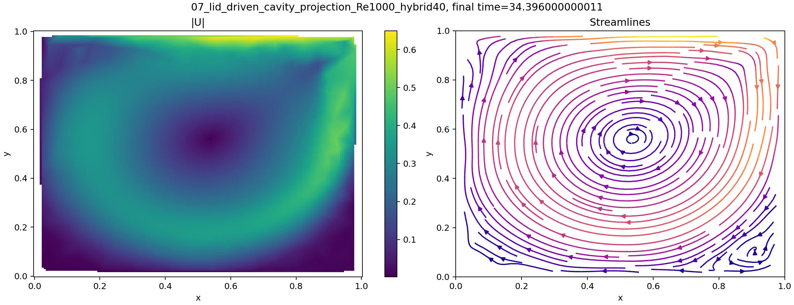

该图可作为粗网格基线。主循环和顶盖剪切层已经形成，但右上角与左下角的局部过渡区更圆滑，说明壁面层和角区回流仍偏弱。

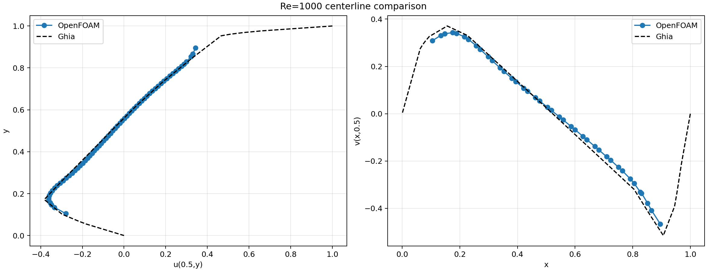

这一组中心线已经给出正确的整体趋势，但顶盖附近的峰值和底部回流段仍明显平滑化，因此更适合作为网格敏感性的基线，而不是高精度复现终点。

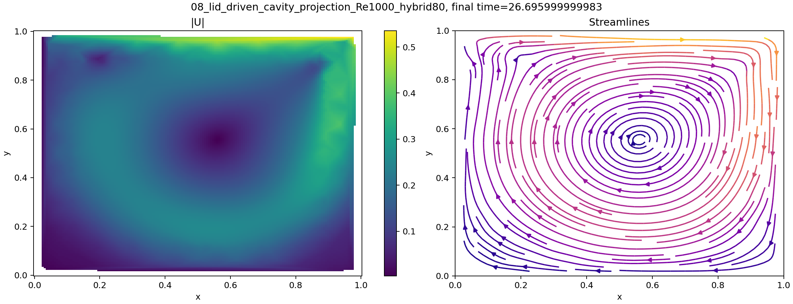

该图显示顶盖附近形成高速度剪切层，主循环占据腔体主体区域，
流线整体闭合且没有出现明显的非物理开口。与低 Reynolds 数 Stokes 型流动相比，
`Re=1000` 的惯性效应已经使主涡中心偏离几何中心，底部和侧壁附近速度梯度较明显。
该图主要证明求解器、混合网格和边界条件能够产生顶盖驱动方腔的基本流动结构；
它不能单独证明中心线已经达到文献精度，定量判断仍需依赖下一张中心线对比图。

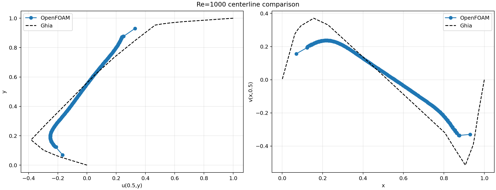

中心线图把 $u(0.5,y)$ 和 $v(x,0.5)$ 插值到 Ghia 参考点上。
本例 $v$ 分量 RMSE 为 `0.138038`，低于 hybrid40 的 `0.160966`；
但 $u$ 分量 RMSE 为 `0.210637`，略高于 hybrid40 的 `0.206742`。
这说明加密后横向速度剖面有所改善，但垂向中心线的峰值和近壁剪切仍未同步收敛；
可能原因包括混合网格壁面层分布、线性迎风对高 Reynolds 数剪切层的耗散、
以及压力投影法中压力边界和速度校正对中心线插值的影响。

`Re=3200`、hybrid40 的结果图和中心线对比图如下：

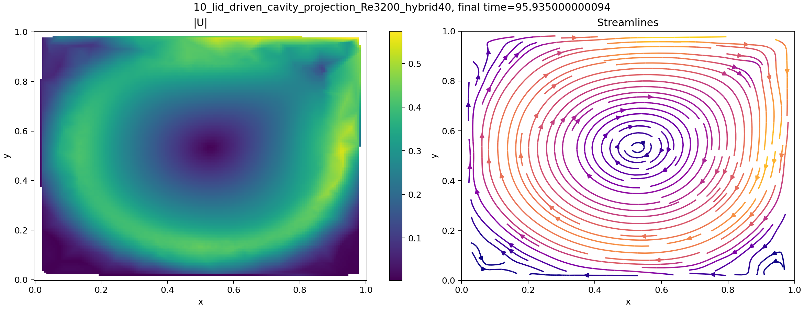

该图中主循环比 `Re=1000` 更靠近顶盖驱动方向，内部回流区更集中，
这与 Reynolds 数升高后惯性增强、边界层相对变薄的趋势一致。hybrid40 的壁面层
单元数较少，近壁梯度只能被粗略分辨，因此图像可用于确认主循环拓扑，
但不应用来判定角区次级涡或薄边界层的精确位置。

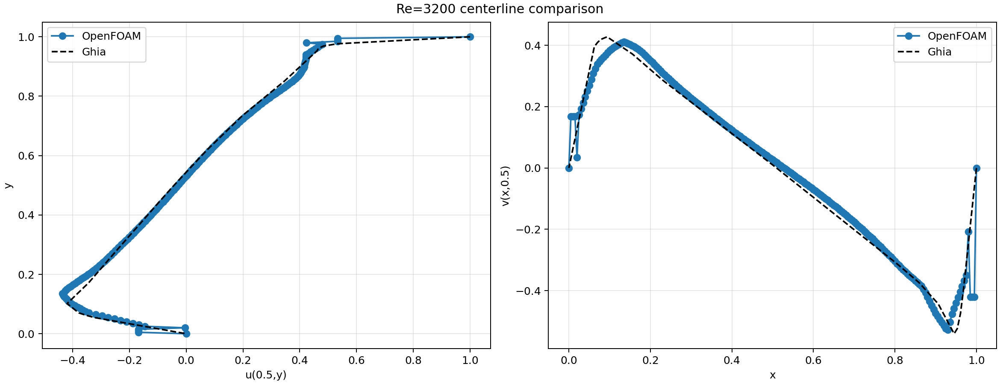

该中心线图显示当前 hybrid40 结果与 Ghia 参考数据的吻合度优于同组
hybrid80 摘要：$u$、$v$ RMSE 分别为 `0.030110` 和 `0.050971`。
这种“较粗网格优于较细网格”的现象不能解释为网格加密带来的正常收敛；
更合理的解释是当前保留的 hybrid80 缺少 `log.projectionFoamStudent`，
且其结束时间、稳态证据和后处理状态与 hybrid40 不同，二者不是严格可比的
完整网格收敛序列。

该案例在 `t=95.935` 达到稳态，连续 20 个时间步满足稳态判据，
最终最大速度散度约为 `5.74e-9`，可作为当前投影法结果中具有完整
运行日志和后处理证据的一组 `Re=3200` 方腔算例。

`Re=3200`、hybrid80 的结果图和中心线对比图如下：

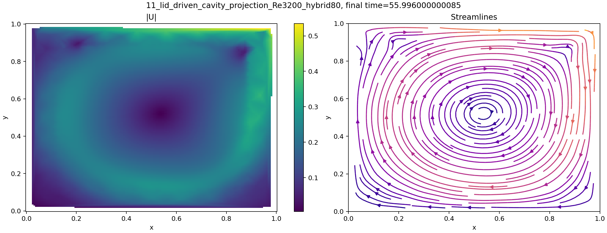

该图和 hybrid40 的主循环拓扑一致，但右侧壁附近的高速度带更窄，左上角和右上角的局部低速斑块更明显。
这说明提高名义分辨率后，整体流场并未改变，但局部边界层和角区剪切层的分布发生了重新分配。

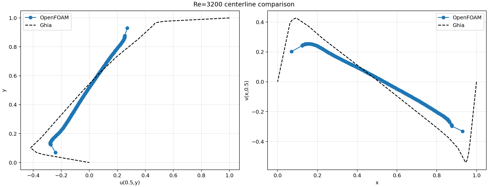

与 hybrid40 相比，hybrid80 的 `u(0.5,y)` 和 `v(x,0.5)` 都没有实现同步改进；
尤其是 `v` 曲线在右侧壁附近的 trough 被抬高，`u` 曲线在下半段也更平缓。
这与摘要中的更大 RMSE 一致，说明少数高非正交角单元会放大压力投影误差，
使名义上的加密不能自动转化为精度收益。

### 6.3 方腔跨实验比较

方腔四组结果的差异不能只按单元数理解。`Re=1000` 一组里，hybrid80 让 `v`
中心线更接近参考，但 `u` 中心线略有退化，说明投影法在方腔问题上的网格收益是分量依赖的，
并不总是单调改善。

`Re=3200` 一组里，hybrid80 的 RMSE 反而大于 hybrid40。对应的 `checkMesh`
显示，10 号案例的最大非正交角约为 `40.26` 度，而 11 号案例约为 `54.14` 度；
虽然 11 的平均非正交角更低，但少数角区单元更尖锐，压力泊松方程对这类局部极值更敏感，
因此误差反转更像是网格质量分布改变造成的，而不是投影法收敛性失效。

从证据等级看，`10` 是当前唯一同时保留完整 solver log 和后处理证据的 `Re=3200`
方腔案例；`11` 虽然有摘要和图件，但缺少投影求解日志，因此更适合做趋势对照，
不宜单独当作稳态证明。

## 7. 三角腔结果

### 7.1 主涡位置与流函数

下表将当前摘要中的主涡与参考主涡进行比较。
坐标误差为数值位置与参考位置的差值绝对值，流函数误差为绝对值。

| Re | 数值主涡 `(x,y)` | 参考主涡 `(x,y)` | `|dx|` | `|dy|` | `|dpsi|` | 结果状态 |
|---:|---|---|---:|---:|---:|---|
| 100 | `(-0.1957,-0.2085)` | `(0.3315,-0.6445)` | 0.5272 | 0.4360 | 0.2030 | 瞬态，不用于稳态结论 |
| 200 | `(0.3406,-0.6834)` | `(0.2030,-0.7266)` | 0.1376 | 0.0432 | 0.0462 | 摘要证据 |
| 500 | `(0.2971,-0.7297)` | `(0.1319,-0.7793)` | 0.1652 | 0.0496 | 0.0597 | 摘要证据 |

Re100 的摘要 `finalTime=0.5999999999999502`，而配置目标为
`endTime=80.0`，且当前没有对应的 case 目录和 solver log。
因此该条结果只能作为历史瞬态诊断，不能支持稳态涡结构结论。

Re200 和 Re500 的主涡位置已经落在主循环所在的下部区域，
但当前文件系统只保留 `0` 时刻字段、网格和后处理摘要，
缺少最终正时间目录及投影求解日志。因此其数值趋势可以参考，
但复现等级低于 PISO 三角腔结果。

### 7.2 三角腔场图

`Re=100` 的图件如下：

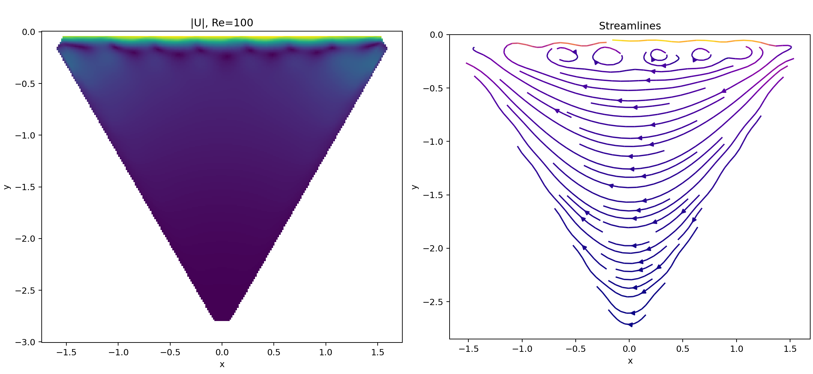

该图仍然显示早期发展阶段的顶盖剪切主导特征：上边界附近已经出现多处局部波动，
但流线尚未组织成后续工况中的单一主循环。换言之，这组图说明流动已经被驱动起来，
却还不能视为收敛后的主涡结构。

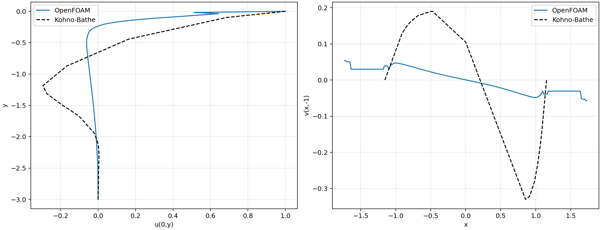

对应的中心线在上下两条剖面上都远离参考曲线，尤其是 `v(x,-1)` 的下壁 trough
尚未建立，说明此时的投影结果只能用于瞬态诊断，不能用于稳态精度判断。

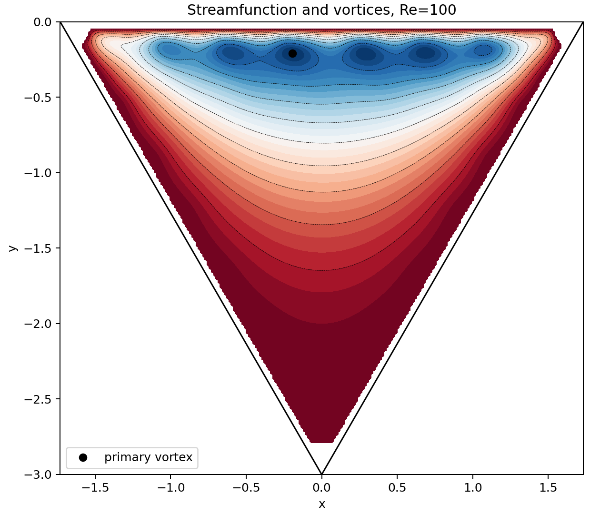

流函数图中的多个小极值位于顶盖附近，彼此分散且尺度较小，更像是未收敛瞬态中的局部卷吸，
不能直接当作稳定的次级涡结构。

`Re=200` 的图件如下：

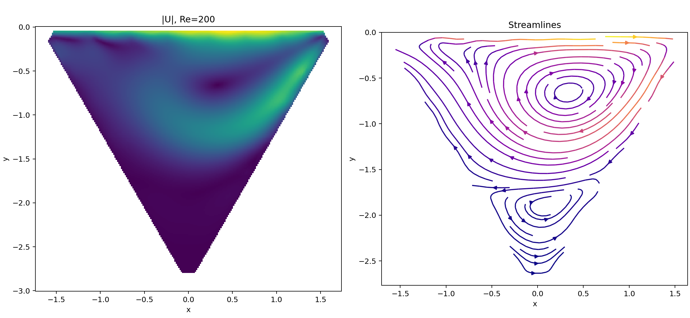

Re200 速度场图显示顶盖剪切驱动的主循环已经形成，主涡位于三角腔下部偏右区域。
由于等边三角腔的左右斜壁把回流限制在收缩几何中，流线不是方腔中的近矩形闭合形态，
 而是沿斜壁收束。速度幅值在顶盖附近最高，向底部衰减，符合顶盖驱动腔流的基本能量输入路径。

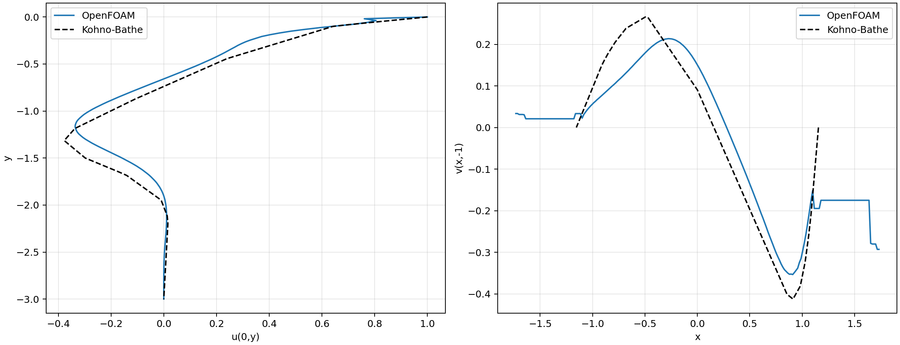

Re200 的中心线已经恢复出较稳定的主循环轮廓，但 `u(0,y)` 在下半段仍偏平，
`v(x,-1)` 的负峰位置也比参考值略偏右，说明当前结果对主循环纵向深度的捕捉好于横向位置。

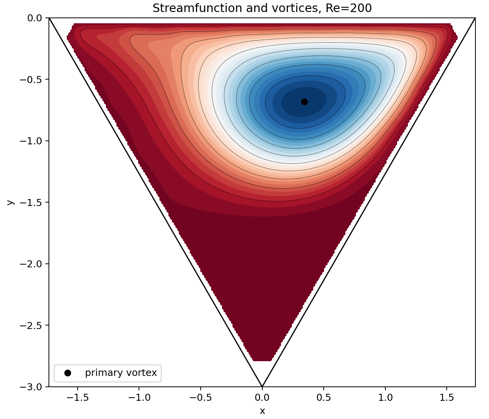

流函数图给出主涡位置和涡量分布的后处理诊断。Re200 的数值主涡
`(0.3406,-0.6834)` 与参考主涡 `(0.2030,-0.7266)` 相比，垂向位置较接近，
横向偏差较大，这与中心线图中的右移趋势一致。
图中小幅值局部极值对插值网格、有限区域掩膜和分辨率较敏感，
不应在没有局部网格收敛证据时直接解释为可靠的物理次涡。

`Re=500` 的图件如下：

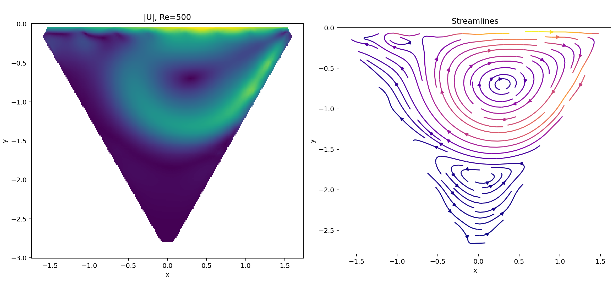

与 Re200 相比，Re500 的主循环仍然位于腔体下部，但右侧剪切层更陡，左下部回流区更厚，
说明更高 Reynolds 数确实增强了惯性输运；同时，这也使得薄边界层更难在当前网格上被充分解析。

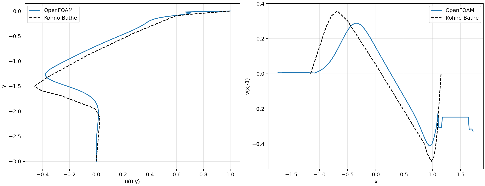

Re500 的 `u(0,y)` 在上半段已基本沿着参考趋势演化，但下半段仍偏平；
`v(x,-1)` 的负峰深度明显不足，说明主涡和底部回流的强度被低估。
这与 `v` 分量 RMSE 和最大绝对误差同时增大的情况一致。

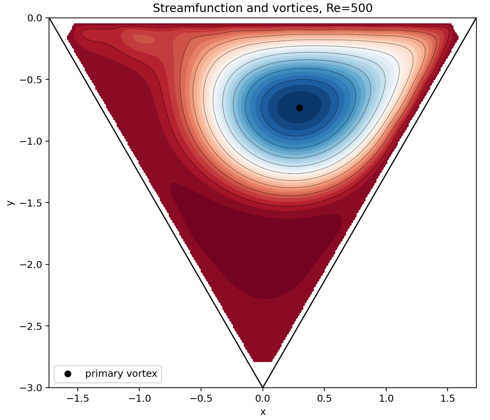

Re500 的流函数主涡核心继续向右下方移动，但与参考位置相比仍偏右，
并且下方次级回流的等值线更宽，说明当前 hybrid80 对高 Reynolds 数下的剪切层仍偏保守。

### 7.3 三角腔跨 Reynolds 数比较

Re100、Re200、Re500 不能按同一证据等级直接比较。Re100 只推进到 `t≈0.6`，
图中已经出现多处顶盖附近的局部波动，但这些波动尚未组织成稳定主循环，因此它只能作为瞬态诊断；
不能把这组图里的小极值解释为收敛后的物理次涡。

Re200 和 Re500 使用的是同一 `hybrid80` 网格，`checkMesh` 指标也相同，
因此二者差异主要来自 Reynolds 数而不是网格变化。Re200 已经恢复出清晰的单主涡结构，
Re500 则表现出更强的右侧剪切层和更明显的下部回流，但中心线 trough 仍被低估，
说明更高 Reynolds 数下的薄边界层已经开始超出当前分辨率的舒适区。

换言之，三角腔的误差来源主要有三类：斜壁和顶角对混合网格更敏感，最大非正交角达到 `61.68` 度；
流函数和主涡来自离散速度场的后处理重构，对插值分辨率和域内掩膜敏感；
而 Re500 相比 Re200 的额外偏差，则主要反映了更高 Reynolds 数下的薄剪切层未被充分解析。
因此，本节更适合被读成“趋势已经被捕捉，但高 Re 精度仍有限”。

## 8. 稳态性、网格与证据完整性

### 8.1 已有稳态日志

方腔 Re1000 hybrid40 和 hybrid80 的投影法日志均出现
`Steady state reached`，并给出 `max |div(U)|` 约为 $10^{-9}$、
`max |U-Uprevious|` 约为 $10^{-6}$。

方腔 Re3200 hybrid40 的日志出现 `Steady state reached`，
结束时间为 `t=95.935`，最终 `max |div(U)|` 约为 `5.74e-9`。
方腔 Re3200 hybrid80 当前保留摘要，但未找到对应
`log.projectionFoamStudent`，因此仍只按摘要证据使用。
三角腔 Re200、Re500 也未保留投影 solver log。

### 8.2 网格质量

已保留三角腔网格的 `checkMesh` 输出为 `Mesh OK`，
最大非正交角约为 `61.68` 度，平均非正交角约为 `8.26` 度，
最大 skewness 约为 `0.978`，日志没有报告致命网格错误。
这说明网格可以进入求解，但非正交性仍是三角腔误差的重要潜在来源。

## 9. 局限性与风险

- 当前报告是压力投影法的已归档子集报告，不等同于第五题完整 Re-网格矩阵；
- 三角腔 Re100 的摘要与配置终止时间不一致，不能作为稳态结果；
- 三角腔 Re200、Re500 缺少 solver log 和最终正时间目录，独立复核能力有限；
- 方腔 Re3200 hybrid80 缺少当前 solver log，只能依赖摘要、中心线和图件；
- 方腔 Re3200 hybrid40 虽然已有完整运行日志，但与 hybrid80 的误差差异较大，仍需结合网格和离散设置进一步复核；
- 方腔中心线误差仍然较大，结果适合算法流程验证，不宜直接作为高精度文献复现；
- 涡结构来自插值后的速度场和二次流函数重构，对插值和网格掩膜较敏感；
- 混合网格在相同 `hybridN` 下单元分布并非均匀，不能仅用一个名义分辨率衡量所有误差来源。

## 10. 结论

1. `projectionFoamStudent` 已实现独立的预测速度、压力泊松方程和速度/通量投影流程。
2. 方腔 Re1000 的两个混合网格案例，以及 Re3200 hybrid40 案例能够稳定结束，场图和流线呈现顶盖驱动腔流的基本结构。
3. 方腔中心线与 Ghia 数据仍存在明显误差，当前结果更适合作为投影法实现和工作流验证。
4. 三角腔 Re200、Re500 的摘要显示主涡已形成，但由于最终场和 solver log 不完整，结论只能限定为结果档案分析。
5. 三角腔 Re100 当前摘要仍是早期瞬态，不能支持稳态验证；后续若要闭合第五题，应重新生成并完整运行该案例。

## 11. 证据索引

详细证据索引见同目录文件 `evidence_index.md`。
